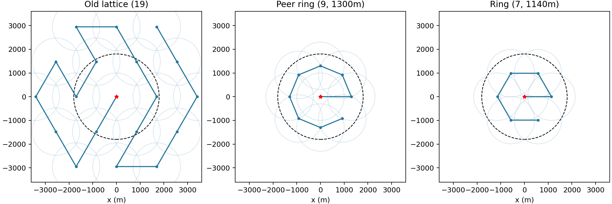
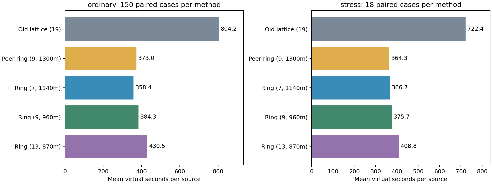

# 同学一论文与我们的 B 题方案：复核和改进

2026-09-11，基础种子42，本地单线程CPU。已完整阅读提供的35页截图；第36页起的代码附录、逐局CSV和执行日志不在本次材料中。阅读索引见[逐页笔记](experiments/runs/2026-09-11_peer-paper-review/page_notes.md)，原件见[同学一目录](别人的结果/同学一)。

**判断：对方第三问的布点思路优于我们之前的布局，论文组织也更接近成稿；我们在几何正确性、未知距离处理、第四问覆盖与结束保证、实验可追溯性上更扎实。不能把对方整套方案直接判为更好，也不能因为其证明有错就忽略环形布点的真实收益。** 我们已经吸收环形思想并独立实现，新的离线配对实验把普通场景平均每源时间从804.16秒降到了372.96秒；进一步7点布局为358.38秒。

## 1. 各自强在哪里

|维度|同学一现有材料|我们此前方案|本次判断|
|---|---|---|---|
|Q1几何|半平面、卡壳、Welzl、κ、图表完整；关键命题和构造有错|半平面可行性/无界判定、退化处理、舍入外包、MEC独立核验|我们的正确性证据更强；可学习对方图示与复杂度展示|
|Q2建模|GDOP解释、min–max、候选区域和Pareto图表达较好|保留未知距离，用可行集给第二点保收证书，把失收计入后续代价|对方展示较完整，但额外距离假设使具体最优坐标不适用于原题一般情形|
|Q3搜索布局|中心+8个1300m环点，思路紧凑|19点三角格，固定点集的路线已达到长度下界|对方布局明显更好；我们此前优化变量范围太窄|
|Q4与结束|双环与边界补扫，自报清除约98%—100%，承认没有有限步严格保证|圆外顶点覆盖任意180°方向；未知总数结束证书；有限光学覆盖|在“保证全清优先”的要求下，我们更合适|
|实验可信度|展示大量图表，但部分表图不一致，源码与原始轨迹缺失|配置、固定版本、真值隔离、全量轨迹、压力场景均可复算|现有材料中，我们更可核验；双方都没有本队最终算法的官方成绩证据|
|论文表达|摘要、目录、分问、图、敏感性、优缺点齐全|主要是工程和实验报告，还不是最终参赛论文|对方结构更成熟；其数学与数值错误必须先修，不能只看排版完整|

## 2. 已经复算的关键问题

以下反例和具体坐标均保存于[paper_numeric_checks.json](experiments/runs/2026-09-11_peer-paper-review/paper_numeric_checks.json)，由[独立检查程序](peer_paper_checks.py)生成，18项检查通过。交点核查使用独立的直线对枚举，不依赖我们的多边形裁剪实现。

**第12页：两个无实际测量误差的角锥，不必构成平行四边形。** 取真实源G=(0,0)，检测点S1=(-1000,0)、S2=(0,-1000)，读数分别0°、90°，不确定半宽仍为1°。交集四边形两条对角线的中点相差0.86176m，故不是平行四边形。原证明把随距离变宽的角锥替换成平行条带；条带可作局部近似，不能证明原角锥的精确性质。

更直接地，把S2改成(8.7265355,-999.9619231)，读数90.50°，两站到真实源仍均为1000m，实际误差均为0。交集满足

$$\kappa=\frac{2\max_{x\in P}\|x-M\|}{D}=1.0265287>1,$$

其中M确实是最远点对的中点。这意味着要以该M包住区域，半径比D/2大约2.65%；不是“2.65%的漏清概率”。原文n=2必有κ=1的推论也被反例否定。我们继续使用真实最小包围圆判定光学清除。

**第13页：其等边三站示例不是其声称的三角形区域。** 按原构型取边长1200m、源为三站重心、无实际角误差，±1°角锥交集有6个顶点；直径27.93094m，最小包围半径14.10621m。原文还把κ中M由直径中点换成了重心，混用了两个比值。Jung界D/2≤R≤D/√3本身没有问题，我们已有可由真实角锥实现的等边三角形反例。

**第15页：扩大矩形把无界区域“数值有界化”，不能求得原区域的有限直径。** 可以明确求“与已知物理源域相交后的区域”，也可以做画图截断；这两种操作都需要说清改变了什么集合。我们的Q1先判断空集、无界、点、线段和有界多边形。

**第18页：给出的第二点不能覆盖全部合法未知距离。** 原题只给第一检测点和读数，没有给目标在1500m处。设第一站(0,0)、返回30.00°，真实源为100(cos30°,sin30°)=(86.60254,50)，接收半径1000m。第一站正常收到信号，但其推荐第二点(640,931.3)距源1040.64328m，会返回no_signal。其45场景从150m开始，漏掉了该合法场景。我们用首次反馈的一致可行集和半径范围给保收证书，不把名义目标当作已知真值。

同一问题还存在内部数值矛盾：第20页称ρ∈[1020,1140]、相对角∈[-40°,40°]的候选框均在最优值20%以内；第18页自己的表给框内角点(1020,-40°)的最坏直径189.13m，而1.2×105.67=126.804m。304.42降到105.67的相对降幅为65.29%；188.09%是用新值作分母计算旧值的超出比例。

**第22页：“有三条方向线即保证误差≤15m”不成立。** 三个检测点(0,0)、(100,0)、(200,0)都返回0.00°时，源在(600,0)或(1400,0)、半径1500m、误差0都符合反馈。这两个位置相差800m，任何统一包围圆的半径至少400m。因此你之前听到的“三个准确坐标”，不能理解为“三次测向就获得三个真坐标”或“保证准确定位”。应根据几何条件和可行区域大小决定是否继续检测。

**第29—33页：第四问存在发现阶段的覆盖缺口。** 对圆周源G=1800u，方向朝外，接收要求u·(P-G)≥0。若所有扫描点都满足||P||≤1800，则u·P≤1800，除P=G外均在后方。有限个圆内或圆周点无法覆盖任意圆周朝外源。

把文中900m/6点、1700m/10点、1500m/12点、1800m/16点以及原点都加入，取源方向7°，最近站只有219.77m远，但所有45点均在背面，无一可检测。这个反例针对其固定扫描点集，不冒充运行了缺失的完整策略。其第33页已经承认严格保证未满足；我们公平保留这一自我评价。若要补齐，必须真正保留合适的圆外站点，并证明方向覆盖。

其表6的98.08%是源级清除比例，不能当作“98.08%的局全部清除”。在必须全清的任务里，两者应分开报告。

**实验图表需要原始数据校对。** 第25页表5为每源434.0s、检测141.5次；同页图15却标每源365.7s、检测160次，基线533.8s相同。因此不能用434.0直接与我们的804.16或358.38作跨模拟器排名。第13页6500个几何样本只保留2494个，也需要说明排除规则；一致的有界误差生成应保留真实源。没有日志时，结论是“尚不可复核”，不能据此断言数据造假。

## 3. 真正值得吸收的改进：先优化布点

受第21—22页环形布点启发，我们在[ring_coverage.py](ring_coverage.py)独立实现“原点+等角环点”，并补上圆域内部覆盖的证明。设源域半径R0=1800，外环点数n，环半径a，α=π/n。对最近环点所属扇区，源的角偏差不超过α。在扇区边界上，距最近站的平方为

$$\min\{r^2,\ r^2+a^2-2ra\cos\alpha\},\qquad0\le r\le R_0.$$

两支交于r*=a/(2cosα)。当r*≤R0时，全域精确覆盖半径为

$$R_{cover}=\max\left\{\frac a{2\cos\alpha},\sqrt{R_0^2+a^2-2R_0a\cos\alpha}\right\}.$$

第一项检查内部，第二项检查圆周。r*>R0时整个源域到原点不超过R0，函数按对应分支处理。该公式是连续全域证明；另用181个半径×1440个角度的网格独立核对数值，但数值网格不代替证明。

|布局|总站数|环半径/m|精确覆盖半径/m|距1000m的余量/m|静态开路径/m|
|---|---:|---:|---:|---:|---:|
|我们原三角格|19|—|≤981.50|≥18.50|30600.00|
|同学一环形布局，独立实现|9|1300|778.62|221.38|8264.84|
|进一步减少站点|7|1140|992.69|7.31|6840.00|
|缩小9点圆环|9|960|984.21|15.79|6103.27|
|更多点、更短静态路线|13|870|985.71|14.29|5823.80|

环形布局仅适用于全向Q3。Q4仍保留方向覆盖格点。我们之前“2-opt已达到最短”的结论只适用于固定19点集合；它没有证明19点布局最优，更没有证明总任务时间最短。本次结果明确显示应把站点集合、定位动作和路线一起考虑。



## 4. 同一后端、同一策略的840次比较

使用用户此前提供的同学benchmark冻结版本c477d366，全部为进程内Protocol.handle。五种布局共享原有主动定位、角度舍入外包、MEC清除、光学覆盖和未知总数结束条件。**这里只有对方布点思想的独立复现，没有其完整算法源码，不能称“我们整套算法与他们整套算法的直接比赛”。**

普通场景为3种位置分布×5种固定误差场×10个新种子67—76，共150局；每个布局跑同一批。种子=42+25+重复号。另有18局压力场景：最小接收半径1000m、边界目标、近共线、未知数量且最后频道为20、源数10/16，结合正/负/空间最坏端点误差。Q4朝外覆盖单独由前面的反例和我们已有格点证明处理。

|普通150局/布局|全部清除|平均总虚拟秒|平均每源秒|最慢总虚拟秒|平均指令|平均/最大真实秒|
|---|---:|---:|---:|---:|---:|---:|
|我们原19点|150/150|9721.95|804.16|10920.25|239.18|0.174/0.267|
|对方9点布点+我们的定位清除|150/150|4561.57|372.96|5422.00|144.15|0.177/0.270|
|新7点布点+我们的定位清除|150/150|4403.14|358.38|5328.94|124.69|0.182/0.266|
|新9点960m|150/150|4717.20|384.26|5681.63|144.62|0.194/0.310|
|新13点870m|150/150|5284.85|430.51|6625.12|183.75|0.199/0.319|

|压力18局/布局|全部清除|平均总虚拟秒|平均每源秒|最慢总虚拟秒|平均指令|平均/最大真实秒|
|---|---:|---:|---:|---:|---:|---:|
|我们原19点|18/18|8679.17|722.38|9985.62|221.44|0.174/0.271|
|对方9点布点+我们的定位清除|18/18|4497.65|364.27|5059.25|130.83|0.201/0.330|
|新7点布点+我们的定位清除|18/18|4576.65|366.71|6239.97|115.17|0.210/0.359|
|新9点960m|18/18|4660.72|375.72|6163.06|133.22|0.212/0.348|
|新13点870m|18/18|5062.80|408.76|7189.19|168.11|0.218/0.378|

“平均每源秒”是各局T/K的算术平均；总数K只用于离线评分，策略不能读取。真实秒是单局CPU本地运行的墙钟时间；整批含场景、日志、压缩轨迹等共158.41秒。全部840次清除、异常0；[失败列表](experiments/runs/2026-09-11_peer-paper-review/ring_failures.json)为空。

普通场景，9点1300m布局相对旧布局每源时间下降53.62%；7点布局下降55.43%，相对9点再降3.91%。按生成种子聚类的bootstrap 95%区间，前两项分别为[50.18%,55.83%]、[51.36%,58.13%]。这里只反映这组人工场景的不确定性，不是官方获奖或性能置信度。候选在评价前冻结，本次按样本筛选；尚未再用一批未查看场景确认筛选结果。

**并非每局都更快。** 四种环形各在150局中的145局快于旧方案，5局慢于旧方案，均为种子74聚集场景下的五种误差场。7点的最大单局回退944.56秒；9点1300m回退1057.92秒。全部18局压力场景则都快于旧布局。完整记录见[变慢案例](experiments/runs/2026-09-11_peer-paper-review/ring_regressions.json)。保留这些案例，不能用平均收益把它们抹掉。

**静态路线最短仍不等于方法最好。** 13点870m路线仅5823.80m，比7点的6840m更短，但普通每源时间430.51s，反而高于358.38s。多出来的扫描/切频，以及不同发现时机导致的定位绕行，都计入总任务成本。



## 5. 现在采用什么，论文还可改什么

**Q3建议主方案采用9点1300m环形覆盖+我们原有集合定位/主动选点/光学兜底。** 它已有大幅平均收益，覆盖余量221.38m，且本批压力样本最大耗时最小。7点1140m作为平均效率候选保留：它满足相同数学发现与结束保证、平均更快，但覆盖余量只有7.31m，压力最慢为6239.97s而9点为5059.25s。这个选择是对覆盖余量和样本尾部的工程判断，不是题面强制排序或全局最优定理。

**Q4继续使用保留外部顶点的格点覆盖。** 当前圆内有限圆环不能替代它。可以以后在覆盖格点保证之上做主动发现、共路清除和路线重排，不能靠“连续没信号”结束。

所有环形Q3布局都满足覆盖半径<1000；继续扫描所有未清除频道，保证每个源至少被发现一次。首次测向保留真实源的保守区域，光学28m单元中心覆盖保证有限清除。达到公开上限16，或完成所有必要扫描且所有发现源已清除，才结束。旧策略的有限动作/虚拟时间宽松上界仍可包住这些更少、坐标范围更小的站点设计；样本840次全清是验证记录，理论保证来自这条证明链。

可立即吸收的论文表达包括：一张规则/假设对照表；Q1用角锥、直径圆漏包和MEC三图解释；Q2画信息收益—移动时间Pareto图；Q3/Q4分别写覆盖和结束命题；将实验表和图都从同一CSV生成；展示源数、最小接收半径、误差结构的敏感性。不能只报算法名字或一个平均分。

下一步有价值的模型改进是“由后验不确定度决定继续测向”，代替“凑够三条线”；以及把位置、半径和朝向放在联合可行集中利用有/无信号。已接收与未接收的地点确实蕴含朝向信息，但在距离或源位置不确定时，不能直接套用已知G的角区间。这部分本轮没有新增实现，不计入840次收益。

写作上应注明环形布点受这份材料启发，新增内容是独立的全域覆盖推导、不同环形参数比较、严格集合定位/光学结束链与完整复现实验。对方第一问错误证明、额外距离假设和不一致数值不能沿用。

## 6. 复现与还缺的验证

代码：[几何反例](peer_paper_checks.py)、[环形覆盖](ring_coverage.py)、[配对实验](ring_experiments.py)、[汇总图表](summarize_ring_review.py)。本轮全部[计划/命令/配置/日志/结果](experiments/runs/2026-09-11_peer-paper-review)。原图、原始附件和上游未修改。

推荐9点方案的单局离线入口：

```bash
zsh B/experiments/runs/2026-09-11_peer-paper-review/command.sh smoke-ring9
```

7点候选将最后参数换成`smoke-ring7`。现有`run_smart_robot.py --method auto`仍指向上一轮冻结的算法选择；本轮新增布局需要显式选择，避免历史实验含义悄然改变。脚本拒绝把环形布局用于Q4。840次结果目录受保护；重复完整评测须用`ring_experiments.py --output B/新的目录`，不能覆盖本次结果。

还缺：同学论文完整代码与原始数据，才能同条件复现其整套策略；本队最终程序在用户实际提供的Windows/官方演练环境中验证；正式接口的现实时间、网络、角度舍入等一致性检查。当前正式请求0、未注册账号、未使用报名身份、未消耗测试机会。旧打包产物也需要在实际官方准备阶段按最终选择重新打包验证。

本次发现增强了B的可行性：三名计算机队员能把可证明几何与真正有效的布点/决策算法结合起来，收益已落实到代码。但是否选B和冲击国奖，仍不能只凭离线平均耗时决定；我们的数学内容已经比对方当前稿可靠，接下来需要把它整理成同样清楚、且没有这些硬伤的论文，并通过本队自己的官方演练。
