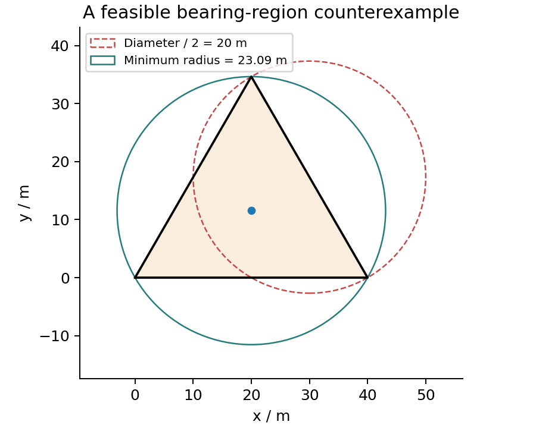
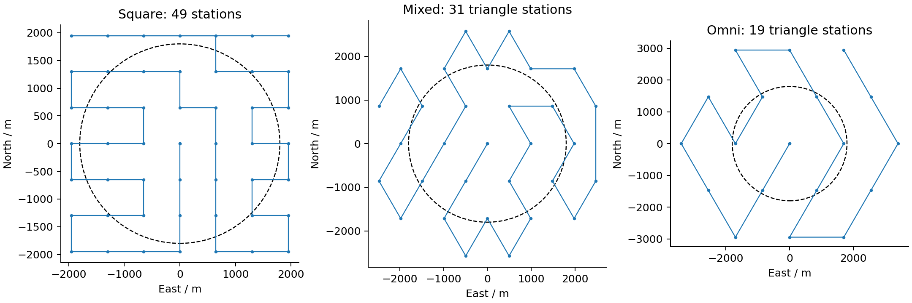
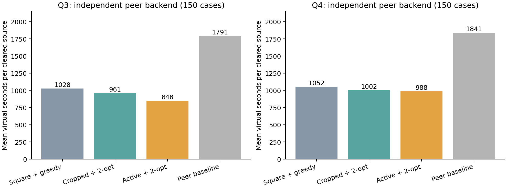

# B 题独立算法、双后端实验与选题报告

**2026-09-11：用户指定 Q1/Q2 benchmark 复核；持续优化工作暂停**

已读取用户指定的 [HANDOFF](https://github.com/ygbtft/shumo/blob/b/HANDOFF.md)，冻结 b 分支提交 `253bf943a58d6f21de88f14fdc940da66b87ab96`，执行同学原版和我们的已有内核。**同学的 Q2 候选域与固定点最坏误差实现更完整；我们的 Q1 退化分类存在真实错误，不能沿用此前“所有退化情况已处理正确”的笼统结论。** 双方的结果都应区分数学答案、数值未决和接口规范。

本轮四套固定夹具共 **1194 例**，不是 1194 次清除任务。额外运行单元测试、8 个固定点区间认证及我们的接口适配检查。没有新增 Q3/Q4 清除任务，没有官方演练或正式调用，没有修改任何一方的生产几何/定位内核，也没有为通过而修改夹具或容差。旧优化目标未宣称完成。

**1. 同学原版重跑结果**

| 检查 | 同学原版实跑 | 子进程现实秒 |
|---|---:|---:|
| Q1 区域、退化、直径及输出契约 | 274/285，失败 11 | 1.664 |
| Q1 最小圆、直径圆覆盖及状态 | 329/330，失败 1 | 0.388 |
| Q2 保证接收/获得方向的候选域 | 531/531，失败 0 | 5.064 |
| Q2 最坏直径及采样、选择契约 | 46/48，失败 2 | 93.919 |

生产单元测试 **416 通过、1 失败**，子进程现实时间 7.527 秒；以上五项顺序执行共 108.562 秒。可选认证模块单元测试另为 **12/12**。环境是 macOS 15.6 ARM64、Python 3.13.5、CPU 单线程，使用用户指定 Anaconda Python。没有安装新依赖。

HANDOFF 中的 `264/285`、`502/531` 已不能代表该提交在本机的实跑结果；“单元测试全过”“残留均为无害问题”也不成立。以本轮保存的输入、代码版本、日志和结果为准。

Q1 区域的 11 个失败中：7 个真实空集返回 `NUMERICAL_UNRESOLVED`；`empty_rotate` 把空集返回为 `OK/UNBOUNDED`，属于分类错；另 3 个冗余约束案例返回多边形但标记数值未决，流水线没有给出直径。其中部分顶点残差也超过冻结容差。不能把这 11 例统称为错误坐标，也不能全部豁免。

单元测试的反例很简单：第一站 `(0,0)` 测得 `180°±1°`，第二站 `(10,0)` 测得 `0°±1°`。第一扇形要求 `x≤0`，第二扇形要求 `x≥10`，交集为空。同学代码返回数值未决；我们的原内核在这个简单例子返回空集。

Q1 圆的唯一失败是 `isosceles_1e-09_transform_(1, 0.731, (123, -456))` 的**强制三点共圆接口**：三点几乎共线，真外接圆半径约 `499990511.435167 m`，返回 `499990507.135840 m`，差约 `4.299327 m`，却给出 `OK`。同例最小包围圆的圆心 `(123,-456)`、半径约 `1 m` 是正确的。它属于极端条件数下强制圆精度/状态问题，不能误写成“最小包围圆漏包”。冻结规则允许该尺度返回数值未决，但没有允许 `OK` 搭配不满足容差的数值。

Q2 候选域 **531/531** 全检查通过；其中明确 IN/OUT 判定，保收域 438/438、保证方向域 440/440。其余包含边界、未决和不一致观测；全通过不等于每例都给出肯定或否定答案。

Q2 最坏直径的两个失败为 `polar_1`、`polar_6`：加密采样时分别丢掉此前的 128、256 个样本，违反“样本嵌套保留”契约；本轮没有触发 J 的独立点对下界低估检查。这是实际接口缺陷，但不是此次已经证明的 J 低估。标准报告 A=0、B=0、C=40，另外 8 例不适用 J 分级。**仅高于有限样本下界不能证明覆盖连续最坏情况。**

**2. 我们在同一独立真值上的结果**

适配器只调用原有 [geometry.py](geometry.py) 和 [signal_minimax.py](signal_minimax.py)，不调用同学生产求解器。两方接口范围不同，不能把下面的通过数直接与上一表排名。

| 检查 | 我们已有内核的结果 | 缺口/解释 |
|---|---|---|
| Q1 原生测向/半平面流水线 | 199 通过、11 失败、75 不支持 | 75 例含 90° 半宽，现有测向接口明确要求小于 90°；199 也未包含同学全部元数据契约 |
| Q1 的 75 例半平面内核补测 | 原始顶点输出比较 74/75 | 剩余 `regular_31` 是多余边界点，独立边界核对误差小于 6×10⁻¹⁵ m，分类和直径正确；保留原失败记录，归为输出规范化 |
| Q1 最小包围圆/直径 | 317 个点集均通过，其中 7 个另走测向流水线 | 固定种子 42；不含强制三点圆、支持索引、任意种子及 13 个专门状态接口 |
| Q2 保证接收证书 | 118 个肯定证书均正确；265 个外部点未获证书 | 另外 144 个实际可行点被保守拒绝，其中 89 个边界、55 个内部点；4 个不一致观测不支持 |
| Q2 连续直径上界检查 | 34 个上界未被解析值/独立下界反驳 | 1 个检测点不保证接收而被拒绝；13 个不同 API 不支持；34 不表示上界紧或全局最优 |

我们的 Q1 11 个失败分为：**4 个空集误判无界、3 个极薄有界三角形误判无界、4 个点/线段维数误判**。失败 ID：`facing_rays`、`tiny_gap_8`、`long_triangle_10`、`tiny_gap_10`、`long_triangle_12`、`tiny_gap_12`、`long_triangle_14`、`tiny_gap_14`、`point_rotate`、`segment_rotate`、`facing_rays_shuffle_duplicate`。

可复现的关键反例：

- `x≤0` 与 `x≥10⁻⁸` 的交集为空，当前 HiGHS 默认可行性容差下却返回无界。
- `y≥0, y≤10⁻¹⁰x, 10⁻¹⁰x+y≤1` 是有界三角形，顶点为 `(0,0)`、`(10¹⁰,0)`、`(5×10⁹,0.5)`；当前 LP 路径返回无界。
- 正对的两条零误差射线应相交成线段，却因约 `10⁻¹⁵ m` 的浮点伪顶点被按顶点个数判成多边形。点的旋转也会产生类似维数错误。

另外，199 个核心通过案例中有 **48 个**不满足一一对应的顶点规范化。这些例子的顶点几何和直径在本轮容差内，但不能算成完整输出契约通过。给独立真值顶点作为单独测试输入时，直径内核 **139/139**；这定位了故障主要在区域构造/分类阶段，不能替代流水线测试。

75 例补测直接用独立夹具提供的半平面作为输入，明确没有补写一个“90° 测向 API”。`regular_31` 返回 34 个边界点而真规范化顶点数为 31，其中 `(10,0)` 位于直边内部。原适配器比较顶点集合得到约 1.017 m 差异，补查到两侧多边形边界的最大距离只有约 5.96×10⁻¹⁵ m，因此不能把这个差异称作区域位置错误。详见[补查](./experiments/runs/2026-09-11_q12-peer-benchmark/diagnostics/supplement_vertex_review.json)。

原始圆结果中一个辅助字段的命名容易误导，已在[适配器勘误](./experiments/runs/2026-09-11_q12-peer-benchmark/adapter_errata.md)解释；它不计入上述 PASS，也不代表生产实现了精确直径圆覆盖状态接口。

题目关注的两个锚点均重现：等边三角形边长 40 m 时 `D=40, R*=23.094010768`，直径圆不能覆盖，20 m 也不能保证清除；对称四站基准为 `D=41.321338, R*=20.660669`，直径圆能覆盖区域，但半径仍大于 20 m。这两种“能覆盖”必须区别。

**3. Q2：保证接收与连续最坏误差**

对于问题二的全向源，给定第一站方向反馈后，设完整物理可行源集合为 F、第一站为 S，未知接收半径在 `[1000,1500] m`，要对所有相容情形保证第二站 q 接收，要求

$$\forall x\in F:\quad \|q-x\|\leq\max(1000,\|S-x\|).$$

这保留了“既然 S 接收，真实半径至少为源到 S 的距离”的信息，不能只假设未知源距离等于 1000 或 1500。我们的外包多边形证书偏保守，同学的精确候选域还区分“收到信号”与“收到 direction”；距离不超过 5 m 可能反馈 near。

`tangent_segment_3` 的源可行段为 `[500,1400]`，检测点 `(0,20)`。当源为 `(1400,0)`、接收半径恰为 `1400 m` 时，第一站能接收，第二站距离约 `1400.142850 m`，不能接收。我们的证书拒绝此点是合理的。这一夹具仍可检查条件于方向反馈的 J 计算，但不能拿其有限数值推荐一个保证接收的检测点。

我们输出的是连续角度分箱的 MEC 半径上界，乘 2 得到直径上界；同学主要输出 J 的数值估计。这两种量不能只比较数值大小：例如解析 J 为 `15.459510179 m`，我们的上界 `18.529970419 m`，同学估计 `15.459510179 m`；另一极窄角案例解析 J 只有 `0.610121049 m`，我们的近距分支保守下限使上界为 `10 m`，约 16.39 倍。没有低估证据不等于决策效率高。

可选区间模块 12 项测试全部通过。对有代表性的 8 个固定点调用同学的独立 `mpmath.iv` 分支定界模块，每例最多 10 秒、20000 节点，目标区间宽度 0.1 m：

| 固定点案例 | 同学 Ĵ（米） | 独立区间 [L,U]（米） | 区间宽度（米） | 达到 0.1 米宽度 |
|---|---:|---|---:|---|
| segment_10_100_20_1 | 15.459510 | [15.446777, 15.527344] | 0.080566 | 是 |
| segment_10_100_20_0.5 | 8.348055 | [8.327637, 8.408203] | 0.080566 | 是 |
| tangent_segment_2 | 144.991332 | [144.978333, 145.065308] | 0.086975 | 是 |
| polar_same_station_closed_0 | 1495.000000 | [1495.000000, 1495.078125] | 0.078125 | 是 |
| segment_special_18 | 8.000000 | [8.000000, 8.093750] | 0.093750 | 是 |
| polar_0 | 147.272020 | [147.221646, 147.319911] | 0.098265 | 是 |
| polar_1 | 995.117283 | [995.079335, 995.212626] | 0.133290 | 否，节点预算用尽 |
| polar_6 | 995.171633 | [995.137823, 995.237823] | 0.100000 | 是 |

共 7/8 区间达到目标宽度；`polar_1` 在 20000 节点用尽时仍为约 0.13329 m 宽，保留有效上下界，但不算 0.1 m 收敛。8 个数值估计均未被认证带反驳；这句话不等于所有案例认证完成。包含嵌套等全部契约的可选运行是 **6/8** 通过，因为 `polar_1` 还未收敛，`polar_1/6` 仍有原来的样本嵌套失败。**固定 q 的认证不能证明 q 的连续全局最优。**

**4. CPU 与“清除快慢”的关系**

原始[题面](../CUMCM2026Problems/B题/B题.pdf)第 1—2 页分别要求平均定位清除时间和程序运行时间；[附件 2 提取](inputs_readonly_extract/附件2.txt)第 4 节规定虚拟计时和现实截止。

$$T_{virtual}=L/5+5N_{measure}+N_{switch}+5N_{clear,success}+3N_{clear,fail}.$$

上述公式按合法且实际执行的动作统计；clear 不触发切频。平均定位清除时间为虚拟总时间除以成功清除源数。同场景、完全相同的指令序列，不因 CPU 更快而缩短虚拟时间。CPU 影响程序运行的现实秒数，以及在现实预算内能尝试的候选数量。使用按秒停止的搜索/认证时，硬件也可能间接改变最终方案或认证区间宽度；固定种子仍不能消除这种硬件依赖。

现实截止是“开放 25 分钟窗口结束”和“enter 后 20 分钟结束”中较早者，应读取 `remaining_real_duration_s`。因此不能无限计算后再执行。公平比较应同时保存虚拟动作账本、现实耗时、硬件/线程和算法预算；正确性比较优先固定案例与工作量，另报告真实限时表现。本报告表中的运行秒数包含不同范围的 oracle/接口检查，不能当作两方生产算法的直接速度排名，更不能替换截图中的平均清除时间。

**5. 当前判断与后续顺序**

这份 benchmark 很有价值，确实发现了我们之前测试没覆盖的问题。**Q1 下一步应优先修复数值可行性与维数判定，再谈完整退化保证；Q2 可借鉴同学的保收域、不可区分点对和独立区间认证，结合我们的保守上界与移动耗时。** 不能直接整套照搬，因为同学也还有已复现的缺陷。

待用户恢复优化后，建议先固定本轮失败夹具，对空集使用可复核证据，对病态尺度增加高精度回退/数值未决；清理重复、共线顶点并按仿射维数分类。之后再扩展精确 C_sig/C_dir 与源集合裁剪，减少合法候选的保守拒绝；修复同学嵌套采样的思路可单独借鉴，但冻结参考副本保持只读。近距分支只在可行时加入，能减少我们的无效 10 m 直径上界。最后才进行 Q3/Q4 联合清除收益测试。

本轮不是官方评分测试，不能据此确认截图成绩对比、国奖概率或宣布超过同学一。此前清除执行次数与结果属于历史归档；本次没有增加正式或合成清除成绩。

**6. 复现与记录**

本轮目录：[experiments/runs/2026-09-11_q12-peer-benchmark](./experiments/runs/2026-09-11_q12-peer-benchmark/summary.md)。[计划](./experiments/runs/2026-09-11_q12-peer-benchmark/plan.md)、[运行前检查](./experiments/runs/2026-09-11_q12-peer-benchmark/precheck.md)、[配置](./experiments/runs/2026-09-11_q12-peer-benchmark/run_config.json)、[原版完整命令](./experiments/runs/2026-09-11_q12-peer-benchmark/attempt-02/upstream_commands.json)、[单测日志](./experiments/runs/2026-09-11_q12-peer-benchmark/attempt-02/logs/upstream_unit_tests.txt)、[原版结果](./experiments/runs/2026-09-11_q12-peer-benchmark/upstream_worktree/models/q1q2/benchmarks/)、[我们的结果](./experiments/runs/2026-09-11_q12-peer-benchmark/our_results/)、[失败归因](./experiments/runs/2026-09-11_q12-peer-benchmark/diagnostics/failure_attribution.json)、[认证配置与结果](./experiments/runs/2026-09-11_q12-peer-benchmark/certification/report.json)、[下一步](./experiments/runs/2026-09-11_q12-peer-benchmark/next_steps.md)、[只读核验与哈希清单](./experiments/runs/2026-09-11_q12-peer-benchmark/manifest.json)。

入口脚本为 [q12_peer_benchmark.py](q12_peer_benchmark.py)、[q12_our_benchmark.py](q12_our_benchmark.py)、[q12_benchmark_diagnostics.py](q12_benchmark_diagnostics.py)、[q12_certification_run.py](q12_certification_run.py)。首次隔离副本缺少 `mock/`，导致 import 失败、没有执行案例；已保存[环境修正](./experiments/runs/2026-09-11_q12-peer-benchmark/environment_correction.md)和原日志，加入同提交依赖后另开 attempt-02 完整重跑。没有把初始化失败算作算法失败。

上游固定夹具沿用其既有随机数据，不重新生成；我们新增方法的基础随机种子为 42。输出目录已有防覆盖标记，复现时应另选 B/ 内运行目录，不删除既有记录。参考仓库、题面附件、公共代码和双方生产内核的只读检查另存 manifest。本轮没有更改历史 `FINAL_MANIFEST`；它仍描述此前封存版本，新报告和适配器由本轮独立清单绑定。


---

以下是此前封存记录；Q1/Q2 正确性与持续优化暂停状态以上方本轮复核为准。

## 2026-09-11 最新：21站整数覆盖、精确边界证书与扫描计算优化

**本阶段新增7620次离线计分执行全部清除，累计59514次；其中3900次来自参数冻结后的新确认，正式请求0。** 找到了可证明覆盖全域、任意180°朝向和最小1000m接收半径的21站整数布局。新确认中，Q4简单距离版较同场景22站版，普通每源453.14→445.33秒、压力543.08→528.34秒，平均CPU和指令也降低。但81/195局变慢，最大总时间上升，普通改善区间包含零；完整goal继续active。

**当前值得作为下一轮主要候选的是Q3 range_area7，以及Q4 range_grid21_29；保留22站对照。** 前者本批238.95秒/源，后者445.33秒/源，达到本批240/460普通目标。Q4固定站序加公开源数删除count_locked_grid21_29均值更低，为441.52/516.62秒每源，但相对同布局简单距离版普通CPU高17.10%，且有1399.38秒个例回退，不自动当作最优。CLI仍需显式指定方法，没有偷偷改默认。

**1. 布点的实质进展：21站可行，最短静态路线仍不等于最好任务**

原22站为中心+7内+14外。重新检查搜索范围后发现，过去内圈半径只试了990和1050等较疏候选，并未充分检验接近1000m的范围。本轮冻结3组内/外圈点数、4内半径、4外圈余量、5相位，共240候选：36个有连续证书、204个有实际盲区见证、0未决。成功者为中心+8内+12外共21站。[原始枚举与证书](experiments/runs/2026-09-11_odd-ring-cover/summary.md)。

还得到可解释的否定结果：对“原点+两层等角规则圈”这个特定家族，7内+13外及6内+14外在任意合法半径/相位下都有径向间隙。前者内圈凸包能保证到达的上界901.506m，与外圈首次可接收阈值903.805m之间相差2.299m；后者间隙19.838m。已给出解析推导并用600组参数/相位和未修改后端检查。**这不证明任意21站布局不可能，也不证明21是全局最少。** [推导与范围](REGULAR_RING_OBSTRUCTION.md)。

对36个成功布局逐坐标取厘米/整数，重新检验72个实际坐标配置，68个获证、4个未决。4个未决布局在坐标轴方向恰与1800m圆域相切，旧证书要求严格位于凸包内部，无法处理等号。新算法将坐标与四叉分割统一放大到整数，以精确有向面积判定闭凸包；距离仍保留10^-5m余量。独立验证改用“每个角点属于选定站点的某个三角形”，并精确检查整个分割，4个全部获证。向内破坏1m后产生的真实盲区也被正确拒绝。[舍入记录](experiments/runs/2026-09-11_rounded-cover21/summary.md)、[相切点精确证明](experiments/runs/2026-09-11_closed-cover21/summary.md)、[整数证明细节](INTEGER_COVERAGE_GUARANTEE.md)。原来的4个“未决”记录保留，没有改写成反例或直接放宽浮点容差。

主候选grid21_29使用有严格凸包余量的整数坐标，避免依赖闭180°端点等号。源圆域仍为1800m，外部顶点仍保留；外部站点不能投影回源圆域。其整数坐标见[坐标CSV](experiments/runs/2026-09-11_cover21-confirmation/layout_grid21_29_coordinates.csv)，具体全域证书见[选定布局](experiments/runs/2026-09-11_cover21-confirmation/selected_layouts.json)。相切布局只在闭边界口径下解释；本地后端轴向边界测试通过，官方端点口径仍需实际软件核验。


新主布局的静态路线17826.74m，比旧22站17716.55m**长110.19m**；整局平均却更快、检测更少。这再次说明只优化TSP路长不是完整答案。两种布局还改变了检测位置与发现顺序，不能把全部收益简单归因为少一个站点。

**2. 另外两个已实现改进及其适用范围**

[lean_scan_policy.py](lean_scan_policy.py)把实际位置数组比较延后到需要证书或删除统计时，保留相同证书函数、历史顺序和所有原统计。1116次训练全清，570项前置检查通过；6对实际训练、2对新确认合计948个计分配对的实际请求、反馈和虚拟时间相同。新确认Q3普通/压力CPU降低1.40%/1.32%，Q4基础预测降低1.48%/1.99%。它减少计算，不虚构新的几何或虚拟时间收益；相对更简单range，Q3仍有5个普通局最多多2秒，CPU约高0.25%。

[public_count_scan_policy.py](public_count_scan_policy.py)只在已经实际发现16个不同频道后，才推断其余频道为空，并仅原地删除这些RF。不能因为10/13个已知源或多次无信号就这样结束。新的归纳条件是每个最初未知频道必须有真实测量，或在已到站后有16源空频道证书；旧的“每站至少4条未知RF”断言不能原样套用。[证明](PUBLIC_COUNT_SCAN_GUARANTEE.md)。744训练全清，780项前置检查通过，旧训练只多省9次RF，效果很小；新确认同为21站固定站序时，普通/压力再省95/18条RF，195局无虚拟回退，但CPU约多1.34%/1.04%。它相对匹配的原计划有删除收益，不支配其他路线。

这些是面向B题的独立几何/费用推导。ICRA论文的有界不确定区域和观测选择提供了建模启发，但21站覆盖、整数相切证书、有限接收负反馈及计费结论不是原文定理。[ICRA联系与来源](ICRA_CONNECTION.md)。

**3. 冻结后的全部指标**

1116次计算优化训练、744次公开源数训练、1860次布局训练，共3720计分。布局训练另有560项前置检查，包含20方法各18个旧压力及9个精确轴向多源场景的完整协议；这些预检不算成绩。训练后冻结20候选，再生成普通147—156=42+105+repeat、压力SeedSequence([42,120,problem,layout_index,count])，误差42+3200+100×problem+index，共3900次。没有依确认重新调参；157—166尚未生成。[冻结配置](experiments/runs/2026-09-11_cover21-confirmation/run_config.json)。

每个方法普通150/150、压力45/45全清，0策略异常、0区域不一致。每源数值是各局每源时间的算术平均，不换成源数加权平均。下表各格为普通/压力；CPU/墙钟包括策略、Client和本地后端，不含导入、初始化、场景生成和写盘，不能直接当作截图的整个程序时间。

|问题/方法|普通/压力每源秒|普通/压力平均总秒|普通/压力P95总秒|普通/压力最大总秒|普通/压力指令|普通/压力平均CPU秒|普通/压力平均墙钟秒|
|---|---:|---:|---:|---:|---:|---:|---:|
|Q3 peer_layout9_proxy|336.68/382.86|4465.49/4863.09|5177.08/6098.81|5371.30/6212.41|142.77/142.64|0.19567/0.18623|0.19586/0.18640|
|Q3 area_return1_7|239.76/282.01|3182.05/3530.59|3803.51/4711.01|4131.20/4757.92|140.76/141.87|0.02599/0.02562|0.02601/0.02564|
|Q3 range_area7|238.95/281.40|3171.31/3522.59|3792.71/4711.01|4119.20/4757.92|138.97/140.53|0.02591/0.02552|0.02594/0.02554|
|Q3 deferred_area7|238.96/281.40|3171.36/3522.59|3792.71/4711.01|4119.20/4757.92|138.97/140.53|0.02635/0.02593|0.02637/0.02595|
|Q3 lean_deferred_area7|238.96/281.40|3171.36/3522.59|3792.71/4711.01|4119.20/4757.92|138.97/140.53|0.02598/0.02559|0.02600/0.02560|
|Q4 width_convex22|463.58/547.10|6099.83/6855.10|6718.80/7631.72|6955.57/8306.03|310.52/341.47|0.04020/0.03496|0.04066/0.03530|
|Q4 range_convex22|453.14/543.08|5960.37/6802.97|6501.25/7538.92|6701.94/8276.03|287.23/332.76|0.03957/0.03453|0.03978/0.03497|
|Q4 predict_convex22|452.98/542.86|5958.33/6800.17|6496.88/7538.92|6701.94/8276.03|286.67/332.22|0.04199/0.03668|0.04211/0.03687|
|Q4 locked_full_convex22|459.97/540.39|6056.63/6757.15|6593.06/7615.69|6760.56/7904.84|313.41/350.11|0.04132/0.03529|0.04150/0.03545|
|Q4 count_locked_convex22|442.74/531.69|5825.03/6641.26|6440.90/7426.89|6647.56/7608.84|274.56/330.71|0.04308/0.03792|0.04319/0.03811|
|Q4 original_predict_convex22|452.98/542.86|5958.33/6800.17|6496.88/7538.92|6701.94/8276.03|286.67/332.22|0.04262/0.03743|0.04280/0.03768|
|Q4 lean_locked_convex22|442.95/531.86|5828.44/6643.95|6440.90/7426.89|6672.56/7608.84|275.11/331.13|0.04301/0.03739|0.04311/0.03756|
|Q4 width_grid21_29|451.47/531.42|5928.64/6653.47|6683.85/8146.11|6821.88/8621.15|287.19/325.24|0.03805/0.03409|0.03814/0.03421|
|Q4 range_grid21_29|445.33/528.34|5848.60/6611.47|6581.20/8057.51|6747.54/8495.15|273.81/318.20|0.03776/0.03403|0.03786/0.03415|
|Q4 predict_grid21_29|445.12/528.11|5846.01/6608.34|6581.63/8049.51|6747.54/8483.15|273.24/317.58|0.03993/0.03661|0.04002/0.03679|
|Q4 locked_full_grid21_29|458.29/524.81|6045.30/6522.12|6729.02/7562.85|7088.65/7672.55|310.89/329.47|0.04188/0.03337|0.04203/0.03356|
|Q4 count_locked_grid21_29|441.52/516.62|5817.54/6420.21|6397.29/7458.88|6705.65/7575.55|272.62/312.38|0.04422/0.03562|0.04442/0.03576|
|Q4 lean_locked_grid21_29|441.76/516.77|5821.45/6422.61|6406.49/7463.68|6729.65/7581.55|273.25/312.78|0.04363/0.03526|0.04374/0.03539|
|Q4 range_grid21_7|455.60/541.82|5978.14/6790.09|6654.58/7736.54|6859.16/8671.46|279.67/322.11|0.03804/0.03560|0.03816/0.03580|
|Q4 range_closed21_3|455.01/538.69|5982.64/6764.88|6535.59/7924.63|6746.62/8603.40|282.41/321.31|0.03795/0.03547|0.03819/0.03564|

初始化、最大墙钟及逐例时间另列于[完整汇总](experiments/runs/2026-09-11_cover21-confirmation/summary.csv)和[逐例CSV](experiments/runs/2026-09-11_cover21-confirmation/trials.csv)。三个训练矩阵的完整墙钟为44.76、27.90、73.31秒，新确认为182.82秒，包含采集/写盘。这些是整批时间，不能与截图单次1.19/1.86秒相除比较。当前全部使用本地CPU单线程。


图仅显示均值，不替代尾部、逐例回退或证明。[绘图源数据哈希](experiments/runs/2026-09-11_cover21-confirmation/figure_data.json)、[布局PDF](figures/cover21_layouts.pdf)、[权衡PDF](figures/cover21_tradeoffs.pdf)。

**4. 收益、退步与统计边界**

range_grid21_29相对range_convex22，普通/压力每源均值降低1.724%/2.715%，每局指令平均少13.42/14.56，CPU降低4.58%/1.46%。但普通61/150、压力20/45局变慢，最大个例增加993.54/862.06秒；最大总时间分别6701.94→6747.54、8276.03→8495.15秒。普通种子块95%重采样区间约[-0.253%,3.910%]，包含零，因此只说本批实测下降，不说稳定显著或逐例支配。

predict_grid21_29相对同布局range仅省普通/压力0.047%/0.042%，CPU多5.76%/7.57%，33/195局变慢、最坏9/4秒。两个最大回退已核实完全来自切频。count_locked_grid21_29相对同布局range均值低0.855%/2.218%，但81/195局变慢，最坏增加1399.38/527.13秒，普通CPU多17.10%。相对22站同类count_locked，普通0.275%改善区间[-1.027%,1.259%]也包含零；压力有2.834%改善、CPU约降6.05%，普通最大总时间仍增加58.09秒。

两个其他21站布局没有稳定优胜：grid21_7普通比22站range慢0.544%，其最坏普通/压力增加1708.61/1890.33秒；相切closed21_3普通慢0.414%，最坏增加1066.86/1890.68秒。不能因为静态路线较短或证书处理更精细就优先使用它们。

所有区间采用seed42、10000次种子块重采样，保留同一种子的15种普通条件；属于探索性比较，未作多重比较校正。人工压力集不是实际发生概率。[完整配对、区间和全部回退](experiments/runs/2026-09-11_cover21-confirmation/paired_analysis.json)。

本批Q3/Q4确已达到240/460普通目标，但相同未改range对照在117—156四批、每问题600普通局的均值为246.11/474.21。不能把本批整体更容易的部分算成算法收益，也不能拿这个四批合并替新21站证明跨批稳定性。[跨批描述统计](experiments/runs/2026-09-11_cover21-confirmation/cross_batch_reference.json)。

**5. 公开反馈诊断：扫描与定位必须共同决策**

20条已见轨迹重放不读真值、不增加成绩。range_grid21_29在clustered/adversarial-spatial/152中实际扫描8→12站，扫描多1013.09秒，源任务只少19.55秒，总计慢993.54秒；near_collinear/n16/positive中12→18站，扫描多1722.29秒、源任务少860.24秒，仍净慢862.06秒。

最大收益也展示了同一个机制：clustered/adversarial-negative/152中扫描17→10站，扫描少1962.79秒、源任务少660.02秒，共快2622.81秒；range_transition/n16/positive中22→12站，共快2607.98秒。固定站序的另一个压力退步则说明站数也不是充分指标：boundary_tangent/n16/spatial中扫描20→9站，扫描省1743.71秒，源任务却多2270.84秒，净慢527.13秒。[完整拆账与逐任务事件](experiments/runs/2026-09-11_cover21-confirmation/regression_public_diagnosis.json)。

后续需要研究下一检测位置、剩余扫描与清除任务的联合选择。只有公开反馈可参与决策，未来未出现的示向/真实源位置不可用于排名。源数上限也只在已有足够公开证据时生效。

**6. 保证、检查、失败记录和选题判断**

316项独立几何检查通过，包括204个实际盲区见证、600组解析障碍参数、全部新连续证书以及1m破坏反例。99项最终运行检查通过：80条公开反馈区域/MEC清除重放，全部3900确认轨迹的1000861条指令物理与费用重算，2871条删除计划展开及948个相同决策配对。[几何审计](experiments/runs/2026-09-11_odd-ring-cover/geometry_audit.json)、[运行审计](experiments/runs/2026-09-11_cover21-confirmation/final_checks.json)。

2871条删除展开覆盖52863个扫描段，删除60015条RF，其中262条来自公开16源空频道证书、2017条来自成对负点预测；3794条删除发生于实际位置尚未到站时。累计减费356452秒，每例精确等于5×删除数+切频减少数，物理路径一致。统计跨重复训练/方法，不是独立场景数或单局成绩。最少实际未知RF降到1条，但每站独立核验的真实检测/已证空频道合计至少5个，满足理论要求至少4个；没有用旧断言错误拒绝合法删除。[确认删除审计](experiments/runs/2026-09-11_cover21-confirmation/certified_deletion_audit.json)。

165531个示向回复最大绝对误差1.004999708°，受1.01°外包覆盖；本批重复地点回复0条，不能宣称新增同地点误差固定的重复实测证据。全轨迹方向核账在归一化点积绝对值≤3×10^-12的浮点边界内保留后端容差，不把它冒充任意实数的精确判定；整数覆盖另有精确证明和专门轴向闭边界协议检查。

4组自有127.0.0.1随机端口HTTP与进程内结果一致，其中公开源数方法特意复用已见的edge/iid/152，实际触发4次空频道删除；这是协议核查，未加入新成绩。2个cover21 CLI通过。原题PDF/两DOCX、同学原件、公共探索、两个上游副本均未变；前一51894清单237项先核验后保留。

本阶段计分和Python前置/运行审计无失败；另保留一次外层zsh收尾解析错误。原因判断是审计子进程运行时编辑了启动脚本，Python的99项结果已完整写出，随后外层继续读取时出错。已将分支改为exec并检查语法；计分与审计没有重跑或覆盖。[原错误与修正](experiments/runs/2026-09-11_cover21-confirmation/launcher_correction.md)。全部既有历史失败保留；最终归档核对代码、记录、图表来源与哈希，见[总清单](FINAL_MANIFEST.json)。

发现/清除/结束保证仍优先：Q3七站和Q4新21站都有连续发现证书，原方格h≤1000/√2且保留外顶点的保底证明继续成立。示向使用有界区域而非中心线交点，清除用全区域MEC/保证清除位置，累计主动预算耗尽后有有限光学覆盖。只在16源全清，或全域覆盖完成且全部已发现源清除后结束。21站最大半径<1950m、站数更少，不扩大源服务和打断预算，继承335136秒<100小时、9766请求的宽松上界。59514次全清不能替代这些论证。

**仍推荐B作为有条件的主候选，尚不能承诺国奖或全面超过同学一。** 新21站的连续证书、整数/闭边界区分和可证明费用删除，增加了可写入论文的实质内容。peer_layout9_proxy依然只是布点思想代理；没有同学完整源码就不能假装复现其全部实现。截图341.05/658.00与40/40缺少同口径条件，不能与离线均值直接判定官方胜负。

完整goal保持active。后续优先在新21站上减少扫描/源任务联动的千秒回退，验证有证明的切频重排，并考察更少点或非对称布局；不能由两规则圈障碍推出任意布局下界。真实程序时间还应补最小运行包的启动/配置读取/HTTP整体计时，避免只优化计时内循环。147—156已见，157—166与新压力流留待下次冻结。官方验证仍需用户实际提供运行环境、允许条件与本队完整轨迹；当前不注册账号、不使用报名身份、不消耗正式机会。


---

以下保留此前各轮原始结果；当前21站覆盖、确认结果及局限以上方更新为准。

## 2026-09-11 最新：延后扫描移动、负反馈预测与相同决策下的计算加速

**本阶段新增8178次离线计分执行全部清除，其中3900次来自参数冻结后生成的新确认场景；累计51894次，正式请求0。完整goal保持active。** 最新普通确认Q3约247.52秒/源，Q4简单距离版486.77、预测版486.38秒/源；这一批未达到240/460门槛。不能用上一批达标、累计全清次数或最低均值宣布稳定达标、全指标胜出或官方超过截图。

当前有两种不同意义的改进：一是对具体原策略证明可以省去某些必无信号检测，同时保留其后续移动和清除计划；二是在实际决策完全相同的对照中，减少证书与历史约束的计算开销。**Q4固定站序加预测本批普通均值最低，但有77/195局比简单距离版慢，不作为全面更优方法。** 实用对照继续保留range_area7/range_width015；数学主线可以使用延后移动的证书删除。命令行需显式指定方法，本轮未自动更换默认策略。

**1. 与ICRA参考文献的联系及本轮独立推导**

[Tokekar、Isler的原文](https://tokekar.com/pubs/tokekar2013asensor.pdf)把带有界误差的示向表示为角锥，研究最坏情况下交集区域的直径/面积和有效传感器的选择。与B题第一、二问的建模出发点高度相近。但原文的静态布点问题没有B题的有限接收、180°盲区、移动切频费用和未知数量结束条件。三传感器结论有位置、角误差和观测有效性条件，不意味着三个精确坐标，也不证明任意三次测量足以清除。没有证据确认它是官方题源。[完整联系、原文定位与前轮实现](ICRA_CONNECTION.md)。

本轮进一步利用“对整个可行区域成立才执行”的原则，实现以下工作。具体负反馈和费用推导属于我们针对B题的独立工作，不归给ICRA原文。

- **将首条必无信号RF携带的移动延后。** 共20频道、至多16个源，每个开始的扫描段至少有4个未知频道必须真实检测，所以本站一定有保留请求。删除已知源的必无信号RF后，可以把前往本站的同一段移动延后到首条保留RF；期间只维护内部计划，不改真实客户端位置/频道/时间，不插入源任务。每个保留测量和扫描段末恢复原行动计划。相对对应无删除版，移动段不变、微秒舍入不变，少n条RF时总费用精确少5n秒加切频减少数。相对任意不同路线或CPU不存在这种保证。[证明与适用范围](DEFERRED_SCAN_GUARANTEE.md)、[实现](deferred_skip_policy.py)。
- **用两个可信负点预测下一点仍无信号。** 对候选源g，若历史无信号点a、b均不比拟测点q离g远，且线段[q,g]与[a,b]相交，那么“q收到信号”会与至少一个负点矛盾。五个线性半平面给出充分条件；仅当包含真实源的整个多边形都严格满足时才省去RF。实际/推得的负点单独记忆，推断标记不冒充实测反馈，也不裁剪区域或改变原策略排名。退化时放弃该证书。单个no_signal不能被解释成频道不存在。[独立展开核验](deferred_replay.py)。
- **相同决策下减少计算。** 负点预测先在一个真实多边形顶点检查廉价必要条件，最终接纳仍调用原完整证书；历史约束用矩阵批量筛选可能有效的集合，再按原顺序裁剪，每次区域改变后重新筛选剩余集合。不能只在最初区域筛选一次：后续裁剪产生的新顶点可能使原来无效的约束重新有效。[预测预筛](CHEAP_PREDICTION_GUARD.md)、[批处理等价范围](BATCHED_HISTORY_EQUIVALENCE.md)、[预测代码](cheap_prediction_policy.py)、[历史批处理代码](batched_history_policy.py)。

**2. 训练、冻结、全部指标与真实运行时间**

先完成24方法×93旧训练=2232次延后扫描实验、10方法×93=930次历史批处理、12方法×93=1116次预测预筛；前置检查分别2016、1091、1038项通过。Q3负点预测在训练没有额外省去RF而增加CPU，未晋级；Q4保留4/8点窗口及相同决策的原计算版作对照。没有根据本轮确认结果重新调参。[训练记录](experiments/runs/2026-09-11_deferred-scans/summary.md)、[批处理记录](experiments/runs/2026-09-11_batched-history/summary.md)、[预测记录](experiments/runs/2026-09-11_cheap-prediction/summary.md)。

随后冻结20方法，每个方法使用150普通和45压力场景，共3900次，全部清除，0策略异常和0区域不一致。普通种子137—146=42+95+repeat；压力SeedSequence([42,119,problem,layout_index,count])，误差42+2900+100×problem+index。压力包括边界朝外/切向、近共线、远端聚簇、接收范围转换，源数10/13/16与正/负端点及空间误差；接收半径最小等合法边界保留。147—156尚未生成。[冻结配置](experiments/runs/2026-09-11_deferred-confirmation/run_config.json)。

每个方法普通150/150、压力45/45全清。下表每格为普通/压力；每源耗时是各局每源时间的算术平均，没有换成源数加权平均。全部方法均已列入，包括负结果和CPU对照。

|问题/方法|普通/压力每源秒|普通/压力平均总秒|普通/压力P95总秒|普通/压力最大总秒|普通/压力指令|普通/压力平均墙钟秒|
|---|---:|---:|---:|---:|---:|---:|
|Q3 peer_layout9_proxy|362.42/376.91|4443.27/4774.68|4959.55/5950.29|5274.81/6058.19|139.87/142.07|0.1818/0.1818|
|Q3 area_return1_7|248.51/281.03|3043.03/3522.98|3674.00/4735.21|3829.76/4844.24|139.83/143.24|0.0248/0.0260|
|Q3 range_area7|247.52/280.70|3030.60/3518.71|3665.32/4735.21|3829.76/4844.24|137.75/142.53|0.0247/0.0260|
|Q3 faithful_area7|247.69/280.70|3032.66/3518.71|3667.40/4735.21|3829.76/4844.24|138.10/142.53|0.0247/0.0260|
|Q3 deferred_area7|247.52/280.70|3030.62/3518.71|3665.32/4735.21|3829.76/4844.24|137.75/142.53|0.0251/0.0264|
|Q4 width40_f015_22|497.26/550.21|6031.70/6883.84|6712.30/7527.48|6896.74/8349.22|319.57/348.96|0.0372/0.0336|
|Q4 range_width015|486.77/545.64|5904.75/6828.22|6576.90/7524.53|6878.74/8307.22|298.35/339.64|0.0369/0.0335|
|Q4 faithful_width015|487.59/546.25|5915.09/6834.91|6588.05/7524.53|6885.74/8307.22|299.93/340.69|0.0370/0.0338|
|Q4 deferred_width015|486.86/545.70|5905.97/6828.84|6576.90/7524.53|6879.74/8307.22|298.35/339.64|0.0378/0.0346|
|Q4 predict8_width015|486.38/545.47|5900.08/6826.20|6576.90/7524.53|6879.74/8301.22|297.34/339.20|0.0440/0.0406|
|Q4 arc05_noskip_width015|496.11/531.12|6031.68/6649.45|6805.20/7579.52|7024.12/8176.21|312.90/332.47|0.0441/0.0384|
|Q4 deferred_arc05_width015|487.96/527.97|5931.71/6610.79|6699.62/7417.35|6927.55/8134.21|296.03/325.93|0.0447/0.0393|
|Q4 locked_noskip_width015|498.81/541.21|6087.71/6752.48|6774.05/7705.74|7153.14/7880.79|326.59/350.13|0.0392/0.0343|
|Q4 deferred_locked_width015|481.65/532.37|5870.74/6642.24|6558.12/7421.10|6720.14/7527.79|289.97/331.53|0.0395/0.0349|
|Q4 cheap_predict4_width015|486.51/545.62|5901.65/6827.91|6576.90/7524.53|6879.74/8301.22|297.61/339.49|0.0392/0.0360|
|Q4 cheap_predict8_width015|486.38/545.47|5900.08/6826.20|6576.90/7524.53|6879.74/8301.22|297.34/339.20|0.0398/0.0370|
|Q4 cheap_predict8_arc05_width015|487.73/527.76|5928.90/6608.19|6698.78/7417.35|6927.55/8128.21|295.55/325.49|0.0466/0.0414|
|Q4 cheap_predict8_locked_width015|481.23/531.62|5864.90/6632.97|6544.02/7415.10|6696.14/7521.79|288.97/329.96|0.0416/0.0371|
|Q4 history_first8_width015|486.54/541.52|5904.39/6767.50|6580.24/7449.63|6861.78/8214.19|297.93/338.13|0.0451/0.0471|
|Q4 batch_history_first8_width015|486.54/541.52|5904.39/6767.50|6580.24/7449.63|6861.78/8214.19|297.93/338.13|0.0425/0.0431|

墙钟/CPU包括策略、Client和本地后端的任务执行，不含导入、场景生成与写盘；初始化、CPU均值/最大值及完整逐例数值另列。[完整汇总CSV](experiments/runs/2026-09-11_deferred-confirmation/summary.csv)、[逐例CSV](experiments/runs/2026-09-11_deferred-confirmation/trials.csv)。三个训练矩阵实际墙钟分别86.54、49.74、50.06秒，确认矩阵181.05秒；这些包含采集写盘的整批时间不能与截图单次程序时间混用。所有计分采用本地CPU单线程，基础seed42。


图中只比较均值，不能替代下文逐例回退和最坏保证；原始数据哈希保存在[绘图数据](experiments/runs/2026-09-11_deferred-confirmation/figure_data.json)，可导出[矢量PDF](figures/deferred_tradeoffs.pdf)。

同一个未改range策略合并117—146三批、每问题450普通局，Q3为248.49、Q4为481.24秒/源。上一批238.15/447.84达标是真实的单批结果，但尚未跨批稳定达到240/460。该合并只是已有结果的描述统计，不是新确认，也不支持新预测策略的跨批效果。[跨批统计](experiments/runs/2026-09-11_deferred-confirmation/cross_batch_reference.json)。

**3. 哪些收益成立，哪些比较仍然退步**

延后移动Q3相对area原版普通/压力每源均值降低0.395%/0.118%；Q4相对width原版降低2.091%/0.820%。相对上一轮只删原地RF的faithful，Q3普通再降0.068%、压力相同，Q4普通/压力再降0.150%/0.102%，这些配对没有虚拟时间回退。但延后版相对简单range并未支配：Q3四局多1秒，虽然表中四舍五入都为247.52；Q4普通/压力分别63/150和10/45局更慢，最大多10/5秒，CPU也稍高。不能将表中相同小数误写成逐动作完全相同。

Q4廉价8点预测相对延后版，普通/压力再省0.100%/0.041%，195局没有虚拟时间回退；相对简单range只有0.080%/0.031%的均值改善，38/195局更慢、最大7/5秒，CPU增加约7.79%/10.26%。因此它提供更多可证明的删除，却仍不是相对range的全指标改善。

计算加速的比较更清楚：廉价8点预测与未预筛8点预测在195局中实际请求、虚拟时间、结果和原统计相同，普通/压力平均CPU降低9.57%/9.04%。历史first8批处理与原first8同样195局决策相同，CPU降低5.71%/8.72%。连同训练共1413个实际计分配对都通过逐请求等价审计。此处只主张本机实测计算节省，不声称任意机器或任意尺度浮点输入有固定加速比。[训练CPU对照](experiments/runs/2026-09-11_deferred-confirmation/training_cpu_effects.json)。

其他候选必须保留局限：

|Q4候选，相对range_width015|普通/压力每源均值改善|变慢局数（共195）|最坏普通/压力增加秒|普通/压力CPU增加|
|---|---:|---:|---:|---:|
|cheap_predict8_width015|0.080%/0.031%|38|7.00/5.00|7.79%/10.26%|
|cheap_predict8_arc05_width015|−0.199%/3.277%|71|2215.61/1404.16|26.26%/23.48%|
|cheap_predict8_locked_width015|1.138%/2.570%|77|1095.88/1539.47|12.58%/10.78%|
|batch_history_first8_width015|0.045%/0.755%|48|1373.95/129.00|15.26%/28.36%|

固定站序的普通均值虽最低，按十个种子块重采样的95%区间约[-1.661%,3.177%]，包含零；历史批处理相对range普通改善区间[-0.212%,0.317%]也包含零。重采样10000次、seed42，保持同一种子的15种普通条件成组；这是探索性比较，未作多重比较校正，压力样本也不是实际发生概率。[完整配对、区间和回退列表](experiments/runs/2026-09-11_deferred-confirmation/paired_analysis.json)。

**4. 只用公开反馈拆解大回退**

完成15条已见轨迹的诊断重放，不读真值、不增加成绩。预测版相对range的两例最大7秒/5秒回退，测量/清除和移动费用相同，差额全部来自切频；下一步可以研究保持计划的频道重排。

更大回退属于联合任务问题：clustered/iid/145中，arc预测版扫描9→19站，扫描多2040.60秒、源任务多175.01秒，总计慢2215.61秒；near_collinear/n16/spatial中，range为13站，arc/locked分别19/17站，总计慢1404.16/1539.47秒。历史批处理在clustered/adversarial-positive/145中扫描9→16站，源任务虽少133.25秒，扫描却多1507.20秒，净慢1373.95秒。这些例子说明局部定位区域缩小或局部路线改善不保证整局更快。[各动作拆账与完整诊断](experiments/runs/2026-09-11_deferred-confirmation/regression_public_diagnosis.json)。

**5. 全域保证、独立核查与剩余工作**

3987条训练/确认删除配对完成原计划展开核验，覆盖77872个扫描段；实际删除73147条RF，其中1643条来自成对负点预测、6530条发生在实际位置尚未到站时，累计减费433091秒，每例都精确等于5×删除数+省下的切频数，物理移动路径一致。该总和跨重复训练/方法，不是单局时间或独立场景数。每扫描段的未知频道实际请求由独立Client轨迹核验，本批至少5条，证明仅要求至少4条。[训练删除审计](experiments/runs/2026-09-11_deferred-scans/certified_deletion_audit.json)、[预测删除审计](experiments/runs/2026-09-11_cheap-prediction/certified_deletion_audit.json)、[确认删除审计](experiments/runs/2026-09-11_deferred-confirmation/certified_deletion_audit.json)。

1057项最终运行检查通过，含1028条可行区域公开反馈重放、全部954个实际历史收缩执行、上述3987条展开和1413个相同计算结果配对；3900条确认轨迹的1040868条指令全部重新核算物理和费用。157513个示向回复最大绝对误差1.004999750°，落在1.01°舍入外包内。本批重复地点回复0条，不能宣称新增了同地点误差固定的重复实测证据；该规则仍由后端审计及先前专门检查支持。[最终运行审计](experiments/runs/2026-09-11_deferred-confirmation/final_checks.json)。

Q3七站连续覆盖、Q4二十二站连续方向覆盖、原方格保底均保留。只在16个已知源全部清除，或全域保证扫描完成且所有已发现源都清除时结束。定位使用1.01°误差外包、MEC全区域清除证书、累计主动预算及有限光学兜底；新删除不扩大动作空间、预算或移动段，原335136秒<100小时、9766条请求的粗上界继续成立。成功次数不替代这些证明。

4组自有127.0.0.1随机端口HTTP等价检查、2个deferred系列CLI通过；没有调用正式服务。原PDF/两DOCX、同学原件、公共探索和两个上游副本未变。上一43716清单219项在改入口前逐项核验并保留。本阶段计分/前置/运行审计无失败，既有历史失败和修正记录继续保留。归档单独检查文档链接、代码语法、轨迹/评分夹具哈希，并在关闭日志后索引，见[总清单](FINAL_MANIFEST.json)。

**仍推荐B作为有条件的主候选，但不承诺国奖或全面超过同学一。** 区域几何、连续发现、有限完成以及可证明的费用删除能构成清晰的数学与实验主线。免疫/群智能等算法名称不是评价依据。peer_layout9_proxy仍仅复现可识别的布点思想，无完整同学源码就不能称其完整实现；本批Q3对它的150个普通局均更快，但45个压力局中仍有9局变慢；其压力平均指令142.07还略低于我们的142.53，进一步否定全指标已胜出的说法。

截图341.05/658.00、40/40及程序时间缺少同口径逐局条件；本队仍缺用户实际提供的官方运行环境、允许的运行条件和本队完整官方轨迹。当前不自动注册或消耗测试机会。137—146已使用，未来147—156及新压力流留待下一次冻结。下一步优先减少删除证书本身的CPU、研究有证明的切频重排和16源上限下的站内空频道删除，再检验尚未枚举的中心+7内+13外共21站布局。后者只是待证候选；前轮408个不同21站候选失败不证明21站不可能。所有新方案仍需完整覆盖/结束论证和冻结确认，goal继续active。


---

以下保留此前各轮原始结果；本轮新场景、推荐及局限以上方为准。

## 2026-09-11 最新：历史负反馈、保持原计划的检测删除与21站反例

**本轮新增5343次计分执行全部清除，累计43716次；其中2925次是在参数冻结后、使用127—136及新压力流的确认。正式请求0。** 当前一批普通场景已达到240/460秒每源的离线数值目标，但跨批稳定达标、逐例与CPU全面占优、官方超过截图均未建立，完整goal保持active。

**更适合作为论文主线的当前组合是：有界角误差可行区域 + 连续保证扫描 + 保收主动测向/有限光学完成 + 保持原计划的冗余检测删除。** Q3对应faithful_area7，Q4对应faithful_width015；它们相对各自无删除的原策略有明确的虚拟时间和请求数不增加证明。已有range_area7/range_width015本批更快少量，保留为实用对照。历史裁剪与固定站序是有代价的候选，不因为模型更复杂或均值最低就自动设为默认。

**1. ICRA启发怎样落到本轮代码**

[ICRA联系、原文与前几轮实现](ICRA_CONNECTION.md)已经区分：原文研究有界示向下的区域与传感器选择；B题还要处理有限接收、定向盲区、移动和停止。原文的有效三传感器结论不是三个精确坐标。本轮的两个推导由我们另行建立，不归给原文，也没有证据确认其为官方命题来源。

[历史成对负反馈](HISTORICAL_PAIR_GUARANTEE.md)使用一个实际成功接收点s和两个清除前实际无信号点q1、q2。对候选g，若两点都不比s离g远，且线段[s,g]与[q1,q2]相交，则与未知半径及闭180°接收半平面矛盾，可排除g。两个距离不等式加三个几何半平面形成线性排除集合；补集取凸外包保守收缩，近共线时放弃该次推断。不能只用线段相交，也不能把所有no_signal都当“频道不存在”。实现见[historical_pair_policy.py](historical_pair_policy.py)。

[保持原计划的删除定理](FAITHFUL_SKIP_GUARANTEE.md)更适合解释保证收益：只在保证扫描时，已知区域的MEC给出严格距离下界大于1500m、且测量点与实际当前位置完全相同，才删除RF。内部记录原计划频道和已尝试位置，真实客户端频道/位置/时间不改；到新位置的首条请求保留，因为协议没有独立移动指令。展开被删逻辑操作后，后续测向、移动、清除和停止计划与对应原策略相同。

若删除n条，移动及光学费用相同，少5n秒检测费用；实际RF频道序列是原序列的子序列，切换费用满足三角不等式，因此T新≤T原−5n、请求数恰好少n。此处的“原”限于明确配对的、无额外历史裁剪且不依赖实时时钟的确定性原策略。**不是相对任意路线策略的支配，不保证CPU减少，也不是所有场景都严格变快。** 实现见[faithful_skip_policy.py](faithful_skip_policy.py)。

**2. 训练、冻结和数值结果**

历史约束14方法×93旧训练=1302次；保序删除12方法×93=1116次。历史Q3所有候选虚拟结果完全相同而CPU增加，未晋级；历史arc版本训练压力变慢，也保留负结果。选first8（时间/CPU折中）和recent8（训练压力较好）及四组保序/无删除对照进入15方法确认。[历史训练](experiments/runs/2026-09-11_historical-negatives/summary.md)、[保序训练](experiments/runs/2026-09-11_faithful-skips/summary.md)、[冻结配置](experiments/runs/2026-09-11_history-confirmation/run_config.json)。

确认每个方法普通150/150、压力45/45全清，0策略异常和0区域不一致。普通种子127—136=42+85+repeat；压力SeedSequence([42,118,problem,layout_index,count])，误差42+2600+100×problem+index。未依此确认调参；137—146尚未生成。下表每格为普通/压力，单位秒；每源指标是各局每源时间的算术平均，未换成源数加权平均。

|问题/方法|普通/压力每源秒|普通/压力平均总秒|普通/压力P95总秒|普通/压力最大总秒|普通/压力指令|普通/压力平均墙钟秒|
|---|---:|---:|---:|---:|---:|---:|
|Q3 peer_layout9_proxy|343.84/372.83|4559.33/4701.01|5177.65/5461.98|5370.47/5620.69|143.03/139.67|0.1921/0.1862|
|Q3 area_return1_7|239.14/283.13|3158.05/3547.70|3569.56/4645.50|3819.87/4697.71|143.73/143.04|0.0263/0.0257|
|Q3 range_area7|238.15/282.64|3144.38/3541.72|3557.56/4645.50|3819.87/4697.71|141.45/142.04|0.0262/0.0257|
|Q3 faithful_area7|238.22/282.66|3145.17/3541.85|3557.56/4645.50|3819.87/4697.71|141.58/142.07|0.0262/0.0258|
|Q4 packet_center22|466.56/547.32|6145.01/6827.75|6747.29/7925.30|7162.69/8509.97|326.03/361.96|0.0441/0.0431|
|Q4 width40_f015_22|458.24/537.35|6037.29/6728.66|6673.64/7420.96|7104.02/8089.18|313.51/343.89|0.0389/0.0342|
|Q4 range_width015|447.84/533.56|5897.26/6682.86|6585.00/7420.96|6918.02/8052.18|290.11/336.24|0.0383/0.0340|
|Q4 faithful_width015|448.80/533.85|5909.80/6686.31|6593.38/7420.96|6918.02/8052.18|292.02/336.76|0.0386/0.0342|
|Q4 arc05_noskip_width015|458.86/529.71|6040.10/6630.54|6686.27/7422.04|6957.73/8121.41|307.29/333.09|0.0460/0.0397|
|Q4 fast_arc05_width015|451.77/526.76|5945.22/6591.79|6570.07/7420.96|6831.73/8084.41|291.41/326.60|0.0456/0.0393|
|Q4 faithful_arc05_width015|452.54/527.04|5955.18/6595.34|6575.48/7420.96|6831.73/8084.41|292.95/327.16|0.0459/0.0394|
|Q4 locked_noskip_width015|460.36/536.18|6054.02/6684.24|6739.98/7524.21|7108.69/7611.70|313.41/342.31|0.0422/0.0343|
|Q4 faithful_locked_width015|445.33/529.09|5854.52/6591.51|6512.83/7446.42|6823.97/7581.70|279.75/326.76|0.0417/0.0341|
|Q4 history_first8_width015|447.71/527.24|5895.83/6589.14|6590.14/7265.21|6918.02/7845.55|289.73/331.73|0.0469/0.0463|
|Q4 history_recent8_width015|447.70/527.21|5895.65/6588.70|6590.14/7265.21|6918.02/7845.55|289.72/331.73|0.0499/0.0502|

墙钟测量包括策略、Client和本地后端，不含导入、场景生成和写日志；初始化单独报告，约0.00007—0.00029秒。CPU、最大墙钟、逐例时间、指令与全部失败列表见[完整数值表](experiments/runs/2026-09-11_history-confirmation/summary.csv)及[逐局CSV](experiments/runs/2026-09-11_history-confirmation/trials.csv)。训练矩阵57.07/41.68秒，确认矩阵149.79秒是含采集写盘的实际运行时间，不能与截图单次“程序运行时间”直接比较。

本批range Q3=238.15、Q4=447.84达到240/460；faithful Q3=238.22、Q4=448.80也达到。但相同未改策略在117—126为259.80/509.11，两批合并各300普通局为248.98/478.47。**本批达标是事实，稳定达到门槛尚无证据；不同批次绝对均值的下降不作为算法收益。** [跨批描述统计](experiments/runs/2026-09-11_history-confirmation/cross_batch_reference.json)。

**3. 同场景收益与必须保留的退步**

保序Q3相对area原版，普通/压力每源均值降低0.385%/0.166%；保序Q4基础限幅相对width原版降低2.062%/0.652%。四对无删除/保序策略在780次新确认比较中均无虚拟时间回退；连同训练372对，共1152条展开计划独立重放，逐动作一致，删除17219条RF，累计省102123秒，均精确等于5×删除数+切换减少数。这个总和跨重复训练/方法，仅用于核账，不是单局或独立场景成绩。[完整支配审计](experiments/runs/2026-09-11_history-confirmation/faithful_dominance_audit.json)。

历史first8相对range_width015普通447.84→447.71秒/源，只有0.029%；按十个种子分组的95%重采样区间约[-0.106%,0.171%]，包含零。压力533.56→527.24，改善1.184%；P95总秒7420.96→7265.21，最大8052.18→7845.55。但普通/压力CPU约增加22%/36%，39/195局变慢，最坏普通/压力增加315.44/380.58秒。recent8效果接近且CPU更高，不作为首选。区间为探索性、未作多重比较校正；压力是人工构造的边界集合，不解释为真实出现概率。[全部配对与回退](experiments/runs/2026-09-11_history-confirmation/paired_analysis.json)。

固定站序保序版faithful_locked本批普通445.33最低、最大6823.97/7581.70较低，但相对基础width原版仍有72/195局变慢，最坏增加636.35/831.56秒，普通CPU高于简单range版。因此“相对自己的无删除版可证明省时”不能偷换为“相对所有算法全面更好”。

两例历史裁剪回退已只用公开反馈拆账：uniform/adversarial-positive/132三策略都22站，历史版扫描省319.20秒，源任务反增634.64秒，净慢315.44；range_transition/n13/negative同为22站，扫描多274.51、源任务多106.07，净慢380.58。缩小区域改变测量落点和任务顺序，整局路程不必下降。共6条诊断重放不计新成绩，不读取真值。[拆账日志与逐任务记录](experiments/runs/2026-09-11_history-confirmation/regression_public_diagnosis.json)。

**4. 更少站点的尝试和保证边界**

实际搜索3个内核点+6个中层点+12个外层点共21站：216个大内核配置，加192个小内核配置，总408个全部找到合法1000m接收半径、闭180°朝向的漏检源；0个获证，0个仅因证书未决而拒绝。独立点积/距离与后端覆盖函数都验证21站全无信号。可加入9个不同频道合法源得到完整场景，仍漏见证源。首个直观反例g=(950,0)、朝向约262.4312°。

这只否定所枚举的408个候选，**不能据此宣称21站不可能或22站全局最少**。没有将这些无保证布局送入策略，也未把数学检查计入全清次数。[216候选与见证](experiments/runs/2026-09-11_multicore-cover-search/summary.md)、[192候选与见证](experiments/runs/2026-09-11_multicore-cover-smallcore/summary.md)。

Q3七点连续覆盖和Q4二十二点方向覆盖继续使用；最初方格h≤1000/√2且保留必要外部顶点的通用保底仍成立。未知频道逐站保证检测；仅在公开16频道上限已全部清除，或完整保证覆盖完成且所有已发现源均清除后结束。已发现源仍保留1.01°舍入外包、MEC全区域清除证书、每源累计主动预算和有限光学覆盖。当前不扩大动作空间或预算，继承335136秒<100小时与9766条请求的宽松上界；不把均值或43716次全清当最坏证明。

**5. 核查、失败留存和当前选题判断**

历史前置665项含4800个独立线段/距离点判定；保序前置848项含关闭功能及展开计划；813项最终运行审计通过，包含779条可行区域反馈重放、全部727个有效历史收缩执行、1152条保序展开计划，以及全部2925条确认轨迹的770286条指令物理/计时重算。9组距离删除复核共610次，客户端真实状态均未伪改。最大返回角绝对误差1.004999946°，受1.01°外包覆盖。本轮轨迹没有重复地点回复，不能把它说成新增的同地点误差固定实证；该规则仍由已审计后端和前轮专门测试支持。

4组自有127.0.0.1随机端口HTTP与进程内逐请求等价，2个history系列CLI通过；无现有官方服务连接。原题PDF/两DOCX、同学原件、公共探索、两个上游副本均核查未变。上一38373清单191项在更改旧入口前全部通过哈希核验并保留。[最终运行审计](experiments/runs/2026-09-11_history-confirmation/final_checks.json)。

本轮保留一次独立见证审计的ImportError：导入未导出的Source，在任何见证检查前退出，改为正确模块后408项全通过；未改布局或策略。另有附带计数命令遗漏json导入的记录，不影响计分。完整旧失败与原始日志未清除；本轮5343计分执行无程序失败。[检查工具修正记录](experiments/runs/2026-09-11_multicore-cover-search/audit_correction.md)。

**仍推荐B作为可认真选择的主候选，暂不声称全面超过同学一或能够保证国奖。** 现在既有区域几何、连续覆盖和有限结束，也有“省略可证明冗余且不改变未来行动”的可解释改进，适合计算机背景队伍组织为数学论证与实验消融。论文应强调真实适用条件、负反馈陷阱、舍入与MEC，而非靠免疫/群智能等名称包装。

同学一无完整源码，peer_layout9仍仅为布局代理；截图341.05/658.00及40/40没有同口径逐局条件，不能判定官方胜负。本队仍缺实际官方运行环境/安装包、允许的运行条件及本队完整官方轨迹；得到用户实际条件后再验证，不自动注册或消耗测试机会。当前goal保持active；后续重点是减少保序删除对首条RF的保留、降低历史裁剪CPU或控制其任务回退，以及有连续证书的非对称布局。未来137—146和新压力流继续留作冻结确认。


---

以下保留此前各轮完整记录；最新推荐和证据范围以上方为准。

## 任务联动与可证明冗余：新增5484次，距离跳过在本轮确认中未变慢

本阶段1674次联动训练、1116次负反馈几何训练、744次等价加速训练，再冻结10候选进行1950次新场景确认，**5484次计分执行全部清除，累计38373次**。这些是策略执行数，含训练复用，不是独立场景数或官方次数。正式请求0，goal仍未完成。

### 实现、假设与保证

最稳的增量是严格距离证书：对于已知源的可行集P及其MEC(c,R)，若计划扫描点q满足||q-c||>1500+R+余量，则任意g∈P到q的距离都超过最大接收半径。可以跳过这条已知频道请求；未知频道仍完整扫描，客户端实际位置、频道、计时不改，也不伪造服务端回复。[实现](coupled_dispatch_policy.py)，[连续区域推导与停止保证](COUPLED_DISPATCH_GUARANTEE.md)。一次省射频仍可能改变后续频道顺序和共享，因此未声称普遍的整局时间单调性。

同时实现两类任务联动。固定站序保留保证扫描点的相对顺序，把已知源按最小路程增量插入；服务入口/出口规划把下一探测候选视为进入点、MEC中心视为完成点，以有向转移成本做滚动规划。MEC中心仍是代理位置，不是精确源坐标。服务内部耗时只是在排名模型里被视为与顺序无关，实际执行会受后续测量与共享影响；这种近似必须用实测检验。有向2-opt反转必须计算段内弧方向改变，不能只算四个边界项。

[加速实现](fast_dispatch_policy.py)用距离缓存和反转代价前缀和减少CPU，在阈值附近回到原求和。四种策略的372条原训练反馈控制、372个计分配对均保持请求与虚拟评分一致。Q4服务弧规划训练普通/压力CPU分别下降31.65%/30.18%，固定站序下降40.45%/31.56%；这些是与同轮慢实现比较，不是对旧简单策略或官方程序的CPU胜出。[加速数据](experiments/runs/2026-09-11_fast-dispatch/equivalent_score_fields.json)。

另独立推导并实现负反馈排除锥：若某候选源g与两个成功接收点a,b形成的三角形包含实际无信号点q，就违背接收集合凸性，可排除该g。用补半平面并的凸包保留外包区域，处理近共线射线、退化区域及舍入余量。它只利用源清除前的真实反馈，半径和朝向均不必已知。[推导](NEGATIVE_FEEDBACK_GEOMETRY.md)，[实现](negative_hull_policy.py)。这是针对B题的独立推导，不归给ICRA原文。训练中确有40个案例发生区域收缩，但均值收益极小，CPU增加，故不设为默认；不能以数学新颖代替实验收益。

所有改动保留原连续覆盖和每源有限光学清除，主动RF与一次光学试探预算跨任务累计，打断上限24次；运动位置范围未扩大，沿用335136s<100小时及9766指令宽松上界。定位与停止仍依靠有界误差外包、真实反馈和覆盖证据，先验/代理路线不提供新的全清证明。

### 117—126与新压力流的同场景确认

每问题150普通、45压力场景，1950次约99.6s完成。候选在首次新真值生成前冻结，基础seed42，压力源包含边界朝外/切向、最小半径、近共线、远处20频道和接收半径临界，未知数量10/13/16及端点/空间误差。每源列是逐局每源时间的算术平均；固定240/460目标口径不变，源数加权值只在完整表另列。

|问题/策略|普通/压力全清|普通/压力每源秒|普通/压力最大总秒|普通/压力指令|普通/压力平均墙钟秒|普通/压力平均初始化秒|
|---|---:|---:|---:|---:|---:|---:|
|Q3 peer_layout9_proxy|150/150；45/45|374.14/376.48|5612.43/6089.91|148.24/142.51|0.1809/0.1851|0.00007/0.00007|
|Q3 area_return1_7|150/150；45/45|260.96/282.01|4000.62/4822.97|144.17/144.31|0.0240/0.0254|0.00007/0.00007|
|Q3 range_area7|150/150；45/45|259.80/281.64|4000.62/4822.97|141.68/143.53|0.0239/0.0253|0.00008/0.00007|
|Q3 fast_locked_area7|150/150；45/45|262.32/284.90|4002.98/4778.02|145.11/143.78|0.0244/0.0261|0.00008/0.00008|
|Q4 packet_center22|150/150；45/45|524.13/552.93|7325.30/8507.24|334.52/363.78|0.0409/0.0427|0.00014/0.00016|
|Q4 width40_f015_22|150/150；45/45|519.20/534.17|7297.08/8148.05|327.56/337.24|0.0359/0.0333|0.00014/0.00016|
|Q4 range_width015|150/150；45/45|509.11/529.37|7200.08/7974.05|306.87/327.22|0.0355/0.0333|0.00014/0.00015|
|Q4 fast_arc05_width015|150/150；45/45|501.02/525.70|6911.77/7530.26|298.83/322.93|0.0422/0.0386|0.00013/0.00015|
|Q4 fast_locked_width015|150/150；45/45|502.93/534.80|6771.00/7766.36|300.05/324.93|0.0372/0.0330|0.00013/0.00014|
|Q4 fast_negative_arc05_width015|150/150；45/45|501.03/525.61|6911.77/7530.26|298.84/322.84|0.0472/0.0436|0.00014/0.00014|

仅距离跳过的Q3 range_area7相对area_return1_7：普通260.96→259.80s/源（0.44%），压力282.01→281.64（0.13%）；普通78快/0慢/72平，压力9快/0慢/36平。Q4 range_width015相对width40_f015_22：普通519.20→509.11（1.94%），压力534.17→529.37（0.90%）；普通135快/0慢/15平，压力31快/0慢/14平，平均指令327.56→306.87、337.24→327.22，普通/压力最大总时长7297.08/8148.05→7200.08/7974.05。建议先将这项增量作为稳健版本候选。两问题在本轮均无虚拟时间回退，但这些有限案例不证明任意场景的时间支配，也不等于已全面超过同学完整实现。

Q4 fast_arc05_width015相对width40_f015_22，普通每源下降3.50%至501.02s，压力下降1.59%至525.70；平均指令298.83/322.93，最大总时长6911.77/7530.26更低。普通110快/40慢，压力26快/15慢/4平，最坏逐例回退710.95/1421.36s。加速后CPU仍高于简单距离跳过版本，作为效率/尾部候选而非全面替代。与range_width015相比，压力P95还从7345.38升至7410.22，不能只报最大值下降。

固定站序fast_locked_width015普通均值502.93s更低、普通最大6771.00较低，但压力534.80较原534.17略差，44/150普通局和26/45压力局变慢，最坏回退712.08/1615.20s；不能因为训练压力表现好就沿用获胜结论。Q3固定站序的新普通和压力均值都变差，不推荐替代距离跳过版本。新负反馈组合普通501.03、压力525.61，基本等于服务弧版本，CPU却更高，因此保留研究代码和证据，暂不加入主版本。

普通10种子块bootstrap的相对每源改善区间：Q3距离跳过约0.24%—0.67%，Q4距离跳过1.40%—2.52%，Q4服务弧规划相对原限幅版2.11%—5.05%。这是保留每种子15条件相关性的探索性区间，未多重校正，不替代最坏情况证明。墙钟/CPU包含policy.run及本地客户端/后端，初始化单列，不含导入、生成和日志；与截图1.19/1.86s缺同口径条件，不能跨机器宣称胜出。[完整均值、总时间、P95、最大、CPU与初始化](experiments/runs/2026-09-11_coupled-confirmation/summary.md)，[逐例配对和区间](experiments/runs/2026-09-11_coupled-confirmation/paired_analysis.json)。

### 独立核查、回退原因与保留的异常

123项独立运行检查通过：全部1950条确认轨迹482668指令的接收/角度舍入/光学清除/时间重算；94条区域与光学证书反馈重放，覆盖全部55个实际负反馈收缩案例（训练40、新确认15）；另6条专门重放检查307次距离跳过，独立计算q到整个多边形的最短距离并事后核对真实半径，确认跳过没有伪改客户端状态。连续覆盖、每源/整局累计预算、原件与上游未改也通过。当前确认没有同地点重复有效读数，不把这轮作为固定误差性质的新证据。[完整审计](experiments/runs/2026-09-11_coupled-confirmation/final_checks.json)。四种策略通过自建随机本地端口HTTP逐请求等价，两个CLI通过；所有这些额外检查都不计入5484。[HTTP](experiments/runs/2026-09-11_coupled-confirmation/http_checks.json)。

7条只读公开反馈回退诊断表明，新方案仍会多走路或多扫站：near_collinear/n16/negative中，服务弧版较限幅原版从15站变20站，扫描任务多1158.73s、定位任务多262.62s，净慢1421.36s；固定站序在同例从15站变18站，扫描多547.29s、定位多1067.92s。另两例扫描站均22个，主要是定位移动增加。因此问题不能再一概归为扫描顺序，也不能用事后逐例最佳策略拼接成在线胜者。[拆账](experiments/runs/2026-09-11_coupled-confirmation/regression_public_diagnosis.json)。

保留两次非计分异常：负反馈几何测试最初从方形生成源，触发原后端的1800m圆域限制，修复仅改变夹具取样；审计包装器最初假设客户端位置是数组，启动时实际是tuple，修复仅改审计快照转换。原失败日志保留，最终533项负反馈前置检查与123项审计是在修复后完整通过；未改策略、反馈规则或完成的计分结果。[夹具记录](experiments/runs/2026-09-11_negative-hull/verification_notes.md)，[审计记录](experiments/runs/2026-09-11_coupled-confirmation/verification_notes.md)。

归档还发现上一清单在finalize_log.txt写完之前采集哈希，160项仅此一项不匹配。原清单/日志保留，未伪称旧清单全通过；新流程先关闭所有索引日志，再生成清单并逐项重算。新计分JSONL、全部轨迹与评分专用真值另有SHA256索引。[进入本轮时的核对](experiments/runs/2026-09-11_coupled-dispatch/entry_integrity_check.json)。

### 当前建议与尚未达到的目标

稳健增量候选为Q3 range_area7、Q4 range_width015；Q4 fast_arc05_width015作为均值/部分尾部更低但有个例回退和CPU代价的备选。所有数字仅在本次同场景内比较，不能把上一轮252/492与本轮259/501的绝对变化解释成算法退步。固定240/460尚未达到，全面优于当前方法及同学完整实现也未证实，**goal保持active**。

离线入口：`/Users/dingdingzai/anaconda3/bin/python -B B/run_bounded_robot.py --series coupled --problem 4 --method range_width015 --seed 42`；效率候选改为`--method fast_arc05_width015`，Q3用`--problem 3 --method range_area7`。全部写入仅B/、CPU、基础seed42。没有注册账号、使用报名身份或消耗正式机会；官方比较仍需用户实际提供运行条件及同口径日志。同学一没有完整源码，论文布局代理不是完整实现，截图40/40也不是40局证明。

继续推荐B作为三名计算机队员可认真考虑的主候选，但国奖可行性尚缺本队官方演练和成稿质量证据，不给出获奖概率。117—126现已查看；127—136及新压力流留作下一次冻结确认，下一步优先研究保持计划顺序的证书跳过与复用历史成对负反馈，同时检查小于22点的布局是否有连续覆盖证书。[后续具体检验](experiments/runs/2026-09-11_coupled-confirmation/next_steps.md)，[目标](GOAL.md)，[命令](COMMANDS.md)。


---

以下保留此前各轮记录；最新证据与未解决问题以上方为准。

## 宽探测与完工成本：新增5400次执行，保留大幅逐例回退

本阶段1674次宽探测训练、1581次面积先验/横移限幅训练，随后11候选在新种子107—116及新压力流确认2145次，**5400次计分执行全部清除**；累计**32889次**。这是策略执行数，包含已见训练复用，不是32889个独立场景，也不是官方测试次数。候选在新真值生成前冻结，代码、反馈、评分真值和负结果全部留存；正式请求0。

### ICRA启发落实为哪些改动

参考论文的相似处是有界示向误差下的可行区域、最坏区域大小，以及有用测量点的选择；没有证据确认它就是命题来源。静态传感器结论未包含B题的未知半径、180°盲区、行走/切频及清除成本，不能直接当作B题整局保证。[原文与逐条比较](ICRA_CONNECTION.md)。

本轮独立推广成对探测：成功锚点为原点，误差锥斜率t=tan1.02°，候选q±=(l,±kl)。只要t≤k且k²+2kt≤1，目标纵向x≥l时，两点均不比成功锚点离目标远，且至少一点在接收半平面；因此两点均无信号仍能保守截去x>l。实施半角1.02°—30°；返回示向的外包半宽仍为1.01°，两者含义不同。另构造合法45°失败反例，说明横向距离不能任意增大。[证明与335136s新预算](WIDE_PROBE_GUARANTEE.md)，[固定/递减半角](wide_probe_policy.py)，[横移限幅](bounded_width_policy.py)。

Q3新增均匀区域面积先验、下一检测点到MEC圆心的后续路程代理，并单独消融扩展候选点。面积先验的均值/协方差经解析和边细分检验，但非线性后验排名仍是近似；未知位置均匀及协方差噪声模型只是排名启发式，不是题设额外给定的分布，也不是全清证书。圆心是预期清除地点的代理，不能写成目标精确坐标。[实现](completion_sensing_policy.py)。所有Q3候选仍过保收判定，真正清除依据实际反馈形成的可行集、MEC或有限光学覆盖。

训练发现：较大半角虽减少射频/CPU，却常因横移变慢；Q3扩大候选点也没有稳定收益。这些负消融和初次45°反例夹具的浮点前提错误均保留。该夹具名义1000m经hypot略超接收边界，改为999.999999m后才满足成功锚点前提；没有放松后端判定，原失败日志保留，随后285项检查全部通过。[宽探测训练](experiments/runs/2026-09-11_wide-probes/summary.md)、[夹具修正](experiments/runs/2026-09-11_wide-probes/verification_notes.md)、[完工评分/限幅训练](experiments/runs/2026-09-11_completion-width/summary.md)。

### 107—116及新压力流：同场景确认

普通每问题150场景，压力45场景，11候选共2145次，109.19s完成。压力含边界朝外、边界切向、近共线、远处20频道、接收半径临界，10/13/16未知源以及端点/空间固定误差。表中每源时间为逐局每源时间的算术平均，继续使用240/460目标口径；源数加权数另列于完整结果。

|问题/策略|普通/压力全清|普通/压力每源秒|普通/压力最大总秒|普通/压力指令|普通/压力平均墙钟秒|普通/压力平均初始化秒|
|---|---:|---:|---:|---:|---:|---:|
|Q3 peer_layout9_proxy|150/150；45/45|368.13/384.84|5487.97/5775.29|143.12/142.69|0.1872/0.1853|0.00007/0.00007|
|Q3 clearance7|150/150；45/45|252.87/282.83|3927.83/4757.76|142.86/141.64|0.0249/0.0256|0.00007/0.00007|
|Q3 area_return1_7|150/150；45/45|252.56/280.80|3921.88/4744.34|142.85/141.31|0.0248/0.0253|0.00008/0.00007|
|Q3 expanded_area_return1_7|150/150；45/45|253.85/283.66|3922.67/4737.00|142.18/140.29|0.0286/0.0313|0.00007/0.00007|
|Q4 quarter22|150/150；45/45|512.08/554.62|7353.33/7997.50|336.80/357.62|0.0418/0.0400|0.00013/0.00014|
|Q4 packet_center22|150/150；45/45|495.05/554.70|6966.49/8167.61|328.31/358.33|0.0405/0.0427|0.00014/0.00015|
|Q4 clearance_f015_22|150/150；45/45|514.88/545.34|7322.72/7908.96|346.92/360.87|0.0494/0.0456|0.00014/0.00015|
|Q4 packet_wide5_22|150/150；45/45|491.27/547.82|6970.21/8302.61|318.93/341.53|0.0357/0.0332|0.00016/0.00016|
|Q4 width40_22|150/150；45/45|494.33/546.16|7010.57/8327.30|319.62/333.04|0.0353/0.0324|0.00014/0.00014|
|Q4 width_uncertainty100_22|150/150；45/45|493.18/536.46|7342.04/8359.06|318.78/326.82|0.0355/0.0320|0.00014/0.00014|
|Q4 width40_f015_22|150/150；45/45|492.46/536.77|7031.62/7779.19|319.23/334.96|0.0364/0.0330|0.00014/0.00014|

Q3面积先验+后续路程area_return1_7较clearance7，普通252.87→252.56s/源（0.12%）、压力282.83→280.80（0.72%）。普通44快/8慢/98平，压力22快/7慢/16平，最坏逐例回退35.67/108.98s。普通10种子块bootstrap区间约0.047%—0.218%，收益虽小但此次区间为正；不能据此消除压力回退。扩展候选组合的普通和压力均值都变差、CPU升高，不作为主推荐。area_return1_7可作为小幅改进候选，原clearance7仍保留。

Q4 width40_f015_22相对quarter22，普通512.08→492.46s/源（3.83%），压力554.62→536.77（3.22%）；平均指令分别下降5.22%/6.34%，策略CPU下降12.92%/17.42%。普通/压力P95总时间6874.20/7741.03→6699.98/7412.79，最大7353.33/7997.50→7031.62/7779.19。尽管这些汇总指标均改善，仍有32/150普通局、10/45压力局变慢；最坏逐例回退2092.45/1749.64s，不能写成全场景支配。

相对当前分包参照packet_center22，width40_f015_22普通只下降0.52%，10种子块区间−0.75%—1.47%包含零；普通最大总时间还从6966.49升至7031.62。压力均值下降3.23%、最大8167.61→7779.19，指令和CPU均较低，因而它是兼顾压力尾部的候选，尚非全面替代。5°分包的普通均值更低（491.27），但压力最大8302.61更高；按区域半径调宽的压力均值536.46略低，最大8359.06同样更高。继续分别保留效率、尾部和个例取舍，不能用一个综合分掩盖它们。

区间是按10个种子块重采样10000次的探索性均值区间，保留每个种子的15种条件相关性；未做多重比较校正，也不是对所有场景的保证。墙钟/CPU计时包含policy.run和本地客户端/后端，初始化单列，导入、生成场景、落日志不计入；不能直接与截图“程序运行时间”跨机器、跨口径比较。[完整均值/总时长/P95/最大/CPU/初始化](experiments/runs/2026-09-11_wide-confirmation/summary.md)，[全部逐例回退和区间](experiments/runs/2026-09-11_wide-confirmation/paired_analysis.json)。

### 为什么尚未达到全面更好

对三个已见大回退案例做7条严格公开反馈重放，不读取源真值：在clustered/adversarial-spatial/116中，width40_f015_22较quarter22的定位任务省159.65s，但扫描站数6→16，扫描任务多2252.10s，净慢2092.45s。远处20频道16源正端点案例，定位任务省1505.72s，扫描任务却多3255.36s；5°分包的另一例也从7站增加到18站。问题仍是测量落点改变后续任务和未知源发现顺序，不是定位区域或光学清除失败。[公开反馈拆账](experiments/runs/2026-09-11_wide-confirmation/regression_public_diagnosis.json)。这种拆账只解释已见结果，不证明任何新奖励模型必定有效；上轮重复记账的发现奖励仍不采用。

65项独立运行审计通过，包含44条仅反馈重放的区域包含与认证清除检查、全部2145条确认轨迹562999条指令的接收/角度舍入/清除/计时重算，以及连续覆盖证书、跨任务累计预算、源文件与原始附件未改检查。本组没有重复地点有效读数，因此不把它当作同地点固定误差性质的新证据；该性质仍依赖已有后端专门测试。[审计](experiments/runs/2026-09-11_wide-confirmation/final_checks.json)。另有四种新策略在自建127.0.0.1随机端口HTTP与进程内逐请求等价，两个CLI通过；都不计计分执行，也没有连接正式软件。[HTTP](experiments/runs/2026-09-11_wide-confirmation/http_checks.json)。

### 覆盖、结束和当前目标

本轮保留Q3连续圆域覆盖、Q4对所有源朝向有效的凸可见覆盖。未知频道必须完整覆盖，或利用公开上限已发现16个不同频道后转入清除；不能因先验样本耗尽或若干站无新信号而停止。每源主动RF、一次提前光学试探、有限光学网格和全局24次打断上限跨任务累计。宽成对探测重新计算动作位置界，单独计入最后兜底圆心前的2500m段，得到335136s<100小时、9766指令的宽松理论上界；数值全清不能替代这些条件性证明。Q3面积排名和Q4调宽均只改效率层，不提供额外结束证据。

本轮普通较快候选Q3约252.56s/源、Q4约491.27s/源，**仍未达到240/460，也未全面优于当前方法，goal保持active**。117—126和新的独立压力流留给下一轮；107—116今后只能用于诊断/训练。接着应处理定位落点对剩余保证扫描和发现最后未知频道的影响，并检验是否能减少逐例大回退，而不只再微调角度。当前已有30000余次策略执行，继续加次数本身不构成新的数学或官方证据。

离线入口：`/Users/dingdingzai/anaconda3/bin/python -B B/run_bounded_robot.py --series wide --problem 4 --method width40_f015_22 --seed 42`；Q3用`--problem 3 --method area_return1_7`。正式演练仍需用户实际提供官方软件、可运行环境及可核验日志条件；当前不注册账号、不使用报名身份、不消耗任何正式机会。同学一没有源码，只能比较清楚标注的布局代理；截图341.05/658.00缺同场景、同汇总口径记录，不能宣称已经正式超过。

对这支三名计算机队员组成的队伍，仍推荐B作为可认真选择的主候选：已有可实施代码、几何保证与可复现实验；国奖可行性尚要由官方演练与论文质量验证，不给出虚构获奖概率。[全部命令](COMMANDS.md)，[本轮计划](experiments/runs/2026-09-11_wide-confirmation/plan.md)，[持续目标](GOAL.md)。


---

以下保留此前各轮原始结论；当前证据和未解决问题以上方为准。

## 分包任务与发现收益：新增4935次执行

本轮1209次分包训练、1581次发现奖励训练和2145次冻结后确认，**4935次计分执行全部清除**；累计**27489次**。首个确认尝试因结果采集字段重名在首条计分行之前退出，旧日志与快照保留；修复只影响采集，候选算法和参数仍与首个真值生成前冻结版本相同。中断尝试没有完整评分/轨迹，不计入上述执行数，也未被用来调参。[异常及修复记录](experiments/runs/2026-09-11_task-confirmation/abort_notes.md)。

### 实际实现与边界

新增分包策略每做一次Q3测向或完整的一组Q4成对探测，就允许重新选择扫描/源任务。每源3次/10轮20次RF预算跨任务累计，光学试探不重置，有限光学兜底保留；整局打断最多24次，预算用完必须继续处理当前源。[实现](interleaved_policy.py)。计入跨源往返后宽松虚拟时间界为314016s<100小时，指令9766；不能把连续定位的1900m内部转移界套给跨源返回。[证明](ROBUST_GUARANTEES_UPDATE.md)。

新增发现优先排序用公开负反馈和有限位置/朝向先验估计下一站的新增发现比例，仅在路线前四个任务中比较。所有原始保证站点仍保留，样本全部排除也不能停止。[实现](discovery_priority_policy.py)。训练中较大发现奖励整体变慢，不能隐藏这一批负结果。

奖励模型审阅还查出错误解释：MEC≤20m频道本来已跳过后续射频，“清除后再节省同一份检测”是重复记账。原消融代码和实测轨迹保留，但该解释不能作为正确成本模型，相关候选不进入本轮确认。[审阅记录](experiments/runs/2026-09-11_discovery-priority/verification_notes.md)。

### 97—106及独立压力流的确认

11候选各150普通、45压力，114.83s完成。候选在首个真值生成前冻结；重启仅修统计字段，无结果驱动调参。表中是同场景比较，不能与上一轮87—96的绝对数值直接判断进退。每源列沿用逐局每源时间的算术平均，源数加权值另列于完整表；不修改240/460目标口径。

|问题/策略|普通/压力全清|普通/压力每源秒|普通/压力最大总秒|普通/压力指令|普通/压力平均墙钟秒|普通/压力平均初始化秒|
|---|---:|---:|---:|---:|---:|---:|
|Q3 peer_layout9_proxy|150/150；45/45|356.84/378.38|5460.63/5659.48|145.71/140.98|0.1778/0.1865|0.00008/0.00009|
|Q3 clearance7|150/150；45/45|254.15/287.35|3690.40/4860.48|142.21/143.40|0.0246/0.0257|0.00007/0.00007|
|Q3 clearance9|150/150；45/45|272.18/284.62|3924.88/4304.63|160.18/156.27|0.0260/0.0262|0.00007/0.00007|
|Q3 packet_center7|150/150；45/45|253.25/290.27|3677.77/4860.48|142.01/146.69|0.0252/0.0265|0.00008/0.00008|
|Q3 packet_center9|150/150；45/45|270.52/285.60|4185.28/4304.63|160.25/157.29|0.0269/0.0267|0.00008/0.00008|
|Q4 quarter22|150/150；45/45|523.10/547.15|7235.64/8271.73|334.35/354.40|0.0413/0.0398|0.00016/0.00017|
|Q4 clearance_f015_22|150/150；45/45|526.36/542.60|7542.89/7637.41|346.52/362.67|0.0484/0.0473|0.00015/0.00018|
|Q4 packet_center22|150/150；45/45|512.11/540.83|7007.84/8271.73|330.23/348.02|0.0409/0.0424|0.00016/0.00017|
|Q4 packet_action4_22|150/150；45/45|522.39/539.12|7587.43/8146.27|332.45/350.00|0.0487/0.0447|0.00015/0.00017|
|Q4 packet_action24_22|150/150；45/45|519.62/538.24|7619.68/8146.27|331.94/349.38|0.0497/0.0461|0.00015/0.00016|
|Q4 packet_discover300_22|150/150；45/45|531.08/543.95|8148.43/8149.72|329.55/349.87|0.0548/0.0532|0.00124/0.00126|

Q4 packet_center22相对已有quarter22：普通平均每源523.10→512.11s（下降2.10%），压力547.15→540.83s（下降1.16%），平均指令334.35→330.23、354.40→348.02。普通最大总时间7235.64→7007.84s，压力最大8271.73s未变；普通平均策略墙钟约0.0413→0.0409s，压力却0.0398→0.0424s，不能宣称CPU全胜。普通99快/39慢/12平、压力23快/10慢/12平，最坏逐例回退分别626.36/775.61s。

Q3 packet_center7普通254.15→253.25s，只改善0.35%；压力287.35→290.27s变差，最坏逐例回退548.07s，因此不整体取代clearance7。九点布局仍是压力尾部备选。Q4动作预测分包普通收益较小，计算和部分尾部更差；发现奖励300分包普通均值变差1.53%，不推荐为当前主方法。当前Q4以packet_center22作为效率候选，clearance_f015_22压力最大7637.41s更低，但普通、指令和CPU更高，继续单列尾部取舍。

Q3普通提升的10种子块bootstrap区间约为−0.09%—0.85%，包含零；Q4中心预测分包对应1.18%—3.12%。这些区间仅表示这组有限普通场景的均值稳定性，不能消除已记录的压力和逐例回退。

[完整均值、P95、最大、CPU和初始化](experiments/runs/2026-09-11_task-confirmation-v2/summary.md)，[同场景逐例回退及10个种子块区间](experiments/runs/2026-09-11_task-confirmation-v2/paired_analysis.json)。有限场景均值或区间不是任意场景保证，也不是官方成绩。

65项独立核查通过：44条完整反馈轨迹重放并事后检查区域包含与认证光学位置，另对2145条确认轨迹共541960条指令独立重算物理与时间；每源累计预算和整局打断上限均通过。本组没有同地点重复有效读数，因此不把它当固定误差性质的新证据。[核查](experiments/runs/2026-09-11_task-confirmation-v2/final_checks.json)。四个新策略还通过自己启动的随机端口本地HTTP与进程内逐请求等价，两个CLI通过；这些额外运行不计计分执行，也不等于官方软件验证。[HTTP记录](experiments/runs/2026-09-11_task-confirmation-v2/http_checks.json)。

离线复现：`/Users/dingdingzai/anaconda3/bin/python -B B/run_bounded_robot.py --series task --problem 4 --method packet_center22 --seed 42`；Q3分包实验用`--problem 3 --method packet_center7`，原Q3默认候选仍可用mission系列clearance7。入口只运行本地同学后端。

goal保持active：Q3当前效率候选约253—254、Q4约512s/源，仍未达240/460。所有写入仅B/，CPU、基础seed42；正式请求0，无账号、报名身份或正式机会使用。27489为策略计分执行数，包含训练复用，不是独立场景数；同学一没有源码，仍只能比较明确重建的布局代理。官方是否超过截图341.05/658.00仍需实际官方运行条件及可核验同口径记录。

训练：[分包1209次](experiments/runs/2026-09-11_interleaved-tasks/summary.md)、[发现排序1581次](experiments/runs/2026-09-11_discovery-priority/summary.md)。


---

以下保留上一轮及更早记录；最新配对确认以上方为准。

## 2026-09-11继续优化：非对称探测、完整保收定义与清除可行域

本轮完成4278次训练和2145次新场景确认，**6423次全部清除**；累计计分离线执行22554次。goal保持active：当前没有一套方法在所有场景和指标上全面胜出，240/460s普通平均每源目标也尚未达到。源码缺失和官方未运行的证据边界不变。

### 新增改进及证据

- 将“已发现16个不同频道后停止发现阶段”独立实现，删除没有实际收益的动态覆盖计算。它与旧替代版195条已录制任务逐请求等价；不能把此前收益归给没有触发的替代扫描。[实现](efficient_joint_policy.py)。
- 第四问成对探测可取任意合法正距离，不必机械二分。比较首步分位、每步分位、增长步长、共享冷却和外圈优先后，四分之一探测+150m共享冷却的普通与压力表现较均衡；外圈优先、单次旋转未稳定胜出。冷却不排除任何可行位置。
- 第二问把完整保收定义化成半平面裁剪和顶点距离检查，能接纳原两类充分条件并集漏掉的合法近处检测点；对所有可能返回角度做区间外包，给出连续最坏后验MEC上界。[证明及限制](C_SIG_AND_MINIMAX.md)。其在线minimax排名在Q3训练中收益很小、CPU更高，故不为了方法名称复杂而推荐。
- 第三问增加“最近保证清除位置”：在各顶点20m圆盘交集中找离当前位置最近的点；不必总走到MEC圆心。有限候选算法经过独立法锥最优性证书及退化用例核查。它只对本次移动最优，整局仍可能变慢。[完整证明与局部最优反例](ROBUST_GUARANTEES_UPDATE.md)。

### 新确认：87—96及独立压力流

11个候选在生成新真值之前冻结，每候选150普通和45压力场景，总2145次，111.83s完成；无未清源、异常或区域不一致。以下是同场景配对数据，不能用上一轮77—86的绝对均值直接判断本轮算法进退。

|问题/策略|普通/压力全清|普通/压力平均每源秒|普通/压力最大总秒|普通/压力平均指令|普通/压力最大策略墙钟秒|
|---|---:|---:|---:|---:|---:|
|Q3 peer_layout9_proxy|150/150；45/45|361.74/377.06|5559.30/5768.50|144.41/140.93|0.2750/0.2448|
|Q3 fast7|150/150；45/45|257.03/287.58|3992.92/4853.62|141.21/142.24|0.0428/0.0345|
|Q3 clearance7|150/150；45/45|255.82/285.80|3960.50/4818.21|140.43/142.51|0.0443/0.0354|
|Q3 clearance9|150/150；45/45|271.71/285.67|3842.47/4241.38|157.49/157.18|0.0425/0.0382|
|Q4 fast22|150/150；45/45|537.88/586.00|7705.44/9674.25|337.90/380.44|0.0556/0.0489|
|Q4 quarter22|150/150；45/45|523.68/549.81|7603.94/8281.04|334.67/365.00|0.0652/0.0707|
|Q4 clearance_f015_22|150/150；45/45|526.05/543.48|7453.35/7764.30|346.01/370.73|0.0800/0.0779|

Q3七点清除可行域版比同场景七点快速版普通均值仅约0.47%改善；九点版压力最大总时间更小，但普通均值和指令更多。Q4四分之一版比快速二分版普通均值改善约2.64%、压力约6.18%，压力最大总时间从9674.25降到8281.04s；它的CPU和部分逐例耗时仍有退步。0.15分位清除位置版将压力最大再降至7764.30s，但普通均值、指令及CPU更高。

逐例回退必须一起看：Q4四分之一版对快速二分版在普通场景120局更快、30局更慢，压力37局更快、8局更慢；普通最坏回退为uniform/iid/93增加1530.56s，压力为boundary_tangent/n13/positive增加463.89s。普通均值改善的10个种子块bootstrap区间为1.73%—3.70%，只反映这组有限数据，不能推出逐例或最坏情况优势。Q3七点清除可行域版对同学九点布局代理的150普通场景均更快，但45压力中仍有9局变慢，最大回退344.38s；九点清除可行域版把这项最大回退减至7.53s，代价是更多指令和较高普通均值。

对已见uniform/iid/93的两条反馈轨迹再作任务拆账发现：quarter22的源定位/清除任务比fast22少652.76s，扫描任务却多2183.32s；访问站点从7个增为17个，最终净慢1530.56s。两者均没有触发有限光学网格兜底。局部定位变快仍可能通过落脚点、固定误差读数与后续任务顺序增加发现成本；这只是该局的成本分解，尚不是新参数在未见场景有效的因果保证。[完整公开反馈任务诊断](experiments/runs/2026-09-11_mission-confirmation/reused_slow_case_task_diagnosis.json)。

因此继续保留效率与尾部两类候选：Q3七点清除可行域版偏效率、九点版偏尾部；Q4四分之一版较均衡，0.15版作为压力尾部候选。不能称任何一个为全指标或全局最优。[完整表：总时间、P95、源数加权、CPU和初始化](experiments/runs/2026-09-11_mission-confirmation/summary.md)，[配对退步及按种子分块区间](experiments/runs/2026-09-11_mission-confirmation/paired_analysis.json)。

### 可复现运行与尚缺证据

增加了自己启动的随机端口本地HTTP服务核查：四个策略通过实际HttpTransport与同学未修改协议交互，均15/15清除，指令序列和虚拟时间与进程内后端完全一致。[HTTP记录](experiments/runs/2026-09-11_mission-confirmation/http_checks.json)。这仍是我们自己的本地协议测试，未连接任何现有官方服务，不能作官方成绩或等价于官方软件耗时。

本轮独立归档核查68项通过：44条完整记录只用公开反馈逐请求重放，事后核对区域包含真值及认证光学覆盖；另重算全部2145条确认轨迹的640276条指令，检查接收、角度舍入和逐动作计时。确认轨迹没有同地点重复读数，因此本组数据本身不能检验“同地点误差固定”；其依据仍是已保存的误差场规则检查，以及[同学提供演练记录的一组同点重复核查](experiments/runs/2026-09-10_peer-benchmark/recording_audit.json)，后者也不是官方来源认证。原附件、同学原图、公开探索、两个上游clone均未修改。[本轮核查结果](experiments/runs/2026-09-11_mission-confirmation/final_checks.json)。连续覆盖和有限结束来自独立几何推导，数值边界使用记录中的容差，不把这些有限轨迹当作最坏情况证明。

新离线入口：`/Users/dingdingzai/anaconda3/bin/python -B B/run_bounded_robot.py --series mission --problem 3 --method clearance7 --seed 42`；第四问使用`--problem 4 --method quarter22`。默认旧series仍可复现历史命令。输出仅在B/robot_runs，CLI不含正式HTTP模式。

本轮Q3普通较低值255.82s/源、Q4约523.62s/源，均未达240/460；压力尾部、指令和真实运行时间均独立报告。累计22554是策略执行数，包含训练复用，不是独立案例数或官方机会。无账号注册、无报名身份使用、正式请求0。本队官方演练仍需用户实际提供可运行环境及操作条件；缺同学一完整源码，不声称已经全面超过其完整实现。三名计算机队员仍可将B作为认真选择的主候选，但国奖可行性仍要由实际官方演练和最终论文质量检验。

训练与数学记录：[非对称探测1860次](experiments/runs/2026-09-11_asymmetric-probes/summary.md)、[保收与旋转1674次](experiments/runs/2026-09-11_reception-layout/summary.md)、[清除可行域744次](experiments/runs/2026-09-11_clearance-neighborhood/summary.md)、[Q2连续最坏界](experiments/runs/2026-09-11_q2-minimax/summary.md)。


---

以下为此前各轮记录；新的确认场景和推荐以上方更新为准。

## 2026-09-11：ICRA联系、联合策略与未查看场景确认

当前仍推荐B作为可认真选择的主候选；已从只优化固定路线，推进到有界误差定位、共享测向、联合扫描/清除调度和更少的定向覆盖点。**尚未达到“全面且大幅超过截图”的goal，保持active。** 没有本队官方成绩，也没有同学一完整源码，不能宣称打败其完整实现或给出国奖概率。

### 论文启发与实际实现

已完整读取Tokekar–Isler的6页ICRA2013论文并保存作者原文。它与B题相似的是有界角误差、可行区域及最坏几何，不是准确直线交点；静态传感器数量目标与其可见性假设不能直接替代B题的移动、有限半径、180°盲区和未知数量。[具体联系、来源和独立推导](ICRA_CONNECTION.md)。

这次新增三项实质算法：①在已到达位置共享有用测向，把未来扫描站与已发现源的可行集中心放入同一动态路线；②为定向源推导成对前向探测，两次合法无信号才产生安全位置上界；③直接用局部接收站点的凸包证明全方向覆盖，找到22点布局。可行集中心只预测路线，真实清除仍用MEC包含或带有限兜底的明确试探。[联合任务实现](joint_task_policy.py)、[成对探测](bracket_policy.py)、[方向覆盖证书](visibility_certificate.py)。

### 独立确认结果

参数先冻结，随后生成seed77—86及新的45种压力组合；共**1950次执行全部清除，无异常**，用时108.48s。每种策略有150个普通、45个压力场景，源数10/13/16等未知，压力包括边界朝外、切向、最小半径、近共线、远处频道20和端点/空间误差。真实位置只用于后端与事后评分。

|问题/策略|普通全清|普通每源秒|压力全清|压力每源秒|普通/压力最大总秒|普通/压力平均指令|普通/压力最大策略墙钟秒|
|---|---:|---:|---:|---:|---:|---:|---:|
|Q3 peer_layout9_proxy|150/150|341.07|45/45|380.30|5501.48/5719.58|140.35/141.73|0.2884/0.2797|
|Q3 joint7|150/150|243.96|45/45|286.56|4101.90/4848.94|144.33/143.16|0.0374/0.0360|
|Q3 joint9|150/150|253.53|45/45|285.61|3953.25/4781.64|156.34/157.33|0.0417/0.0367|
|Q4 square45_conservative|150/150|874.88|45/45|968.76|13641.26/14363.77|586.67/659.02|0.0551/0.0486|
|Q4 joint25|150/150|513.90|45/45|604.75|7604.29/9936.73|369.33/415.09|0.0642/0.0495|
|Q4 joint22|150/150|498.63|45/45|619.71|7507.62/10186.23|335.03/391.27|0.0521/0.0487|
|Q4 replacement22|150/150|488.36|45/45|617.25|7507.62/10186.23|326.96/391.60|0.1048/0.0901|

全表含平均总时间、P95、源数加权每源时间、CPU和初始化：[确认结果](experiments/runs/2026-09-11_icra-confirmation/summary.md)。墙钟为同机单线程的策略运行时间，含本地Client/后端，不含导入、生成和写日志；初始化另列，不能直接等同截图的官方程序耗时。所有逐例变慢记录与按种子分块的区间估计见[配对分析](experiments/runs/2026-09-11_icra-confirmation/paired_analysis.json)。

[确认结果图](experiments/runs/2026-09-11_icra-confirmation/confirmation_comparison.png)与[可导出PDF](experiments/runs/2026-09-11_icra-confirmation/confirmation_comparison.pdf)分开显示普通和压力均值；[22点覆盖证书图](experiments/runs/2026-09-11_icra-confirmation/directional22_certificate.pdf)显示全部2414个保留方格。

Q3七点联合策略普通集比同后端九点布局代理的平均每源时间低28.47%，150例均更快；压力45例中9例反而变慢。九点联合策略普通均值略差但普通最大总时间更小，压力仅2例慢于代理。Q3推荐同时保留七点效率版与九点更宽覆盖余量版；目前没有逐例或所有指标同时占优的单一版本。

Q4二十二点联合策略比旧方格保守在普通和压力均值上明显改善，全部195例虚拟时间更短；然而与更强的二十五点联合策略比较，普通均值较好、压力均值及最大时间较差。二十二点替代版的普通均值更低，但额外覆盖计算增加CPU和墙钟；这一权衡不能称为全面改善。未知总数与16个已发现频道的公开上限产生的节省必须与“替代扫描”的机制分开统计。

确认中的替代版实际替代扫描和替代站点均为0；普通/压力分别跳过309/35个站点，全部来自已发现16个唯一频道的公开上限。下一轮应将此规则独立实现，再用新场景确认；不能把其收益归给没有触发的动态凸包替代算法。

### 截图目标仍未达成

截图自报Q3 341.05s、Q4 658.00s；其40/40不是可确认的40局，缺逐局日志与口径。[当前goal](GOAL.md)暂定普通平均每源240/460s，同时报告压力尾部。确认中Q3七点为243.96s，Q4最低候选为488.36s，**均未达到这个固定口径**；压力仍约286/617s。Q3按源数加权为239.24s，但不能临时换聚合方式宣称达标。九点代理恰为341.07s与截图接近，也只是本次合成数据的数值巧合，不能作为复现官方成绩的证据。

### 保证、负结果和复现入口

覆盖、成对无信号、动态替代与有限停止的完整证明见[保证更新](ROBUST_GUARANTEES_UPDATE.md)。新家族固定预算下的宽松虚拟上界264096s≈73.36h<100h；它不是运行均值，也不是任意病态浮点/硬件墙钟的形式化保证。

[60项最终复核](experiments/runs/2026-09-11_icra-confirmation/final_checks.json)通过，包括40条只经已记录公开反馈的完整请求重放、重放后真值对所有保留区域的包含核查、11个布局全部方格的独立凸包/距离及完整分割检查、原件和上游只读校验。

负结果均保留：仅缩短静态路线不保证整局更快；方格/交错单环没有全面胜出；纯延后清除在压力尾部退步；协方差排名可显著降低CPU但不能作置信证书；成对探测单独使用的普通均值可能变差；途中替代在Q4普通训练并未节省虚拟时间。训练记录：[联合调度](experiments/runs/2026-09-11_joint-search/summary.md)、[非单环布局](experiments/runs/2026-09-11_layout-alternatives/summary.md)、[共享与成对](experiments/runs/2026-09-11_spatial-decisions/summary.md)、[联合任务路线](experiments/runs/2026-09-11_joint-task-routing/summary.md)、[22点与替代](experiments/runs/2026-09-11_convex-visibility/summary.md)。

新增独立离线入口[run_bounded_robot.py](run_bounded_robot.py)：`python -B B/run_bounded_robot.py --problem 3 --method joint7 --seed 42`；第四问可选`--problem 4 --method joint22`。实际Python仍使用用户指定的`/Users/dingdingzai/anaconda3/bin/python`；入口没有正式HTTP模式，输出B/robot_runs。原HttpTransport协议客户端继续保留，当前不调用正式服务。

累计完成的计分离线执行为**16131次**，其中本轮六组新增9390次（含1950确认）；重复训练场景上的不同策略执行不等于独立场景数，更不是官方成绩。单元检查、反馈重放、CLI冒烟均不计入。后续继续优化需使用独立的新确认流，不能把77—86反复调成“测试集最优”。本队官方验证尚缺当前机器可运行的Windows/官方软件、用户实际提供的演练条件与合法登录状态、真实端到端日志；未注册账号、未使用报名身份、正式请求0。


---

以下保留此前各轮完整记录；当前推荐与证据口径以上方冻结后确认结果为准。

**2026-09-11：阅读同学一35页论文后的实质更新。** 完整对照、反例、逐页索引和新实验见[PEER_PAPER_REVIEW.md](PEER_PAPER_REVIEW.md)。对方论文的环形布点优于我们原来偏保守的Q3布局；我们保留更严格的角度集合、主动选点、光学清除和未知数量结束逻辑，已经独立实现组合方案。其“n=2必为平行四边形/κ=1”、指定第二点的普适保收、三条测向线保证15m等结论已由可复算反例否定；Q4有限圆内环点仍漏圆周朝外源，对方也承认没有全清保证。

本次5种布局×(150普通+18压力)=**840次同后端配对离线执行，全部清除，异常0**。它们共用我们原来的主动定位策略，仅变更扫描站点。不是复现了缺少源码的对方完整算法，也不是官方成绩。

|Q3布局|普通平均每源秒|普通平均总秒|压力平均每源秒|压力最慢总秒|
|---|---:|---:|---:|---:|
|此前19点三角格|804.16|9721.95|722.38|9985.62|
|对方9点1300m布点+我们的定位|372.96|4561.57|364.27|5059.25|
|独立7点1140m布点+我们的定位|358.38|4403.14|366.71|6239.97|
|9点960m|384.26|4717.20|375.72|6163.06|
|13点870m|430.51|5284.85|408.76|7189.19|

9点1300m方案普通每源时间较旧布局下降53.62%；7点下降55.43%，但压力尾部较9点更长。9点精确覆盖半径778.62m、7点992.69m，均有完整Q3发现保证。四个环形候选各有5/150普通局比旧布局慢，具体回退已保留。13点虽静态路线最短，实际总任务更慢，再次说明固定站点路线最短不等于整套方法最好。

**当前Q3主推荐改为9点1300m环形覆盖+集合主动定位+有限光学兜底；7点作为平均效率候选。Q4继续保留外部顶点的覆盖方案。** 这是本批候选和覆盖余量下的工程选择，尚无官方最优或连续空间全局最优结论。新的布局可通过[命令记录](experiments/runs/2026-09-11_peer-paper-review/command.sh)中smoke-ring9/smoke-ring7离线运行；旧auto选项保留上一轮语义。

本轮运行158.41秒，单局最大墙钟0.378秒；详细指令/总时间/每源时间/失败与回退见[结果表](experiments/runs/2026-09-11_peer-paper-review/summary.md)。累计已评分离线执行6741次（5901+840），不含单测与单局入口冒烟测试，不等于6741个独立场景。正式请求仍为0。


---

以下为此前算法与实验记录，历史推荐已由上方更新补充。

**2026-09-11新增：已完成免疫、蚁群、粒子群、烟花、增强遗传、贪心及动态重排实验。** 新增3969次离线执行（3069次比较+900次冻结确认），全部清除；连同首轮共5901次。正式/官方请求仍为0。完整表格、压力例、消融和配对统计见[新增算法报告](experiments/runs/2026-09-10_metaheuristics/summary.md)。

**找到更优解：Q4三角格30424.73m → 29700m，减少724.73m，约2.38%。** 31个点的任意相邻距离至少990m，需要30条边，下界是29700m；新路线达到该固定点集的全局最短。免疫、蚁群、粒子群、烟花、增强遗传和迭代搜索的混合版本在5个种子中均达到下界，插入贪心也达到。其余三个既定点集原2-opt已经最短，不能继续靠重排缩短静态路长。

各算法搜索过程中使用相同的有限2-opt改进，属于显式混合算法。10000比较预算的消融中，移除这个改进后，免疫、遗传、粒子群、烟花均为0/5次达到下界，蚁群2/5次。因此群体机制与局部搜索贡献必须分别说明。[实现与参数](experiments/runs/2026-09-10_metaheuristics/algorithm_notes.md)、[源代码](route_algorithms.py)、[动态重排](adaptive_routes.py)均已保存。

**新的完整任务结果：独立确认集每配置150场景。** 先在比较集筛选全清且普通/压力两类样本最慢时间不劣于基线的候选，再冻结选择并使用全新种子57..66确认；确认后不调参。

| 任务 | 冻结候选 | 每源均值：原2-opt→候选/s | 改善 | 最慢总时间：原2-opt→候选/s | 全清 |
|---|---|---:|---:|---:|---:|
| q3_active | 原2-opt | 817.8→817.8 | 0.00% | 10632.0→10632.0 | 150/150 |
| q4_active | 烟花+2-opt | 956.9→924.8 | 3.36% | 13649.3→13823.1 | 150/150 |
| q4_conservative | 原2-opt | 975.5→975.5 | 0.00% | 13458.3→13458.3 | 150/150 |

**烟花的尾部优势没有在确认集保持。** 最慢总时间增加173.8s；39/150例比原2-opt慢，最大单例增加1217.3s。因此它是有均值收益和尾部代价的候选，不能宣称全面超过2-opt，也不因此替换原Q4保守配置。

Q3与Q4保守的冻结选择仍是基线，表中0%是相同策略的重复执行，不能当作新算法泛化证据。动态重排的均值虽改善，但压力尾部未通过预设门槛，因此暂不替换这两个配置。900次确认里600次属于这些重复基线，Q4主动为150对不同策略的比较。

静态最短不等于完整任务最快：插入贪心和蚁群虽生成29700m最短路线，在主比较普通场景中平均每源时间反而高于旧2-opt；清除绕行、检测和发现顺序会改变总时间。每例都更快的承诺也不成立，[确认集退化案例](experiments/runs/2026-09-10_metaheuristics/confirmation/performance_regressions.csv)完整列出了反例。

静态算法保留全部必需顶点；动态算法每次从未访问集合选一站并删除。几何覆盖、每源有限光学兜底、16源公开上界/完整覆盖结束证书，以及原宽松238102秒虚拟时间上界均保留。本轮新增65项算法检查及61项最终复核通过，含12条只用反馈的完整请求重放；原题面/附件、公共探索代码和两个上游副本均未改变。[复核记录](experiments/runs/2026-09-10_metaheuristics/final_checks.json)。

本机可直接试新候选（仅运行同学离线benchmark）：

```bash
/Users/dingdingzai/anaconda3/bin/python -B B/run_smart_robot.py --task q3_active
/Users/dingdingzai/anaconda3/bin/python -B B/run_smart_robot.py --task q4_active --method fireworks
/Users/dingdingzai/anaconda3/bin/python -B B/run_smart_robot.py --task q4_conservative
```

仍推荐把B列为主候选；国奖判断尚缺本队官方演练和论文质量证据。这些合成统计不构成官方成绩。新入口没有HTTP/正式模式，旧Windows策略包保留原版本；官方运行仍需用户实际提供Windows/VM、官方软件、本队演练与日志条件后进行。


---

以下为首轮1932次离线实验的完整记录，保留历史配置与结论。

2026-09-10；基础种子 42；用户指定的本地 Python，CPU。**推荐把 B 列为可认真选择的主候选，但目前不能据此判断国奖概率。** 已实现的算法具有条件性的发现、清除与结束保证；Q3 主动定位在独立后端中降低平均每源时间 17.48%，Q4 的保守扫描在尾部耗时上更稳。选择 B 的下一道实质门槛是本队自己的官方演练与论文表达。

**本轮完成了 1932 次离线执行：自建后端 732 次、同学 benchmark 后端 1200 次，全部清除。它们是两套合成模拟器上的结果，不是官方成绩。** 同学已有的一局演练录制另行审计；本轮没有连接官方模拟器、注册账号、使用报名身份或消耗正式测试机会。

所有代码、记录和产物仅写在 B/。适用规范为 `/Users/dingdingzai/Desktop/AGENTS.md`；用户的 B/ 唯一写入约束和先用本地 CPU 要求优先于该文件的通用目录/远端约定。

**1. 材料、版本和证据层次**

完整阅读了[题面四页](../CUMCM2026Problems/B题/B题.pdf)、[附件1](../CUMCM2026Problems/B题/附件/附件1.docx)、[附件2](../CUMCM2026Problems/B题/附件/附件2.docx)，包括公式、表格和两幅示意图。[完整提取与哈希](inputs_readonly_extract/input_sha256.json)可复核；原件和公共 `b_probe.py` 的结束哈希均与开始一致。

同学仓库冻结为两个副本：

| 版本 | 用途 | 审核结论 |
|---|---|---|
| `c477d3660368f27c7131a0591426b4c4f107ea5d` | 外部 benchmark 1200 次执行 | 直接使用其生成器、误差场、物理和严格协议；未修改上游代码 |
| `ededa9e13f1864be88add579b6724f45bc01fc50` | 最新 macOS handoff | 只新增 handoff、Q1/Q2 计划并修改 README；benchmark 核心文件相同，前述测试仍适用 |

[最新交接说明](reference/shumo-b-macos-handoff/mock/MACOS-WINDOWS-HANDOFF.md)提供 **macOS → Windows ARM64 虚拟机 → 官方软件** 的路线。它不是 macOS 原生版官方模拟器。当前机器只读检查结果是 ARM64/macOS 15.6，Parallels 标准 CLI 路径不存在；两个仓库副本均不含官方 `.7z` 安装包。交接里的 `/Users/flower/...`、已配好的 VM/Python 是同学机器的历史状态，不属于当前机器的部署证据。

证据必须分开：题面/附件规定规则；本轮代码验证算法；同学 JSONL 支持其已覆盖的官方交互；只有将本队最终程序运行于实际官方演练，才有本队的官方验证。新增加的 Q1/Q2 PLAN 仍是设计文档，不能算成已实现算法。

**2. 第一问：区域、直径、最小包围圆**

令检测点为 s，返回方向为 θ，半宽为 ε，u(α)=(cosα,sinα)。源位置 x 满足

$$\operatorname{cross}(u(\theta-\epsilon),x-s)\ge0,\qquad
\operatorname{cross}(u(\theta+\epsilon),x-s)\le0.$$

转成单位法向的半平面 n·x≤b，相交得到闭凸多面集。ε=0 时额外保留前向约束，避免错误地把射线扩为整条直线。理论输入采用 ε=1°；接口最近舍入至 0.01° 时应至少用 1.005°，当前工程默认 **1.01°**，也容纳两位截断，另留微小距离计算余量。跨 0° 的角度由三角函数直接处理。

[geometry.py](geometry.py)先用 LP 判断可行性，再分别最大/最小化两个坐标检查无界性。这是解四个线性优化问题，不是仅检查四个轴方向是否为衰退方向。有界时枚举边界交点、复核全部约束并取凸包；点、线段、薄多边形均独立处理。空集返回空状态及无直径值，无界集数学直径为无穷，不添加人为大方框来伪造有界答案。顶点枚举核心 O(M³)，直径 O(V²)；小规模下选择容易核验的算法。未实现大规模 O(V) 卡壳或任意精度几何认证，极端病态输入仍应保留数值诊断。

若 P=conv{vᵢ}，任意 x=Σλᵢvᵢ、y=Σμⱼvⱼ，有

$$\|x-y\|\le\sum_{i,j}\lambda_i\mu_j\|v_i-v_j\|
\le\max_{i,j}\|v_i-v_j\|.$$

故直径就是最远顶点对的距离。最小包围圆采用种子 42 的随机增量法，最坏 O(V³)；独立支持点/点对/三点圆枚举交叉检查了 180 组点集，并最终重新计算最大顶点距作为包围半径上界。

**直径为 d 的圆不一定覆盖区域。** 实现了真实测向楔形的反例：等边三角形顶点 (0,0)、(40,0)、(20,20√3)。每条逆时针边 a→b，取 u=(b−a)/40，检测点 a−1100u，读数 arg(u)+1°。三组 ±1° 楔形的交恰为该三角形；所有检测点距该三角形内任意源均小于 1500m，反例符合接收距离条件。d=40m，而最小包围半径 R=40/√3=23.094m，任何半径20m的圆均不能覆盖。

一般 d/2≤R≤d/√3：若圆由两点支撑则 R=d/2；三点支撑时支撑三角形最大角介于60°与90°，最大边=2RsinA≥√3R，因而 R≤d/√3。清除应检查 **R≤20m**，不能只检查 d≤40m。代码使用带余量的 R≤20−10⁻⁵。



完整解析输入和结果见 [q1_triangle_example.json](experiments/runs/2026-09-10_independent/q1_triangle_example.json)。[角度压力结果](experiments/runs/2026-09-10_independent/q1_angle_extremes.csv)覆盖 0°、1°、2°、5°到180°及两次误差 −1/0/+1：近共线时可能无界；名义正交的两条中心射线也可能给出超过20m的点估计误差。

在线策略另外使用源域和成功接收给出的1500m距离上界，每个圆用64边外切多边形包围。它是**真实可行集的外包**，不是精确圆弧交集；1500m圆的外包最远半径约1501.809m。纯第一问不强加这些物理先验。600个随机构型、1800次含端点误差的更新均保留真实源；600个后验的光学覆盖检查通过。薄区域不会再仅因面积小被标成线段。

**3. 第二问：距离未知时如何选第二点**

首次 direction 后的真实可行集 F 满足源域、角锥及 5<||g−s||≤1500。某个一致世界中的接收半径 ρ 必须满足

$$\max(1000,\|g-s\|)\le\rho\le1500.$$

所以全向源保证第二点 q 仍收到信号的**完整定义**为

$$C_{sig}=\{q:\forall g\in F,\ \|q-g\|\le\max(1000,\|s-g\|)\}.$$

未知距离不能替换成1000m，也不能把某次无信号当成该频道不存在。这里允许第二次得到 near；near 给半径≤5m的定位约束，随后另花5秒光学清除，并不冒充第二条示向度。

实际代码使用保守多边形 P⊇F，并提供两个可计算的充分证书：①所有顶点距 q≤1000；②对所有顶点 v，||q||²−||s||²−2(q−s)·v≤0，即 q 对所有可行源均不比已收信号点 s 更远。这两类候选的并集是 C_sig 的保守子集，**不声称实现了完整候选集边界或全局最优第二点**。加移动预算 L 时再与 D(s,L) 相交。旧地点重测没有误差平均收益，候选生成直接避开已测地点。

例如首点 (0,0)、读数0°，首次外包的纵向长度≤1502m、横向宽度≤53m。q=(750,350)、(750,400)、(750,550) 均在保收候选区。下面改变未知距离为6、20、100、250、500、750、1000、1250、1500m，第一误差 −1/0/+1，第二误差 −1/−0.5/0/+0.5/+1，每个点135种组合；ρ取与首次接收一致的最小值。

| 第二点 q/m | 收信号样本比例 | 最坏后验外包半径/m | 移动+第二次检测/秒 | 是否有全域保收证书 |
|---|---:|---:|---:|---|
| (0,500)，直接侧移 | 66.67% | 750.23 | 105.00 | 否 |
| (1000,1000)，猜距离造正交 | 29.63% | 750.23 | 287.84 | 否 |
| (750,350) | 100% | 80.44 | 170.53 | 是 |
| (750,400) | 100% | 74.07 | 175.00 | 是 |
| (750,550) | 100% | 62.23 | 191.01 | 是 |

增大侧向基线改善最差样本半径，但增加移动时间；这些最坏数值是**枚举样本的最大值**，不是连续未知位置/误差的全局最坏认证。保收性质来自前面的集合证书。完整候选、权重扫描见 [q2_summary.csv](experiments/runs/2026-09-10_independent/q2_summary.csv)、[成本折中](experiments/runs/2026-09-10_independent/q2_sampled_pareto.csv)。两次测量不能普遍保证20m清除。

在线主动策略实现有限假设的一步前瞻：评估位置端点/内点与误差 −1.01/0/+1，按“预计残余半径 + 0.08×移动检测秒数”选点。Q3 强制通过保收证书；Q4 用已接收地点约束可能朝向，计算离散朝向和半径先验下的接收概率，并把无信号分支的原有不确定度计入代价。这里的概率、权重和候选数量是工程假设，不是题设分布；也未建立精确 Bayesian 后验。实际返回无信号时不删后验，转入有限光学兜底；每源主动测向最多3次。

对一般二维 F，混合源仅有一次接收时不存在可普遍保证继续收信号的不同检测点：固定 g 后，所有与首次接收一致的180°半平面，其交是从 g 经过 s 的前向射线；对多个非共线 g 同时满足通常只剩 s。因此 Q4 不能直接套用 Q2 的全向保收证书。

**4. 覆盖、路线与有限结束证明**

方格保底证明成立：源 g 在边长 h 的某个闭单元内，到四顶点均≤√2h；又 g 属于其凸包，所以过 g 的任意闭半平面至少含一个顶点。h≤1000/√2 就能发现任何未知朝向的180°源。必须保留**与圆域相交的单元的全部顶点**，包括圆外点。只裁单元，不能把所有圆外顶点删除。

改进一：700m 方格只保留与圆域相交的单元顶点，49点降到45点；最近邻路线再做开路径2-opt，不强制返回原点。改进二：使用正三角剖分。混合源取边长 a≤1000，每个三角形的三顶点都距其中任一点≤a，凸包论证同样成立。本轮 a=990，得到31点。Q3 全向源只需三顶点1000m圆盘覆盖三角形，a/√3≤1000即可；取a=1700，得到19点。

| 预计算路线 | 检测点 | 固定巡检路长/m |
|---|---:|---:|
| 650方格、贪心 | 49 | 33800.00 |
| 700裁剪方格、2-opt | 45 | 31669.85 |
| Q4三角格、2-opt | 31 | 30424.73 |
| Q3三角格、2-opt | 19 | 30600.00 |



2万均匀位置和1440个精确圆周位置均通过独立覆盖检查；混合网格对每个采样位置检查**所有朝向**，判据是接收距离内的站点方向最大圆周间隔≤180°，而非仅抽一次随机方向。这仍是有限位置数值检查；全空间保证来自剖分证明。严格内点方格对1440个圆周朝外源发现数为0。

策略会优先清除已由最小圆认证的源，并跳过已清除频道；改进策略在一个站点先测当前频道，节省不必要的切换。主动策略在站点扫描后定位清除刚发现的源，降低后续站点的重复检测。扫描期间无信号的未知频道仍保留。

清除兜底不依赖继续收到无线电信号：第一次有效测向给出的区域，沿首个读数方向的外包矩形长度<1502m、宽度<53m。以后只做交集，范围不会更大。把矩形分成边长≤28m的小矩形并在中心清除，每个小矩形的覆盖半径≤14√2≈19.799m。最多 ceil(1502/28)×ceil(53/28)=54×2=**108个清除点/源**，蛇形顺序路径<3100m。必要时先试最小圆圆心；若未命中再遍历网格。光学与源朝向无关，所以其中至少一次成功。

结束条件只有两类：①已清除16个，达到题设公开上限；②完成全部必需站点上所有未清除频道的扫描，且所有已发现频道都清除了。若此时还有源，其唯一频道既未被清除又经过充分扫描，按覆盖证明必已发现，矛盾。**清了10个、连续无信号或已知频道暂时清完均不是结束证书。**

还有一个刻意宽松、与随机分布无关的虚拟时间上界。只对本轮我们的固定参数策略，取最多49站、16源、全部策略点在半径3750m内：纯扫描路径≤(2×49−1)×3750m；每源至多3个主动点，加圆心、光学起点及回到巡检路径，用6次最长7500m转移包住额外绕行；每源光学蛇形再计3100m。检测/切频按每次6秒，光学失败3秒、成功额外2秒计。总上界为 **238102秒≈66.14小时<100小时，最多2774条指令**。

该上界依赖题面物理规则、正确反馈、保守几何包含关系和请求能在现实期限内完成；它不保证断网、官方异常或几乎没有剩余现实时间的会话成功。数学覆盖证明也不是浮点运算的形式化验证；本实现用外包和明确余量降低数值风险。完整常数见 [worst_case_bounds.json](experiments/runs/2026-09-10_independent/worst_case_bounds.json)。

**5. 模拟器审核与真值隔离**

| 项目 | 原公共 b_probe.py | 本轮实现/同学 benchmark |
|---|---|---|
| 每频道至多一源、总数未知 | 合成生成和策略使用基本符合 | 策略仅知道20频道及10–16的题设范围，未传真实总数 |
| 同地点误差固定 | 通常固定；发现 ±0 坐标键差异漏洞 | 两套新后端都合并数值等价的±0 |
| 定向180°且含边界、1000–1500m | 实现符合，含微小边界容差 | 独立单测覆盖角边界、半径端点与无信号分支 |
| ≤5m near | 先检查方向和距离，符合 | near 无角度字段，随后光学清除 |
| ≤20m光学清除不受方向限制 | 实现符合 | 背面成功、重复清除失败均验证 |
| 移动/切频/检测/光学计时 | 公式符合；浮点累计 | 本轮为微秒累计；同学框架更完整地处理动作准入/关闭 |
| clear 不切测向频道 | 正确 | 199秒例子及专门跨频道用例通过 |
| 严格HTTP、幂等、倒计时和关闭 | 未实现 | 同学框架覆盖更完整；本轮轻量 fixture 不冒充完整协议认证 |
| 场景分布和噪声 | 自设均匀/哈希分布 | 仍是假设；通过多误差场及独立后端减小单实现偏差 |

实际复现旧探针漏洞：同一源、同一频道，在 (0.0,0.0) 返回359.87°，在 (−0.0,0.0) 返回359.94°。原因是直接把 float.hex() 当地点键；这两个坐标物理上相同。该角落漏洞不表示旧120次结果整体失效，也不能因此声称其官方一致；记录见 [final_checks.json](experiments/runs/2026-09-10_peer-benchmark/final_checks.json)。未修改公共探索代码。

我们的策略模块不导入模拟器或评分器，拿到的只有 Client、公开问题类型和预计算站点。真实源仅用于生成器、物理后端、离线评分。进一步去掉模拟器和场景，直接重放外部后端的三份反馈，200、348、609条动作逐项一致，证明这些运行不需要隐藏位置/半径/数量；这属于访问契约核验，不声称 Python 反射是安全隔离沙箱。

本轮49项几何/物理/客户端检查通过；同学纯内存规则测试114项通过。后者包括期限、重复动作、并发拒绝等，但没有在当前机器开 TCP 服务或联系官方2026端口。我们的 urllib 客户端还通过“动作已执行但响应丢失”的注入测试，重试复用完全相同的ID和内容，未重复计费。

**6. 已有官方演练录制的独立审计**

同学提供的[演练报告](reference/shumo-b/practice-logs/REPORT.md)和JSONL属于同一份记录，文件 SHA256 为 `854168090e781fb461e2a7f17a270394289ad4a088c46991da3dbd9c14f51d8c`。本轮[独立审计](experiments/runs/2026-09-10_peer-benchmark/recording_audit.json)核对1367条请求：924次 measure、441次 clear、enter/exit各1次，全部接受，ID唯一、严格串行、原始响应与解析值一致。245个 direction、20个 near、10个 success；发现15频道，清除10频道。最后虚拟时间30115.333001秒。

逐笔重新计算“移动时间四舍五入至最近微秒+整秒动作费”，**1367条的整数微秒差异全部为0**；与未取整实数公式的最大残差约4.944×10⁻⁷秒。一次同地点 direction 重复也一致。不能由此判断恰好半微秒时的舍入分支；该记录没有覆盖拒绝、重试或真实长时超时。

报告声称完成界面给出15源（全向5、定向10），但所引用的PNG截图未进入该提交。因此15的GUI数量和官方来源按同学报告注明，不能称作我们亲眼检查过截图或验证过官方签名。10个成功清除和15个已发现频道则可直接从JSONL核对。没有将清除点当作隐藏源的精确坐标，也未拟造官方场景后做判定对齐。

其报告的2.461秒全流程及持久连接约0.16ms中位RTT是同学VM与采集器的实测；我们的客户端使用 urllib，不能照搬持久连接延迟。已有记录支持本题的虚拟5秒无需现实等待，以及部分规则与官方行为相容；还不能证明本队策略已通过官方演练。

**7. 已实现策略和“智能算法”消融**

`square_greedy` 是650m完整方格+最近邻；`square_cropped_2opt` 是700m裁剪方格+2-opt；`triangle_2opt` 使用分问题的三角覆盖；`active_2opt` 加前述反馈驱动的信息选点与3次上限。所有本轮策略共享保守几何和有限光学兜底。

按用户追加要求实现了遗传路线算法：种群96、180代、精英8、顺序交叉、0.35概率逆序变异、定期2-opt改良，种子42。分别产生 `triangle_genetic` 与 `active_genetic`。遗传算法只优化公开的必需站点，不读取场景真值。本次Q3/Q4预计算分别约0.27/0.30秒，**都未比2-opt缩短路线，端到端结果也相同**。Q3已有19站，其中原点为一站，任意不同站距≥1700m；(19−1)×1700=30600m是路线下界，2-opt已经达到。Q4没有宣称全局最优，遗传算法只是未找到更好解。

另一个失败的优化假设是“站点越少任务越快”：Q3三角格单纯扫描把点数降到19，但缺乏多角度观测，光学定位/移动开销上升；其平均每源1210.1秒，比650方格935.1秒更慢。加主动定位后才降到767.4秒。覆盖、定位、行走必须联合评价。

**8. 自建后端主实验：732次**

每问题61种固定场景，6策略共732次。每问题包含20随机、6圆周、7最低半径、6近共线、3恒+1、3恒−1、3空间±1、3平滑误差、3截断返回、7未知数量10..16。Q4圆周组刻意允许全定向朝外，是强压力扩展，不伪装为已知官方抽样分布。基本种子42，场景独立流为 SeedSequence([42,1,case_index])，所有策略配对同一场景。

| 问题 | 策略 | 局数 | 全清率 | 平均总秒 | 平均每源秒 | 最慢总秒 | 平均指令数 | 最大墙钟秒 |
|---|---|---:|---:|---:|---:|---:|---:|---:|
| Q3 | active_2opt | 61 | 100% | 9752.1 | 767.4 | 11106.2 | 233.6 | 0.217 |
| Q3 | active_genetic | 61 | 100% | 9752.1 | 767.4 | 11106.2 | 233.6 | 0.207 |
| Q3 | square_cropped_2opt | 61 | 100% | 11231.8 | 885.2 | 12630.9 | 566.6 | 0.048 |
| Q3 | square_greedy | 61 | 100% | 11844.9 | 935.1 | 13076.0 | 585.9 | 0.095 |
| Q3 | triangle_2opt | 61 | 100% | 15551.8 | 1210.1 | 21604.1 | 583.9 | 0.034 |
| Q3 | triangle_genetic | 61 | 100% | 15551.8 | 1210.1 | 21604.1 | 583.9 | 0.034 |
| Q4 | active_2opt | 61 | 100% | 11285.5 | 861.3 | 13871.2 | 416.1 | 0.562 |
| Q4 | active_genetic | 61 | 100% | 11285.5 | 861.3 | 13871.2 | 416.1 | 0.422 |
| Q4 | square_cropped_2opt | 61 | 100% | 11694.1 | 891.2 | 13357.6 | 596.7 | 0.075 |
| Q4 | square_greedy | 61 | 100% | 12147.4 | 929.9 | 13686.3 | 620.2 | 0.099 |
| Q4 | triangle_2opt | 61 | 100% | 11907.5 | 902.7 | 15133.7 | 484.5 | 0.040 |
| Q4 | triangle_genetic | 61 | 100% | 11907.5 | 902.7 | 15133.7 | 484.5 | 0.105 |

整个主实验墙钟72.90秒，包含生成与落盘。表中单局墙钟包含策略和内存协议调用，排除事后gzip写盘、场景初始化及路线预计算，不能当官方程序运行时间。[逐局CSV](experiments/runs/2026-09-10_independent/trials.csv)、[分压力类别](experiments/runs/2026-09-10_independent/by_category.csv)、[最慢案例](experiments/runs/2026-09-10_independent/worst_cases.json)、[日志](experiments/runs/2026-09-10_independent/log.txt)均保留。

**9. 同学后端交叉实验：1200次**

在初版策略冻结后，直接接其 `Protocol.handle`，使用原样的生成器和误差场。Q3/Q4各3位置（均匀、贴边、成簇）×5误差（iid、平滑、恒+1、恒−1、空间±1）×10种子（42..51，seed=42+trial），共300个场景/误差组合。每组合4策略，1200次。加入其原有600m蛇形基线 `peer_baseline`；这与用于采集官方日志的脚本是两份不同程序，不能混为同一个成绩。

| 问题 | 策略 | 局数 | 全清率 | 平均总秒 | 平均每源秒 | 最慢总秒 | 平均指令数 | 最大墙钟秒 |
|---|---|---:|---:|---:|---:|---:|---:|---:|
| Q3 | active_2opt | 150 | 100% | 10015.3 | 848.4 | 10939.6 | 249.2 | 0.415 |
| Q3 | peer_baseline | 150 | 100% | 21088.3 | 1790.9 | 24271.0 | 902.5 | 0.051 |
| Q3 | square_cropped_2opt | 150 | 100% | 11295.5 | 961.5 | 12729.3 | 585.7 | 0.066 |
| Q3 | square_greedy | 150 | 100% | 12085.3 | 1028.1 | 12958.0 | 613.1 | 0.060 |
| Q4 | active_2opt | 150 | 100% | 11661.5 | 988.0 | 14068.5 | 437.5 | 0.423 |
| Q4 | peer_baseline | 150 | 100% | 21692.6 | 1840.7 | 26245.2 | 967.6 | 0.047 |
| Q4 | square_cropped_2opt | 150 | 100% | 11808.9 | 1002.5 | 13019.5 | 617.3 | 0.081 |
| Q4 | square_greedy | 150 | 100% | 12373.5 | 1052.4 | 13683.2 | 646.4 | 0.053 |

全矩阵墙钟106.27秒。所有策略样本均全清，没有掩盖失败或剔除最慢例。[逐局结果](experiments/runs/2026-09-10_peer-benchmark/trials.csv)、[15种条件分别统计](experiments/runs/2026-09-10_peer-benchmark/by_category.csv)、[成对收益](experiments/runs/2026-09-10_peer-benchmark/paired.csv)、[最慢案例与轨迹索引](experiments/runs/2026-09-10_peer-benchmark/worst_cases.json)可以逐条追溯。



相对我们自己的650方格，Q3主动策略平均每源减少17.48%，平均指令由613.1降至249.2；相对同学较慢的基线减少52.63%。Q4相对650方格减少6.11%，相对裁剪方格仅减少1.44%；其最慢总时间反而比裁剪方格增加8.06%。例如Q4贴边+恒正误差，主动平均总时间12121.5秒，裁剪方格11794.8秒；成簇+恒正误差也出现逆转。因此不能只用合成总体平均值选Q4最终策略。

清除比例、平均每源时间与全部清除率分别保留；总时间包含最后一次清除之后为确定未知总数而进行的搜索。完整CSV还提供移动、测向、光学、切换计数、CPU时间、墙钟时间、p95及极值。已清除源数为0时没有有意义的每源耗时；主实验/外部矩阵未出现该情形。

**10. 最坏情况与失败记录**

本轮完整策略未出现漏清或运行异常，`failures.json`为空；这不是最坏情况证据。另保存以下可复现反例/负对照：

1. 删除外部顶点：1440个精确圆周朝外源全部漏检。
2. 用d≤40m替代R≤20m：真实三楔形等边三角形反例失败。
3. 清除10个即结束：任何实际11–16源场景都会遗漏1–6个；该错误规则的动作前缀不可能知道实际总数。
4. 距离未知直接侧移或猜距离正交：第二问压力网格出现无信号。
5. 旧探针以有符号零的字节表示区分地点：同点误差不固定。
6. 仅减少站点、不主动定位：Q3总时间反而增加；遗传路线本次无额外收益；Q4主动策略有耗时尾部退化。

静态端点/平滑场是压力测试，并未在线求解全局最坏误差攻击。发现与清除保证仅依赖误差界和几何包含，不要求地点间独立或均匀。近共线、极端误差下不会强行取两射线交点作为真位置；退化后转有界先验及光学覆盖。

**11. 官方验证缺什么，以及如何运行**

当前交付[策略源码包](dist/b-robot-offline-and-practice.zip)，不含报名身份、原始演练记录、官方安装器或VM。包在macOS解压后离线Q3冒烟测试10/10全清；本地入口Q4测试也10/10全清。**尚未在Windows执行本包，也未在官方软件运行本队策略。** Q3/Q4运行需要Python≥3.10和NumPy；Q1的LP检查另需SciPy。包不依赖当前Mac的绝对路径，预计算路线已带入。

本机离线运行：

```bash
/Users/dingdingzai/anaconda3/bin/python -B B/run_robot.py --mode offline --problem 3 --strategy active_2opt
/Users/dingdingzai/anaconda3/bin/python -B B/run_robot.py --mode offline --problem 4 --strategy square_cropped_2opt
```

官方接入应依次完成：用户提供可用Windows机器或完成Mac虚拟机条件；从官方渠道获得并运行模拟器；Windows内确认策略依赖并跑离线自检；用户手动注册/登录并开启**演练**；界面明确就绪后，在同一Windows内运行本包。handoff不要求复刻同学的硬件/账户/绝对路径，也不能据它认定当前机器已部署。当前B/唯一写入授权不包含安装系统应用或向Downloads中转目录写文件，本轮没有做这些操作。

待条件真实具备时，在Windows解压包目录中的命令示意为：

```text
python -B run_robot.py --mode practice --problem 3 --strategy active_2opt --confirm-practice --robot-id <本队队号>
```

该命令会执行动作；不是探活命令，当前未执行。`--confirm-practice`是操作者对已打开演练的声明，接口本身不能查询演练/正式模式；程序没有自动登录、打开测试或任何管理接口。不能使用仓库录制中的同学队号。实际输出使用新的 `robot_runs/时间戳-practice/`，逐条记录响应；HTTP错误和accepted=false都检查，重试只复用相同动作与ID。

正式决策前尚需：本队Q3/Q4实际演练清除率与最慢时间；Windows依赖和完整程序墙钟；当前官方版本的误差/量化与边界行为；断连重试和实际剩余时间；官方日志大小/导出/上传状态。本地JSON或gzip轨迹不能充当要求提交的官方加密日志。未来正式测试每问3次以及论文表格、案例编码和原名日志属于后续明确授权的工作，当前没有开始。

**12. 是否推荐选 B**

对三名计算机专业、有CCF论文经验但首次参加数模的队员，B已经不是“只能凭经验搜索”的题：现在有可证明的方向覆盖、有限结束、误差集合定位、跨实现实验与可运行程序，适合发挥算法实现、实验设计和工程排障能力。当前推荐配置是 **Q3主动三角格，Q4裁剪方格保守路线**；Q4主动策略作为有收益也有尾部代价的消融保留。没有依据为了题目看起来“智能”而强选遗传算法。

冲击国奖仍取决于官方实际成绩、稳健论证和论文质量，1932次离线全清不提供获奖概率。应优先验证本队真实演练，再决定是否进一步压缩Q4的最坏耗时。三人可分别负责几何证明与第一二问、协议/Windows/日志、策略与统计及论文组织，统一代码版本和指标口径。若官方环境迟迟落不了地，不能仅凭合成实验把B视为稳妥选题；也不能据本轮B实验直接断言它优于C。

**13. 复核入口与限制**

- [计划](PLAN.md)、[主要命令记录](COMMANDS.md)、[模拟器与handoff审核](BENCHMARK_REVIEW.md)。
- 两套运行目录各有 plan、command、precheck、配置、日志、summary、next_steps；主实验另有代码快照和输入哈希。
- [几何/协议检查](experiments/runs/2026-09-10_independent/checks.json)、[最终真值隔离与原件检查](experiments/runs/2026-09-10_peer-benchmark/final_checks.json)。
- [Q1/Q2/覆盖数值脚本](analysis_experiments.py)、[指标/图形重绘](summarize.py)；PNG供预览、同名PDF供导出。
- 主实验后只将SciPy导入移入Q1函数，并修正“薄多边形”的分类；策略数值运算和参数未改变，49项检查及反馈重放通过。记录时的原代码另存 `code_snapshot/`。

这里没有完成任意病态输入的形式化数值认证、完整C_sig的全局优化、官方误差场标定或Windows官方演练；这些限制已与可证明覆盖、实际实现及样本统计分别说明。
