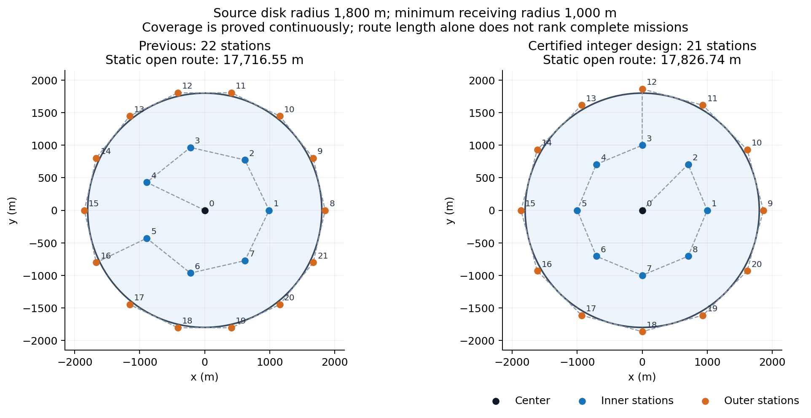
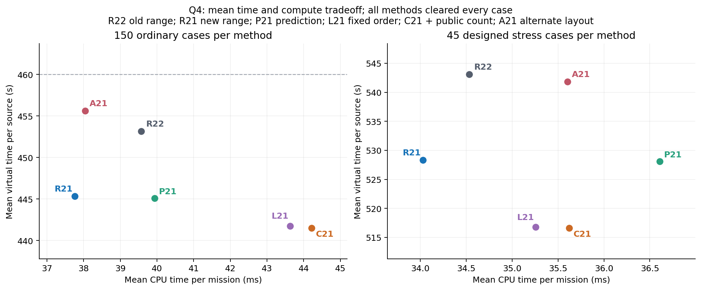

## 2026-09-11 最新：21站整数覆盖、精确边界证书与扫描计算优化

**本阶段新增7620次离线计分执行全部清除，累计59514次；其中3900次来自参数冻结后的新确认，正式请求0。** 找到了可证明覆盖全域、任意180°朝向和最小1000m接收半径的21站整数布局。新确认中，Q4简单距离版较同场景22站版，普通每源453.14→445.33秒、压力543.08→528.34秒，平均CPU和指令也降低。但81/195局变慢，最大总时间上升，普通改善区间包含零；完整goal继续active。

**当前值得作为下一轮主要候选的是Q3 range_area7，以及Q4 range_grid21_29；保留22站对照。** 前者本批238.95秒/源，后者445.33秒/源，达到本批240/460普通目标。Q4固定站序加公开源数删除count_locked_grid21_29均值更低，为441.52/516.62秒每源，但相对同布局简单距离版普通CPU高17.10%，且有1399.38秒个例回退，不自动当作最优。CLI仍需显式指定方法，没有偷偷改默认。

**1. 布点的实质进展：21站可行，最短静态路线仍不等于最好任务**

原22站为中心+7内+14外。重新检查搜索范围后发现，过去内圈半径只试了990和1050等较疏候选，并未充分检验接近1000m的范围。本轮冻结3组内/外圈点数、4内半径、4外圈余量、5相位，共240候选：36个有连续证书、204个有实际盲区见证、0未决。成功者为中心+8内+12外共21站。[原始枚举与证书](experiments/runs/2026-09-11_odd-ring-cover/summary.md)。

还得到可解释的否定结果：对“原点+两层等角规则圈”这个特定家族，7内+13外及6内+14外在任意合法半径/相位下都有径向间隙。前者内圈凸包能保证到达的上界901.506m，与外圈首次可接收阈值903.805m之间相差2.299m；后者间隙19.838m。已给出解析推导并用600组参数/相位和未修改后端检查。**这不证明任意21站布局不可能，也不证明21是全局最少。** [推导与范围](REGULAR_RING_OBSTRUCTION.md)。

对36个成功布局逐坐标取厘米/整数，重新检验72个实际坐标配置，68个获证、4个未决。4个未决布局在坐标轴方向恰与1800m圆域相切，旧证书要求严格位于凸包内部，无法处理等号。新算法将坐标与四叉分割统一放大到整数，以精确有向面积判定闭凸包；距离仍保留10^-5m余量。独立验证改用“每个角点属于选定站点的某个三角形”，并精确检查整个分割，4个全部获证。向内破坏1m后产生的真实盲区也被正确拒绝。[舍入记录](experiments/runs/2026-09-11_rounded-cover21/summary.md)、[相切点精确证明](experiments/runs/2026-09-11_closed-cover21/summary.md)、[整数证明细节](INTEGER_COVERAGE_GUARANTEE.md)。原来的4个“未决”记录保留，没有改写成反例或直接放宽浮点容差。

主候选grid21_29使用有严格凸包余量的整数坐标，避免依赖闭180°端点等号。源圆域仍为1800m，外部顶点仍保留；外部站点不能投影回源圆域。其整数坐标见[坐标CSV](experiments/runs/2026-09-11_cover21-confirmation/layout_grid21_29_coordinates.csv)，具体全域证书见[选定布局](experiments/runs/2026-09-11_cover21-confirmation/selected_layouts.json)。相切布局只在闭边界口径下解释；本地后端轴向边界测试通过，官方端点口径仍需实际软件核验。

新主布局的静态路线17826.74m，比旧22站17716.55m**长110.19m**；整局平均却更快、检测更少。这再次说明只优化TSP路长不是完整答案。两种布局还改变了检测位置与发现顺序，不能把全部收益简单归因为少一个站点。

**2. 另外两个已实现改进及其适用范围**

[lean_scan_policy.py](lean_scan_policy.py)把实际位置数组比较延后到需要证书或删除统计时，保留相同证书函数、历史顺序和所有原统计。1116次训练全清，570项前置检查通过；6对实际训练、2对新确认合计948个计分配对的实际请求、反馈和虚拟时间相同。新确认Q3普通/压力CPU降低1.40%/1.32%，Q4基础预测降低1.48%/1.99%。它减少计算，不虚构新的几何或虚拟时间收益；相对更简单range，Q3仍有5个普通局最多多2秒，CPU约高0.25%。

[public_count_scan_policy.py](public_count_scan_policy.py)只在已经实际发现16个不同频道后，才推断其余频道为空，并仅原地删除这些RF。不能因为10/13个已知源或多次无信号就这样结束。新的归纳条件是每个最初未知频道必须有真实测量，或在已到站后有16源空频道证书；旧的“每站至少4条未知RF”断言不能原样套用。[证明](PUBLIC_COUNT_SCAN_GUARANTEE.md)。744训练全清，780项前置检查通过，旧训练只多省9次RF，效果很小；新确认同为21站固定站序时，普通/压力再省95/18条RF，195局无虚拟回退，但CPU约多1.34%/1.04%。它相对匹配的原计划有删除收益，不支配其他路线。

这些是面向B题的独立几何/费用推导。ICRA论文的有界不确定区域和观测选择提供了建模启发，但21站覆盖、整数相切证书、有限接收负反馈及计费结论不是原文定理。[ICRA联系与来源](ICRA_CONNECTION.md)。

**3. 冻结后的全部指标**

1116次计算优化训练、744次公开源数训练、1860次布局训练，共3720计分。布局训练另有560项前置检查，包含20方法各18个旧压力及9个精确轴向多源场景的完整协议；这些预检不算成绩。训练后冻结20候选，再生成普通147—156=42+105+repeat、压力SeedSequence([42,120,problem,layout_index,count])，误差42+3200+100×problem+index，共3900次。没有依确认重新调参；157—166尚未生成。[冻结配置](experiments/runs/2026-09-11_cover21-confirmation/run_config.json)。

每个方法普通150/150、压力45/45全清，0策略异常、0区域不一致。每源数值是各局每源时间的算术平均，不换成源数加权平均。下表各格为普通/压力；CPU/墙钟包括策略、Client和本地后端，不含导入、初始化、场景生成和写盘，不能直接当作截图的整个程序时间。

|问题/方法|普通/压力每源秒|普通/压力平均总秒|普通/压力P95总秒|普通/压力最大总秒|普通/压力指令|普通/压力平均CPU秒|普通/压力平均墙钟秒|
|---|---:|---:|---:|---:|---:|---:|---:|
|Q3 peer_layout9_proxy|336.68/382.86|4465.49/4863.09|5177.08/6098.81|5371.30/6212.41|142.77/142.64|0.19567/0.18623|0.19586/0.18640|
|Q3 area_return1_7|239.76/282.01|3182.05/3530.59|3803.51/4711.01|4131.20/4757.92|140.76/141.87|0.02599/0.02562|0.02601/0.02564|
|Q3 range_area7|238.95/281.40|3171.31/3522.59|3792.71/4711.01|4119.20/4757.92|138.97/140.53|0.02591/0.02552|0.02594/0.02554|
|Q3 deferred_area7|238.96/281.40|3171.36/3522.59|3792.71/4711.01|4119.20/4757.92|138.97/140.53|0.02635/0.02593|0.02637/0.02595|
|Q3 lean_deferred_area7|238.96/281.40|3171.36/3522.59|3792.71/4711.01|4119.20/4757.92|138.97/140.53|0.02598/0.02559|0.02600/0.02560|
|Q4 width_convex22|463.58/547.10|6099.83/6855.10|6718.80/7631.72|6955.57/8306.03|310.52/341.47|0.04020/0.03496|0.04066/0.03530|
|Q4 range_convex22|453.14/543.08|5960.37/6802.97|6501.25/7538.92|6701.94/8276.03|287.23/332.76|0.03957/0.03453|0.03978/0.03497|
|Q4 predict_convex22|452.98/542.86|5958.33/6800.17|6496.88/7538.92|6701.94/8276.03|286.67/332.22|0.04199/0.03668|0.04211/0.03687|
|Q4 locked_full_convex22|459.97/540.39|6056.63/6757.15|6593.06/7615.69|6760.56/7904.84|313.41/350.11|0.04132/0.03529|0.04150/0.03545|
|Q4 count_locked_convex22|442.74/531.69|5825.03/6641.26|6440.90/7426.89|6647.56/7608.84|274.56/330.71|0.04308/0.03792|0.04319/0.03811|
|Q4 original_predict_convex22|452.98/542.86|5958.33/6800.17|6496.88/7538.92|6701.94/8276.03|286.67/332.22|0.04262/0.03743|0.04280/0.03768|
|Q4 lean_locked_convex22|442.95/531.86|5828.44/6643.95|6440.90/7426.89|6672.56/7608.84|275.11/331.13|0.04301/0.03739|0.04311/0.03756|
|Q4 width_grid21_29|451.47/531.42|5928.64/6653.47|6683.85/8146.11|6821.88/8621.15|287.19/325.24|0.03805/0.03409|0.03814/0.03421|
|Q4 range_grid21_29|445.33/528.34|5848.60/6611.47|6581.20/8057.51|6747.54/8495.15|273.81/318.20|0.03776/0.03403|0.03786/0.03415|
|Q4 predict_grid21_29|445.12/528.11|5846.01/6608.34|6581.63/8049.51|6747.54/8483.15|273.24/317.58|0.03993/0.03661|0.04002/0.03679|
|Q4 locked_full_grid21_29|458.29/524.81|6045.30/6522.12|6729.02/7562.85|7088.65/7672.55|310.89/329.47|0.04188/0.03337|0.04203/0.03356|
|Q4 count_locked_grid21_29|441.52/516.62|5817.54/6420.21|6397.29/7458.88|6705.65/7575.55|272.62/312.38|0.04422/0.03562|0.04442/0.03576|
|Q4 lean_locked_grid21_29|441.76/516.77|5821.45/6422.61|6406.49/7463.68|6729.65/7581.55|273.25/312.78|0.04363/0.03526|0.04374/0.03539|
|Q4 range_grid21_7|455.60/541.82|5978.14/6790.09|6654.58/7736.54|6859.16/8671.46|279.67/322.11|0.03804/0.03560|0.03816/0.03580|
|Q4 range_closed21_3|455.01/538.69|5982.64/6764.88|6535.59/7924.63|6746.62/8603.40|282.41/321.31|0.03795/0.03547|0.03819/0.03564|

初始化、最大墙钟及逐例时间另列于[完整汇总](experiments/runs/2026-09-11_cover21-confirmation/summary.csv)和[逐例CSV](experiments/runs/2026-09-11_cover21-confirmation/trials.csv)。三个训练矩阵的完整墙钟为44.76、27.90、73.31秒，新确认为182.82秒，包含采集/写盘。这些是整批时间，不能与截图单次1.19/1.86秒相除比较。当前全部使用本地CPU单线程。

图仅显示均值，不替代尾部、逐例回退或证明。[绘图源数据哈希](experiments/runs/2026-09-11_cover21-confirmation/figure_data.json)、[布局PDF](figures/cover21_layouts.pdf)、[权衡PDF](figures/cover21_tradeoffs.pdf)。

**4. 收益、退步与统计边界**

range_grid21_29相对range_convex22，普通/压力每源均值降低1.724%/2.715%，每局指令平均少13.42/14.56，CPU降低4.58%/1.46%。但普通61/150、压力20/45局变慢，最大个例增加993.54/862.06秒；最大总时间分别6701.94→6747.54、8276.03→8495.15秒。普通种子块95%重采样区间约[-0.253%,3.910%]，包含零，因此只说本批实测下降，不说稳定显著或逐例支配。

predict_grid21_29相对同布局range仅省普通/压力0.047%/0.042%，CPU多5.76%/7.57%，33/195局变慢、最坏9/4秒。两个最大回退已核实完全来自切频。count_locked_grid21_29相对同布局range均值低0.855%/2.218%，但81/195局变慢，最坏增加1399.38/527.13秒，普通CPU多17.10%。相对22站同类count_locked，普通0.275%改善区间[-1.027%,1.259%]也包含零；压力有2.834%改善、CPU约降6.05%，普通最大总时间仍增加58.09秒。

两个其他21站布局没有稳定优胜：grid21_7普通比22站range慢0.544%，其最坏普通/压力增加1708.61/1890.33秒；相切closed21_3普通慢0.414%，最坏增加1066.86/1890.68秒。不能因为静态路线较短或证书处理更精细就优先使用它们。

所有区间采用seed42、10000次种子块重采样，保留同一种子的15种普通条件；属于探索性比较，未作多重比较校正。人工压力集不是实际发生概率。[完整配对、区间和全部回退](experiments/runs/2026-09-11_cover21-confirmation/paired_analysis.json)。

本批Q3/Q4确已达到240/460普通目标，但相同未改range对照在117—156四批、每问题600普通局的均值为246.11/474.21。不能把本批整体更容易的部分算成算法收益，也不能拿这个四批合并替新21站证明跨批稳定性。[跨批描述统计](experiments/runs/2026-09-11_cover21-confirmation/cross_batch_reference.json)。

**5. 公开反馈诊断：扫描与定位必须共同决策**

20条已见轨迹重放不读真值、不增加成绩。range_grid21_29在clustered/adversarial-spatial/152中实际扫描8→12站，扫描多1013.09秒，源任务只少19.55秒，总计慢993.54秒；near_collinear/n16/positive中12→18站，扫描多1722.29秒、源任务少860.24秒，仍净慢862.06秒。

最大收益也展示了同一个机制：clustered/adversarial-negative/152中扫描17→10站，扫描少1962.79秒、源任务少660.02秒，共快2622.81秒；range_transition/n16/positive中22→12站，共快2607.98秒。固定站序的另一个压力退步则说明站数也不是充分指标：boundary_tangent/n16/spatial中扫描20→9站，扫描省1743.71秒，源任务却多2270.84秒，净慢527.13秒。[完整拆账与逐任务事件](experiments/runs/2026-09-11_cover21-confirmation/regression_public_diagnosis.json)。

后续需要研究下一检测位置、剩余扫描与清除任务的联合选择。只有公开反馈可参与决策，未来未出现的示向/真实源位置不可用于排名。源数上限也只在已有足够公开证据时生效。

**6. 保证、检查、失败记录和选题判断**

316项独立几何检查通过，包括204个实际盲区见证、600组解析障碍参数、全部新连续证书以及1m破坏反例。99项最终运行检查通过：80条公开反馈区域/MEC清除重放，全部3900确认轨迹的1000861条指令物理与费用重算，2871条删除计划展开及948个相同决策配对。[几何审计](experiments/runs/2026-09-11_odd-ring-cover/geometry_audit.json)、[运行审计](experiments/runs/2026-09-11_cover21-confirmation/final_checks.json)。

2871条删除展开覆盖52863个扫描段，删除60015条RF，其中262条来自公开16源空频道证书、2017条来自成对负点预测；3794条删除发生于实际位置尚未到站时。累计减费356452秒，每例精确等于5×删除数+切频减少数，物理路径一致。统计跨重复训练/方法，不是独立场景数或单局成绩。最少实际未知RF降到1条，但每站独立核验的真实检测/已证空频道合计至少5个，满足理论要求至少4个；没有用旧断言错误拒绝合法删除。[确认删除审计](experiments/runs/2026-09-11_cover21-confirmation/certified_deletion_audit.json)。

165531个示向回复最大绝对误差1.004999708°，受1.01°外包覆盖；本批重复地点回复0条，不能宣称新增同地点误差固定的重复实测证据。全轨迹方向核账在归一化点积绝对值≤3×10^-12的浮点边界内保留后端容差，不把它冒充任意实数的精确判定；整数覆盖另有精确证明和专门轴向闭边界协议检查。

4组自有127.0.0.1随机端口HTTP与进程内结果一致，其中公开源数方法特意复用已见的edge/iid/152，实际触发4次空频道删除；这是协议核查，未加入新成绩。2个cover21 CLI通过。原题PDF/两DOCX、同学原件、公共探索、两个上游副本均未变；前一51894清单237项先核验后保留。

本阶段计分和Python前置/运行审计无失败；另保留一次外层zsh收尾解析错误。原因判断是审计子进程运行时编辑了启动脚本，Python的99项结果已完整写出，随后外层继续读取时出错。已将分支改为exec并检查语法；计分与审计没有重跑或覆盖。[原错误与修正](experiments/runs/2026-09-11_cover21-confirmation/launcher_correction.md)。全部既有历史失败保留；最终归档核对代码、记录、图表来源与哈希，见[总清单](FINAL_MANIFEST.json)。

发现/清除/结束保证仍优先：Q3七站和Q4新21站都有连续发现证书，原方格h≤1000/√2且保留外顶点的保底证明继续成立。示向使用有界区域而非中心线交点，清除用全区域MEC/保证清除位置，累计主动预算耗尽后有有限光学覆盖。只在16源全清，或全域覆盖完成且全部已发现源清除后结束。21站最大半径<1950m、站数更少，不扩大源服务和打断预算，继承335136秒<100小时、9766请求的宽松上界。59514次全清不能替代这些论证。

**仍推荐B作为有条件的主候选，尚不能承诺国奖或全面超过同学一。** 新21站的连续证书、整数/闭边界区分和可证明费用删除，增加了可写入论文的实质内容。peer_layout9_proxy依然只是布点思想代理；没有同学完整源码就不能假装复现其全部实现。截图341.05/658.00与40/40缺少同口径条件，不能与离线均值直接判定官方胜负。

完整goal保持active。后续优先在新21站上减少扫描/源任务联动的千秒回退，验证有证明的切频重排，并考察更少点或非对称布局；不能由两规则圈障碍推出任意布局下界。真实程序时间还应补最小运行包的启动/配置读取/HTTP整体计时，避免只优化计时内循环。147—156已见，157—166与新压力流留待下次冻结。官方验证仍需用户实际提供运行环境、允许条件与本队完整轨迹；当前不注册账号、不使用报名身份、不消耗正式机会。
