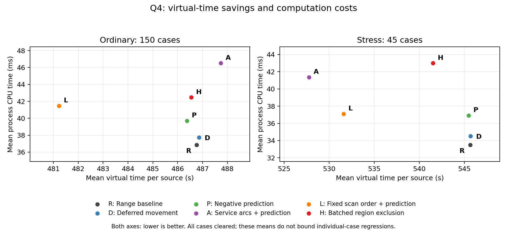

## 2026-09-11 最新：延后扫描移动、负反馈预测与相同决策下的计算加速

**本阶段新增8178次离线计分执行全部清除，其中3900次来自参数冻结后生成的新确认场景；累计51894次，正式请求0。完整goal保持active。** 最新普通确认Q3约247.52秒/源，Q4简单距离版486.77、预测版486.38秒/源；这一批未达到240/460门槛。不能用上一批达标、累计全清次数或最低均值宣布稳定达标、全指标胜出或官方超过截图。

当前有两种不同意义的改进：一是对具体原策略证明可以省去某些必无信号检测，同时保留其后续移动和清除计划；二是在实际决策完全相同的对照中，减少证书与历史约束的计算开销。**Q4固定站序加预测本批普通均值最低，但有77/195局比简单距离版慢，不作为全面更优方法。** 实用对照继续保留range_area7/range_width015；数学主线可以使用延后移动的证书删除。命令行需显式指定方法，本轮未自动更换默认策略。

**1. 与ICRA参考文献的联系及本轮独立推导**

[Tokekar、Isler的原文](https://tokekar.com/pubs/tokekar2013asensor.pdf)把带有界误差的示向表示为角锥，研究最坏情况下交集区域的直径/面积和有效传感器的选择。与B题第一、二问的建模出发点高度相近。但原文的静态布点问题没有B题的有限接收、180°盲区、移动切频费用和未知数量结束条件。三传感器结论有位置、角误差和观测有效性条件，不意味着三个精确坐标，也不证明任意三次测量足以清除。没有证据确认它是官方题源。[完整联系、原文定位与前轮实现](ICRA_CONNECTION.md)。

本轮进一步利用“对整个可行区域成立才执行”的原则，实现以下工作。具体负反馈和费用推导属于我们针对B题的独立工作，不归给ICRA原文。

- **将首条必无信号RF携带的移动延后。** 共20频道、至多16个源，每个开始的扫描段至少有4个未知频道必须真实检测，所以本站一定有保留请求。删除已知源的必无信号RF后，可以把前往本站的同一段移动延后到首条保留RF；期间只维护内部计划，不改真实客户端位置/频道/时间，不插入源任务。每个保留测量和扫描段末恢复原行动计划。相对对应无删除版，移动段不变、微秒舍入不变，少n条RF时总费用精确少5n秒加切频减少数。相对任意不同路线或CPU不存在这种保证。[证明与适用范围](DEFERRED_SCAN_GUARANTEE.md)、[实现](deferred_skip_policy.py)。
- **用两个可信负点预测下一点仍无信号。** 对候选源g，若历史无信号点a、b均不比拟测点q离g远，且线段[q,g]与[a,b]相交，那么“q收到信号”会与至少一个负点矛盾。五个线性半平面给出充分条件；仅当包含真实源的整个多边形都严格满足时才省去RF。实际/推得的负点单独记忆，推断标记不冒充实测反馈，也不裁剪区域或改变原策略排名。退化时放弃该证书。单个no_signal不能被解释成频道不存在。[独立展开核验](deferred_replay.py)。
- **相同决策下减少计算。** 负点预测先在一个真实多边形顶点检查廉价必要条件，最终接纳仍调用原完整证书；历史约束用矩阵批量筛选可能有效的集合，再按原顺序裁剪，每次区域改变后重新筛选剩余集合。不能只在最初区域筛选一次：后续裁剪产生的新顶点可能使原来无效的约束重新有效。[预测预筛](CHEAP_PREDICTION_GUARD.md)、[批处理等价范围](BATCHED_HISTORY_EQUIVALENCE.md)、[预测代码](cheap_prediction_policy.py)、[历史批处理代码](batched_history_policy.py)。

**2. 训练、冻结、全部指标与真实运行时间**

先完成24方法×93旧训练=2232次延后扫描实验、10方法×93=930次历史批处理、12方法×93=1116次预测预筛；前置检查分别2016、1091、1038项通过。Q3负点预测在训练没有额外省去RF而增加CPU，未晋级；Q4保留4/8点窗口及相同决策的原计算版作对照。没有根据本轮确认结果重新调参。[训练记录](experiments/runs/2026-09-11_deferred-scans/summary.md)、[批处理记录](experiments/runs/2026-09-11_batched-history/summary.md)、[预测记录](experiments/runs/2026-09-11_cheap-prediction/summary.md)。

随后冻结20方法，每个方法使用150普通和45压力场景，共3900次，全部清除，0策略异常和0区域不一致。普通种子137—146=42+95+repeat；压力SeedSequence([42,119,problem,layout_index,count])，误差42+2900+100×problem+index。压力包括边界朝外/切向、近共线、远端聚簇、接收范围转换，源数10/13/16与正/负端点及空间误差；接收半径最小等合法边界保留。147—156尚未生成。[冻结配置](experiments/runs/2026-09-11_deferred-confirmation/run_config.json)。

每个方法普通150/150、压力45/45全清。下表每格为普通/压力；每源耗时是各局每源时间的算术平均，没有换成源数加权平均。全部方法均已列入，包括负结果和CPU对照。

|问题/方法|普通/压力每源秒|普通/压力平均总秒|普通/压力P95总秒|普通/压力最大总秒|普通/压力指令|普通/压力平均墙钟秒|
|---|---:|---:|---:|---:|---:|---:|
|Q3 peer_layout9_proxy|362.42/376.91|4443.27/4774.68|4959.55/5950.29|5274.81/6058.19|139.87/142.07|0.1818/0.1818|
|Q3 area_return1_7|248.51/281.03|3043.03/3522.98|3674.00/4735.21|3829.76/4844.24|139.83/143.24|0.0248/0.0260|
|Q3 range_area7|247.52/280.70|3030.60/3518.71|3665.32/4735.21|3829.76/4844.24|137.75/142.53|0.0247/0.0260|
|Q3 faithful_area7|247.69/280.70|3032.66/3518.71|3667.40/4735.21|3829.76/4844.24|138.10/142.53|0.0247/0.0260|
|Q3 deferred_area7|247.52/280.70|3030.62/3518.71|3665.32/4735.21|3829.76/4844.24|137.75/142.53|0.0251/0.0264|
|Q4 width40_f015_22|497.26/550.21|6031.70/6883.84|6712.30/7527.48|6896.74/8349.22|319.57/348.96|0.0372/0.0336|
|Q4 range_width015|486.77/545.64|5904.75/6828.22|6576.90/7524.53|6878.74/8307.22|298.35/339.64|0.0369/0.0335|
|Q4 faithful_width015|487.59/546.25|5915.09/6834.91|6588.05/7524.53|6885.74/8307.22|299.93/340.69|0.0370/0.0338|
|Q4 deferred_width015|486.86/545.70|5905.97/6828.84|6576.90/7524.53|6879.74/8307.22|298.35/339.64|0.0378/0.0346|
|Q4 predict8_width015|486.38/545.47|5900.08/6826.20|6576.90/7524.53|6879.74/8301.22|297.34/339.20|0.0440/0.0406|
|Q4 arc05_noskip_width015|496.11/531.12|6031.68/6649.45|6805.20/7579.52|7024.12/8176.21|312.90/332.47|0.0441/0.0384|
|Q4 deferred_arc05_width015|487.96/527.97|5931.71/6610.79|6699.62/7417.35|6927.55/8134.21|296.03/325.93|0.0447/0.0393|
|Q4 locked_noskip_width015|498.81/541.21|6087.71/6752.48|6774.05/7705.74|7153.14/7880.79|326.59/350.13|0.0392/0.0343|
|Q4 deferred_locked_width015|481.65/532.37|5870.74/6642.24|6558.12/7421.10|6720.14/7527.79|289.97/331.53|0.0395/0.0349|
|Q4 cheap_predict4_width015|486.51/545.62|5901.65/6827.91|6576.90/7524.53|6879.74/8301.22|297.61/339.49|0.0392/0.0360|
|Q4 cheap_predict8_width015|486.38/545.47|5900.08/6826.20|6576.90/7524.53|6879.74/8301.22|297.34/339.20|0.0398/0.0370|
|Q4 cheap_predict8_arc05_width015|487.73/527.76|5928.90/6608.19|6698.78/7417.35|6927.55/8128.21|295.55/325.49|0.0466/0.0414|
|Q4 cheap_predict8_locked_width015|481.23/531.62|5864.90/6632.97|6544.02/7415.10|6696.14/7521.79|288.97/329.96|0.0416/0.0371|
|Q4 history_first8_width015|486.54/541.52|5904.39/6767.50|6580.24/7449.63|6861.78/8214.19|297.93/338.13|0.0451/0.0471|
|Q4 batch_history_first8_width015|486.54/541.52|5904.39/6767.50|6580.24/7449.63|6861.78/8214.19|297.93/338.13|0.0425/0.0431|

墙钟/CPU包括策略、Client和本地后端的任务执行，不含导入、场景生成与写盘；初始化、CPU均值/最大值及完整逐例数值另列。[完整汇总CSV](experiments/runs/2026-09-11_deferred-confirmation/summary.csv)、[逐例CSV](experiments/runs/2026-09-11_deferred-confirmation/trials.csv)。三个训练矩阵实际墙钟分别86.54、49.74、50.06秒，确认矩阵181.05秒；这些包含采集写盘的整批时间不能与截图单次程序时间混用。所有计分采用本地CPU单线程，基础seed42。

图中只比较均值，不能替代下文逐例回退和最坏保证；原始数据哈希保存在[绘图数据](experiments/runs/2026-09-11_deferred-confirmation/figure_data.json)，可导出[矢量PDF](figures/deferred_tradeoffs.pdf)。

同一个未改range策略合并117—146三批、每问题450普通局，Q3为248.49、Q4为481.24秒/源。上一批238.15/447.84达标是真实的单批结果，但尚未跨批稳定达到240/460。该合并只是已有结果的描述统计，不是新确认，也不支持新预测策略的跨批效果。[跨批统计](experiments/runs/2026-09-11_deferred-confirmation/cross_batch_reference.json)。

**3. 哪些收益成立，哪些比较仍然退步**

延后移动Q3相对area原版普通/压力每源均值降低0.395%/0.118%；Q4相对width原版降低2.091%/0.820%。相对上一轮只删原地RF的faithful，Q3普通再降0.068%、压力相同，Q4普通/压力再降0.150%/0.102%，这些配对没有虚拟时间回退。但延后版相对简单range并未支配：Q3四局多1秒，虽然表中四舍五入都为247.52；Q4普通/压力分别63/150和10/45局更慢，最大多10/5秒，CPU也稍高。不能将表中相同小数误写成逐动作完全相同。

Q4廉价8点预测相对延后版，普通/压力再省0.100%/0.041%，195局没有虚拟时间回退；相对简单range只有0.080%/0.031%的均值改善，38/195局更慢、最大7/5秒，CPU增加约7.79%/10.26%。因此它提供更多可证明的删除，却仍不是相对range的全指标改善。

计算加速的比较更清楚：廉价8点预测与未预筛8点预测在195局中实际请求、虚拟时间、结果和原统计相同，普通/压力平均CPU降低9.57%/9.04%。历史first8批处理与原first8同样195局决策相同，CPU降低5.71%/8.72%。连同训练共1413个实际计分配对都通过逐请求等价审计。此处只主张本机实测计算节省，不声称任意机器或任意尺度浮点输入有固定加速比。[训练CPU对照](experiments/runs/2026-09-11_deferred-confirmation/training_cpu_effects.json)。

其他候选必须保留局限：

|Q4候选，相对range_width015|普通/压力每源均值改善|变慢局数（共195）|最坏普通/压力增加秒|普通/压力CPU增加|
|---|---:|---:|---:|---:|
|cheap_predict8_width015|0.080%/0.031%|38|7.00/5.00|7.79%/10.26%|
|cheap_predict8_arc05_width015|−0.199%/3.277%|71|2215.61/1404.16|26.26%/23.48%|
|cheap_predict8_locked_width015|1.138%/2.570%|77|1095.88/1539.47|12.58%/10.78%|
|batch_history_first8_width015|0.045%/0.755%|48|1373.95/129.00|15.26%/28.36%|

固定站序的普通均值虽最低，按十个种子块重采样的95%区间约[-1.661%,3.177%]，包含零；历史批处理相对range普通改善区间[-0.212%,0.317%]也包含零。重采样10000次、seed42，保持同一种子的15种普通条件成组；这是探索性比较，未作多重比较校正，压力样本也不是实际发生概率。[完整配对、区间和回退列表](experiments/runs/2026-09-11_deferred-confirmation/paired_analysis.json)。

**4. 只用公开反馈拆解大回退**

完成15条已见轨迹的诊断重放，不读真值、不增加成绩。预测版相对range的两例最大7秒/5秒回退，测量/清除和移动费用相同，差额全部来自切频；下一步可以研究保持计划的频道重排。

更大回退属于联合任务问题：clustered/iid/145中，arc预测版扫描9→19站，扫描多2040.60秒、源任务多175.01秒，总计慢2215.61秒；near_collinear/n16/spatial中，range为13站，arc/locked分别19/17站，总计慢1404.16/1539.47秒。历史批处理在clustered/adversarial-positive/145中扫描9→16站，源任务虽少133.25秒，扫描却多1507.20秒，净慢1373.95秒。这些例子说明局部定位区域缩小或局部路线改善不保证整局更快。[各动作拆账与完整诊断](experiments/runs/2026-09-11_deferred-confirmation/regression_public_diagnosis.json)。

**5. 全域保证、独立核查与剩余工作**

3987条训练/确认删除配对完成原计划展开核验，覆盖77872个扫描段；实际删除73147条RF，其中1643条来自成对负点预测、6530条发生在实际位置尚未到站时，累计减费433091秒，每例都精确等于5×删除数+省下的切频数，物理移动路径一致。该总和跨重复训练/方法，不是单局时间或独立场景数。每扫描段的未知频道实际请求由独立Client轨迹核验，本批至少5条，证明仅要求至少4条。[训练删除审计](experiments/runs/2026-09-11_deferred-scans/certified_deletion_audit.json)、[预测删除审计](experiments/runs/2026-09-11_cheap-prediction/certified_deletion_audit.json)、[确认删除审计](experiments/runs/2026-09-11_deferred-confirmation/certified_deletion_audit.json)。

1057项最终运行检查通过，含1028条可行区域公开反馈重放、全部954个实际历史收缩执行、上述3987条展开和1413个相同计算结果配对；3900条确认轨迹的1040868条指令全部重新核算物理和费用。157513个示向回复最大绝对误差1.004999750°，落在1.01°舍入外包内。本批重复地点回复0条，不能宣称新增了同地点误差固定的重复实测证据；该规则仍由后端审计及先前专门检查支持。[最终运行审计](experiments/runs/2026-09-11_deferred-confirmation/final_checks.json)。

Q3七站连续覆盖、Q4二十二站连续方向覆盖、原方格保底均保留。只在16个已知源全部清除，或全域保证扫描完成且所有已发现源都清除时结束。定位使用1.01°误差外包、MEC全区域清除证书、累计主动预算及有限光学兜底；新删除不扩大动作空间、预算或移动段，原335136秒<100小时、9766条请求的粗上界继续成立。成功次数不替代这些证明。

4组自有127.0.0.1随机端口HTTP等价检查、2个deferred系列CLI通过；没有调用正式服务。原PDF/两DOCX、同学原件、公共探索和两个上游副本未变。上一43716清单219项在改入口前逐项核验并保留。本阶段计分/前置/运行审计无失败，既有历史失败和修正记录继续保留。归档单独检查文档链接、代码语法、轨迹/评分夹具哈希，并在关闭日志后索引，见[总清单](FINAL_MANIFEST.json)。

**仍推荐B作为有条件的主候选，但不承诺国奖或全面超过同学一。** 区域几何、连续发现、有限完成以及可证明的费用删除能构成清晰的数学与实验主线。免疫/群智能等算法名称不是评价依据。peer_layout9_proxy仍仅复现可识别的布点思想，无完整同学源码就不能称其完整实现；本批Q3对它的150个普通局均更快，但45个压力局中仍有9局变慢；其压力平均指令142.07还略低于我们的142.53，进一步否定全指标已胜出的说法。

截图341.05/658.00、40/40及程序时间缺少同口径逐局条件；本队仍缺用户实际提供的官方运行环境、允许的运行条件和本队完整官方轨迹。当前不自动注册或消耗测试机会。137—146已使用，未来147—156及新压力流留待下一次冻结。下一步优先减少删除证书本身的CPU、研究有证明的切频重排和16源上限下的站内空频道删除，再检验尚未枚举的中心+7内+13外共21站布局。后者只是待证候选；前轮408个不同21站候选失败不证明21站不可能。所有新方案仍需完整覆盖/结束论证和冻结确认，goal继续active。
