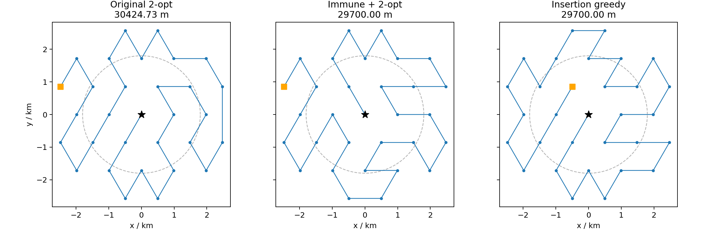
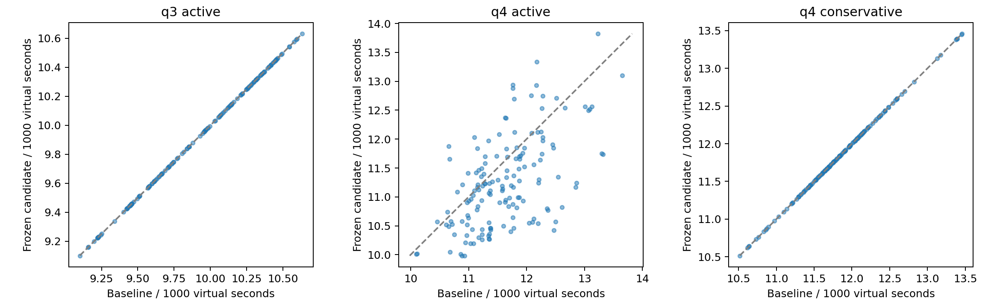

# 新增智能算法与更优解：离线比较及确认

2026-09-10启动，跨日完成；基础种子42；所有写入B/。本轮新增3069次配对比较及900次独立确认，共3969次离线执行。全清次数分别为3069和900，异常分别为0和0。不含任何官方测试。

**结果一：第四问三角格从30424.73m改为29700m，缩短724.73m（2.3820%），达到该31点集的全局最短路长。** 多种群体混合算法和插入贪心均达到下界；不能据本例认定复杂群体算法优于简单插入贪心。固定点集的最优性不代表覆盖点布局或完整任务的全局最优。

**结果二：完整任务收益需要在线评估。** 动态重排只用当前已接受位置和剩余必需站点，补偿主动定位/清除造成的绕行。最短的固定路线与最短的完整任务不是同一个目标。

**实现与预算**

代码：[route_algorithms.py](../../../route_algorithms.py)、[adaptive_routes.py](../../../adaptive_routes.py)。具体克隆、信息素、速度、火花机制和参数见[算法说明](algorithm_notes.md)。六个随机算法为显式混合版本，共用有限2-opt；主试验种子42..46，每算法最多100000次候选比较，达到下界提前停止。完整路径评分与增量评分并非等CPU工作量，墙钟单独报告；初解计算计入墙钟，未计入搜索预算。旧遗传的实现和历史结果保留，本轮增强遗传并非旧参数原样重跑。

| 算法 | 重复数 | 最好/最差路线/m | 达到下界 | 平均预计算/ms |
|---|---:|---:|---:|---:|
| 最近邻贪心 | 1 | 33588.92/33588.92 | 0/1 | 6.55 |
| 插入贪心 | 1 | 29700.00/29700.00 | 1/1 | 7.68 |
| 原2-opt | 1 | 30424.73/30424.73 | 0/1 | 6.08 |
| 增强遗传+2-opt | 5 | 29700.00/29700.00 | 5/5 | 8.43 |
| 免疫+2-opt | 5 | 29700.00/29700.00 | 5/5 | 9.64 |
| 蚁群+2-opt | 5 | 29700.00/29700.00 | 5/5 | 14.03 |
| 粒子群+2-opt | 5 | 29700.00/29700.00 | 5/5 | 11.99 |
| 烟花+2-opt | 5 | 29700.00/29700.00 | 5/5 | 10.86 |
| 迭代搜索+2-opt | 5 | 29700.00/29700.00 | 5/5 | 9.02 |

另外三个点集的原2-opt均已达到下界：650方格31200m、700裁剪方格31669.848481m、Q3三角格30600m。它们的随机方法在验证初解达到下界后提前结束，没有声称在那里进行了有效群体搜索。

**最优性证明**

每个必需点互不相同且包含原点，存在最优路线先访问原点；若某路线后访原点，将它提前并用三角不等式跳过其原位置不增路长。因此只需固定原点首站的开放排列。Q4三角格任意两点距离≥990m，31点要走30条边，故L≥29700m；新路线每边恰990m，达到下界。Q3同理18×1700=30600m。650方格48×650=31200m。

裁剪方格需加强下界：以格点坐标和奇偶染色，与原点同色的A有21点、B有24点。从A出发的排列最多容纳21个B段，因此至少24−21=3条同色相邻边。同色最短边≥700√2m，异色边≥700m，故L≥44×700+3×700(√2−1)=31669.848481m，原2-opt恰达到。这里的「最优」针对保留全部既定检测点的开放路线。

**局部搜索消融**

另做6算法×5种子×2模式，共60次优化，双方比较预算均为10000，仍用共同2-opt初解。这是删除搜索过程中的局部改进，不是删除初解中的2-opt；主实验的100000预算不能与此表直接混排。数据见[ablation.csv](ablation.csv)。

| 算法 | 无局部搜索：达下界/5，平均路长/m | 有局部搜索：达下界/5，平均路长/m |
|---|---:|---:|
| 增强遗传 | 0/5，30424.73 | 5/5，29700.00 |
| 免疫 | 0/5，30424.73 | 5/5，29700.00 |
| 蚁群 | 2/5，30134.84 | 4/5，29844.95 |
| 粒子群 | 0/5，30424.73 | 4/5，29844.95 |
| 烟花 | 0/5，30424.73 | 4/5，29844.95 |
| 迭代搜索 | 0/5，30424.73 | 5/5，29700.00 |

消融结果用于解释局部搜索的贡献。本轮只优化19/31/45/49点的小型结构点集，没有据此提出新的通用元启发式算法。

**普通场景比较：每策略75例**

同学原版进程内协议，3种位置分布×5种固定空间误差×5个新种子52..56。真实源数、位置、半径、方向不传给策略；只在外部评分器统计全清和每源时间。路线先按静态长度冻结，再开始完整任务，见[routes_frozen_before_evaluation.json](routes_frozen_before_evaluation.json)。同一组下各算法全程定位与光学兜底参数相同。

Q3三角格主动：

| 算法 | 全清 | 总虚拟时间均值/s | 每源均值/s | 最慢总时间/s | 平均指令 | 平均/最大墙钟/s |
|---|---:|---:|---:|---:|---:|---:|
| 最近邻贪心 | 75/75 | 9575.5 | 786.2 | 11211.3 | 248.6 | 0.176/0.318 |
| 插入贪心 | 75/75 | 9648.1 | 787.7 | 11430.9 | 244.3 | 0.173/0.303 |
| 原2-opt | 75/75 | 9575.5 | 786.2 | 11211.3 | 248.6 | 0.175/0.271 |
| 增强遗传+2-opt | 75/75 | 9575.5 | 786.2 | 11211.3 | 248.6 | 0.175/0.268 |
| 免疫+2-opt | 75/75 | 9575.5 | 786.2 | 11211.3 | 248.6 | 0.175/0.270 |
| 蚁群+2-opt | 75/75 | 9575.5 | 786.2 | 11211.3 | 248.6 | 0.175/0.285 |
| 粒子群+2-opt | 75/75 | 9575.5 | 786.2 | 11211.3 | 248.6 | 0.175/0.271 |
| 烟花+2-opt | 75/75 | 9575.5 | 786.2 | 11211.3 | 248.6 | 0.175/0.271 |
| 迭代搜索+2-opt | 75/75 | 9575.5 | 786.2 | 11211.3 | 248.6 | 0.175/0.293 |
| 在线贪心重排 | 75/75 | 8759.8 | 732.3 | 11344.5 | 223.6 | 0.174/0.256 |
| 在线2-opt重排 | 75/75 | 8522.7 | 711.9 | 10678.5 | 222.9 | 0.174/0.253 |

Q4三角格主动：

| 算法 | 全清 | 总虚拟时间均值/s | 每源均值/s | 最慢总时间/s | 平均指令 | 平均/最大墙钟/s |
|---|---:|---:|---:|---:|---:|---:|
| 最近邻贪心 | 75/75 | 11844.9 | 973.9 | 14041.8 | 446.6 | 0.419/0.677 |
| 插入贪心 | 75/75 | 11792.2 | 963.4 | 13018.4 | 479.1 | 0.433/1.107 |
| 原2-opt | 75/75 | 11514.6 | 944.3 | 13991.8 | 454.4 | 0.437/0.737 |
| 增强遗传+2-opt | 75/75 | 11215.8 | 917.2 | 12505.9 | 424.9 | 0.434/0.778 |
| 免疫+2-opt | 75/75 | 11239.0 | 923.4 | 12851.2 | 423.0 | 0.453/1.130 |
| 蚁群+2-opt | 75/75 | 11774.1 | 961.2 | 12981.5 | 470.1 | 0.429/0.887 |
| 粒子群+2-opt | 75/75 | 11258.0 | 921.7 | 12697.0 | 429.4 | 0.481/1.057 |
| 烟花+2-opt | 75/75 | 10939.7 | 897.8 | 12413.1 | 395.0 | 0.441/0.733 |
| 迭代搜索+2-opt | 75/75 | 11131.6 | 910.8 | 12810.6 | 427.4 | 0.449/0.714 |
| 在线贪心重排 | 75/75 | 10847.8 | 895.7 | 12905.9 | 397.6 | 0.416/0.726 |
| 在线2-opt重排 | 75/75 | 11038.2 | 903.7 | 13435.1 | 418.3 | 0.411/0.609 |

Q4裁剪方格保守：

| 算法 | 全清 | 总虚拟时间均值/s | 每源均值/s | 最慢总时间/s | 平均指令 | 平均/最大墙钟/s |
|---|---:|---:|---:|---:|---:|---:|
| 最近邻贪心 | 75/75 | 11714.3 | 963.3 | 12869.1 | 641.9 | 0.062/0.125 |
| 插入贪心 | 75/75 | 12043.9 | 985.9 | 12960.5 | 575.3 | 0.058/0.117 |
| 原2-opt | 75/75 | 11573.3 | 951.5 | 12787.1 | 643.9 | 0.061/0.086 |
| 增强遗传+2-opt | 75/75 | 11573.3 | 951.5 | 12787.1 | 643.9 | 0.061/0.081 |
| 免疫+2-opt | 75/75 | 11573.3 | 951.5 | 12787.1 | 643.9 | 0.060/0.078 |
| 蚁群+2-opt | 75/75 | 11573.3 | 951.5 | 12787.1 | 643.9 | 0.061/0.137 |
| 粒子群+2-opt | 75/75 | 11573.3 | 951.5 | 12787.1 | 643.9 | 0.062/0.183 |
| 烟花+2-opt | 75/75 | 11573.3 | 951.5 | 12787.1 | 643.9 | 0.061/0.145 |
| 迭代搜索+2-opt | 75/75 | 11573.3 | 951.5 | 12787.1 | 643.9 | 0.061/0.097 |
| 在线贪心重排 | 75/75 | 11163.7 | 922.1 | 13457.3 | 601.4 | 0.063/0.209 |
| 在线2-opt重排 | 75/75 | 11005.5 | 908.2 | 12921.6 | 600.7 | 0.080/0.197 |

**压力场景：每策略18例，单独报告**

边界朝外且接收半径1000m、近共线且半径1000m、10/16源未知数量且频道20位于远端。每类都配正/负/空间变号的±1°固定误差。Q4每场至少一个全向源，其他源朝外；没有把定向源误当全向。误差是静态压力场，不是针对策略求出的全局最坏攻击。

Q3：

| 算法 | 全清 | 总虚拟时间均值/s | 每源均值/s | 最慢总时间/s | 平均指令 | 平均/最大墙钟/s |
|---|---:|---:|---:|---:|---:|---:|
| 最近邻贪心 | 18/18 | 8673.1 | 718.8 | 9856.5 | 221.3 | 0.194/0.287 |
| 插入贪心 | 18/18 | 8178.9 | 688.2 | 9730.1 | 213.0 | 0.185/0.277 |
| 原2-opt | 18/18 | 8673.1 | 718.8 | 9856.5 | 221.3 | 0.186/0.277 |
| 增强遗传+2-opt | 18/18 | 8673.1 | 718.8 | 9856.5 | 221.3 | 0.185/0.284 |
| 免疫+2-opt | 18/18 | 8673.1 | 718.8 | 9856.5 | 221.3 | 0.187/0.294 |
| 蚁群+2-opt | 18/18 | 8673.1 | 718.8 | 9856.5 | 221.3 | 0.187/0.278 |
| 粒子群+2-opt | 18/18 | 8673.1 | 718.8 | 9856.5 | 221.3 | 0.186/0.286 |
| 烟花+2-opt | 18/18 | 8673.1 | 718.8 | 9856.5 | 221.3 | 0.186/0.279 |
| 迭代搜索+2-opt | 18/18 | 8673.1 | 718.8 | 9856.5 | 221.3 | 0.189/0.320 |
| 在线贪心重排 | 18/18 | 7922.6 | 675.6 | 10045.4 | 201.1 | 0.185/0.282 |
| 在线2-opt重排 | 18/18 | 7987.7 | 673.2 | 9913.5 | 203.9 | 0.187/0.279 |

Q4主动：

| 算法 | 全清 | 总虚拟时间均值/s | 每源均值/s | 最慢总时间/s | 平均指令 | 平均/最大墙钟/s |
|---|---:|---:|---:|---:|---:|---:|
| 最近邻贪心 | 18/18 | 13191.7 | 1071.0 | 15556.5 | 622.9 | 0.404/0.752 |
| 插入贪心 | 18/18 | 11739.2 | 959.5 | 14497.8 | 575.6 | 0.384/0.541 |
| 原2-opt | 18/18 | 12084.5 | 983.9 | 15332.8 | 608.6 | 0.377/0.550 |
| 增强遗传+2-opt | 18/18 | 12490.4 | 1009.8 | 14804.0 | 628.5 | 0.380/0.536 |
| 免疫+2-opt | 18/18 | 12843.7 | 1032.5 | 15569.1 | 669.9 | 0.388/0.578 |
| 蚁群+2-opt | 18/18 | 11961.1 | 976.3 | 14925.5 | 576.2 | 0.374/0.542 |
| 粒子群+2-opt | 18/18 | 13236.3 | 1068.6 | 14995.4 | 668.1 | 0.384/0.754 |
| 烟花+2-opt | 18/18 | 12231.0 | 987.3 | 14154.7 | 583.0 | 0.399/1.014 |
| 迭代搜索+2-opt | 18/18 | 11713.8 | 954.3 | 13166.5 | 588.8 | 0.392/0.682 |
| 在线贪心重排 | 18/18 | 12631.6 | 1034.1 | 15815.7 | 617.1 | 0.367/0.555 |
| 在线2-opt重排 | 18/18 | 11933.1 | 975.0 | 14809.0 | 596.2 | 0.403/0.527 |

Q4保守：

| 算法 | 全清 | 总虚拟时间均值/s | 每源均值/s | 最慢总时间/s | 平均指令 | 平均/最大墙钟/s |
|---|---:|---:|---:|---:|---:|---:|
| 最近邻贪心 | 18/18 | 11780.8 | 958.1 | 12259.1 | 651.6 | 0.074/0.108 |
| 插入贪心 | 18/18 | 12070.4 | 982.4 | 12814.9 | 636.8 | 0.075/0.112 |
| 原2-opt | 18/18 | 11723.2 | 953.6 | 12120.1 | 649.7 | 0.075/0.114 |
| 增强遗传+2-opt | 18/18 | 11723.2 | 953.6 | 12120.1 | 649.7 | 0.075/0.133 |
| 免疫+2-opt | 18/18 | 11723.2 | 953.6 | 12120.1 | 649.7 | 0.072/0.102 |
| 蚁群+2-opt | 18/18 | 11723.2 | 953.6 | 12120.1 | 649.7 | 0.073/0.121 |
| 粒子群+2-opt | 18/18 | 11723.2 | 953.6 | 12120.1 | 649.7 | 0.072/0.109 |
| 烟花+2-opt | 18/18 | 11723.2 | 953.6 | 12120.1 | 649.7 | 0.074/0.108 |
| 迭代搜索+2-opt | 18/18 | 11723.2 | 953.6 | 12120.1 | 649.7 | 0.075/0.112 |
| 在线贪心重排 | 18/18 | 11049.3 | 903.6 | 13183.3 | 579.7 | 0.071/0.094 |
| 在线2-opt重排 | 18/18 | 10918.8 | 894.7 | 12765.9 | 574.3 | 0.095/0.223 |

**冻结选择后的独立确认：每任务150例**

主比较集可用于候选选择，因此单独使用此前未用的种子57..66。先执行[已记录的选择规则](confirmation_plan.md)：全清且普通/压力两类的样本最大时间均不劣于原2-opt，再按普通场景平均每源时间选优。选中的Q3、Q4主动、Q4保守分别为原2-opt、烟花+2-opt、原2-opt。选择结果在确认集第一例前写入[冻结记录](confirmation_selection.json)，确认后不调参换路线。

| 算法 | 全清 | 总虚拟时间均值/s | 每源均值/s | 最慢总时间/s | 平均指令 | 平均/最大墙钟/s |
|---|---:|---:|---:|---:|---:|---:|
| 原2-opt | 150/150 | 9932.9 | 817.8 | 10632.0 | 248.4 | 0.368/0.658 |
| 原2-opt（冻结选择） | 150/150 | 9932.9 | 817.8 | 10632.0 | 248.4 | 0.371/0.632 |

| 算法 | 全清 | 总虚拟时间均值/s | 每源均值/s | 最慢总时间/s | 平均指令 | 平均/最大墙钟/s |
|---|---:|---:|---:|---:|---:|---:|
| 原2-opt | 150/150 | 11631.0 | 956.9 | 13649.3 | 420.9 | 0.585/0.959 |
| 烟花+2-opt（冻结选择） | 150/150 | 11257.5 | 924.8 | 13823.1 | 400.5 | 0.564/0.953 |

| 算法 | 全清 | 总虚拟时间均值/s | 每源均值/s | 最慢总时间/s | 平均指令 | 平均/最大墙钟/s |
|---|---:|---:|---:|---:|---:|---:|
| 原2-opt | 150/150 | 11846.3 | 975.5 | 13458.3 | 626.7 | 0.068/0.257 |
| 原2-opt（冻结选择） | 150/150 | 11846.3 | 975.5 | 13458.3 | 626.7 | 0.067/0.090 |

q3_active：平均每源时间下降0.00%，按场景布局整体重采样的95%bootstrap区间[0.00%, 0.00%]；0/150例更快，0例更慢，最大单例退化0.0s（uniform__iid__57）。

q4_active：平均每源时间下降3.36%，按场景布局整体重采样的95%bootstrap区间[1.63%, 5.06%]；111/150例更快，39例更慢，最大单例退化1217.3s（clustered__adversarial-positive__58）。

q4_conservative：平均每源时间下降0.00%，按场景布局整体重采样的95%bootstrap区间[0.00%, 0.00%]；0/150例更快，0例更慢，最大单例退化0.0s（uniform__iid__57）。

**尾部确认没有保持初筛优势：** Q4烟花在确认集的最慢总时间从基线13649.3s变为13823.1s，增加173.8s（1.27%）。这是均值收益与尾部代价的候选，不是对基线逐场景支配的策略；不因均值下降就替换原Q4保守配置。

若冻结选择仍是原2-opt，该任务的baseline/selected是真实执行两次相同策略，不能当作两个独立算法的比较或额外泛化证据。本次Q3和Q4保守均属此类，900次确认中600次为这两组重复基线；Q4主动的300次才是150对不同策略比较。动态重排的平均收益保留在主比较表，但因压力尾部未通过预设门槛，未在此确认集单独验证。

同一位置/种子的五个误差条件相关，bootstrap按完整布局分块，保留这种相关性；该区间描述合成分布的有限样本不确定性，不是所有场景保证，更不是官方分数区间。平均每源是逐局time/cleared后平均，另存pooled每源口径，二者不混用。

**失败与退化、发现/清除/结束保证**

未清除、异常与性能退化分别记录。即便全清率100%，某些场景仍会更慢；[主比较退化例](performance_regressions.csv)和[确认集退化例](confirmation/performance_regressions.csv)列出全部相对基线更慢的案例，原始轨迹可复放。光学兜底和最大三次主动检测参数未改，不能宣称每例都提速。

静态重排保留每个必需顶点；动态重排每次从剩余集合取一个并删除，最多原点集大小次。全覆盖的几何条件不受顺序影响，未知频道仍逐站扫描，达到16个公开上界或完整覆盖且全部已发现源清除才结束。原有每源≤108个光学兜底点的有限清除保证仍适用。已有宽松238102秒虚拟时间界仅用站点数、转移距离和每源动作上限，未假定特定顺序，故同样适用于本轮重排。它不包含无限断网重试，也不把有限压力样本当成严格最坏证明。

静态优化应在进入会话之前完成。本轮记录单次预计算和在线墙钟；动态重排的计算发生在会话内、CPU与墙钟均计入，但计算本身不增加题面虚拟移动时间。在线测时可能受并行单线程消融和其他主机负载影响，毫秒级差异不宜作为算法优劣依据。

**官方验证与选B建议**

本轮没有官方连接、账户注册、报名身份或正式机会消耗。同学核心代码冻结为c477d366，macOS handoff的ededa9e13版本核心相同；handoff并不意味着这台Mac已具备官方Windows环境。仍需用户真实提供Windows/VM、官方软件和本队演练条件后，验证当前候选的接口、现实限时、最慢运行与官方日志要求。

继续推荐将B作为主候选：目前有可证明的覆盖与结束、四个固定点集的最短路线证书、可复现的群体算法消融和反馈驱动改进。国奖可行性仍由官方真实表现和论文质量决定；合成全清次数不能折算获奖概率。论文应写清“覆盖保证+误差集合定位+动态重排”的问题结构，给复杂算法和简单基线相同评价机会。

原1932次实验及旧策略包保留。本轮新增结果以本目录为准；旧包尚未包含新算法，不应把旧包当作已验证的新候选入口。

**一个可复核的性能失败例**

clustered__adversarial-positive__58中，两策略均清除14源；烟花路线使总虚拟时间由10658.034s升到11875.312s。移动增加3066.391m，测量增加50次，切换增加48次，光学清除调用增加102次。按题面计时，约613.278+250+48+306=1217.278s，微秒舍入带来小于0.001s的差异。两者成功清除数相同，因此成功附加时间抵消。主动再测无信号次数由2升到4，光学兜底调用由3升到105；更短巡检路引出的观察顺序和兜底成本抵消了路长收益。指标与逐条轨迹见[案例记录](confirmation/worst_paired_case.json)。
