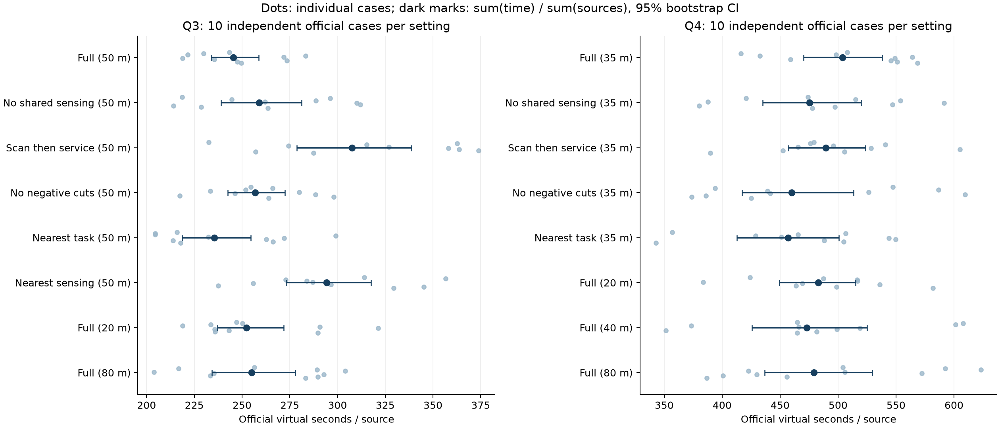
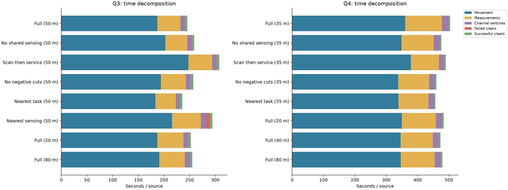
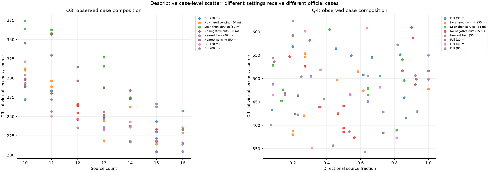

# 官方模拟器消融实验结果

已完成 16 组 × 10 局 = 160 局官方演练，另有 2 局接入校验。批次全排除 160/160 局。本档案不包含本地 mock 评分，也未使用正式测试额度。

## 先读结论

这批官方数据还不足以证明所有模块都能提高效率。14 项主比较在 Holm 多重比较校正后均未达到 0.05 水平；不能把均值排序直接写成算法优劣或最优门限。

问题三的两个较大观察差异是：扫描与服务分阶段比完整策略慢 25.32%，测向最近邻慢 19.92%。后者累计失败排除 301 次，完整策略为 7 次。原始差值的未校正 bootstrap 区间均为正，但主随机化检验的校正后 p 值分别为 0.1777、0.1367，证据强度应如实区分。

问题四尤其不能照着原始均值排名：完整策略组平均每局 12.4 个源、定向源占 62.9%；分阶段组平均 13.8 个源、定向源占 53.6%。原始均值中分阶段反而快 2.81%，而预先记录的源构成调整模型估计其慢 47.67 秒/源。这表明结论对案例构成和模型假设敏感，调整结果仅是辅助证据。

源构成调整后的辅助分析支持问题三分阶段、问题三测向最近邻、问题四分阶段存在较大代价；它不能替代未通过多重校正的主比较。其余机制及门限变化在本批样本下尚不能下肯定结论。

20 米完整策略在问题三、四各 10 局均无失败排除尝试；这不等于证明它最快。问题四默认完整策略的双负反馈裁剪只触发 2 次，关闭该裁剪组触发 0 次，样本对这一机制的检验很弱。

## 计分与实验口径

计时直接取官方保存的虚拟微秒数。本文组内秒/源 = 总虚拟秒数 / 总源数，是本实验的汇总口径；同时保留逐局成绩和逐局等权均值（summary.csv 的 mean_case_seconds_per_source），不将组间汇总称为官方另行给出的总分。每次调用的位移、测量、切频、成功/失败排除耗时与官方返回值逐项核对，误差仅在微秒舍入范围。

官方每次分配新案例，无法把这些数据表述为同一场景配对消融。排程采用 10 个随机运行顺序区组，每区组包含全部 16 组。2 局接入校验不参与下列比较。

每组只有 10 局，案例几何分布不可观测。表中 95% 区间为独立案例 bootstrap 百分位区间；14 项与本题默认完整策略的比较同时报告 Holm 校正的随机化检验。未显著不等于效果为零，也不能凭均值更低认定门限更优。

## 原始官方成绩

|问题|设置|全排除局数|源总数|定向源占比|秒/源|95% 区间|失败排除次数|
|---|---|---:|---:|---:|---:|---|---:|
|3|完整策略，50米|10/10|134|0.0%|245.474|[233.871, 258.799]|7|
|3|关闭顺路补测，50米|10/10|125|0.0%|259.022|[238.957, 281.165]|6|
|3|扫描与服务分阶段，50米|10/10|127|0.0%|307.619|[278.714, 338.792]|0|
|3|关闭负反馈位置裁剪，50米|10/10|122|0.0%|256.980|[242.638, 272.572]|3|
|3|在线路线改为最近邻，50米|10/10|141|0.0%|235.488|[218.591, 254.669]|1|
|3|测向选点改为保收最近邻，50米|10/10|124|0.0%|294.384|[273.192, 317.544]|301|
|3|完整策略，20米|10/10|125|0.0%|252.246|[237.220, 271.918]|0|
|3|完整策略，80米|10/10|119|0.0%|255.027|[234.151, 277.860]|3|
|4|完整策略，35米|10/10|124|62.9%|503.752|[470.389, 538.136]|0|
|4|关闭顺路补测，35米|10/10|128|40.6%|475.518|[435.112, 520.056]|2|
|4|扫描与服务分阶段，35米|10/10|138|53.6%|489.581|[456.898, 523.622]|0|
|4|关闭负反馈位置裁剪，35米|10/10|132|50.8%|460.093|[417.262, 513.415]|0|
|4|在线路线改为最近邻，35米|10/10|136|50.7%|456.781|[412.779, 500.855]|0|
|4|完整策略，20米|10/10|129|55.8%|482.839|[449.316, 515.126]|0|
|4|完整策略，40米|10/10|129|53.5%|472.909|[425.577, 525.098]|1|
|4|完整策略，80米|10/10|127|44.1%|479.226|[436.850, 529.467]|5|

## 相对默认完整策略的变化

问题三默认门限 50 米，问题四默认门限 35 米。正数表示变体更慢。差值区间是未作多重比较校正的 95% 区间；推断结论参考 Holm 校正后的 p 值。

|问题|变体|差值（秒/源）|变化|差值 95% 区间|Holm p|
|---|---|---:|---:|---|---:|
|3|no_share__g50|+13.548|+5.52%|[-10.690, +38.978]|1.0000|
|3|scan_then_service__g50|+62.146|+25.32%|[+30.537, +95.978]|0.1777|
|3|no_negative__g50|+11.506|+4.69%|[-7.410, +31.196]|1.0000|
|3|online_nearest__g50|-9.986|-4.07%|[-31.702, +12.990]|1.0000|
|3|nearest_sensing__g50|+48.910|+19.92%|[+24.050, +74.484]|0.1367|
|3|full__g20|+6.772|+2.76%|[-13.706, +29.682]|1.0000|
|3|full__g80|+9.553|+3.89%|[-15.047, +35.080]|1.0000|
|4|no_share__g35|-28.234|-5.60%|[-81.168, +25.516]|1.0000|
|4|scan_then_service__g35|-14.171|-2.81%|[-61.849, +33.238]|1.0000|
|4|no_negative__g35|-43.659|-8.67%|[-98.712, +18.035]|1.0000|
|4|online_nearest__g35|-46.971|-9.32%|[-102.476, +7.829]|1.0000|
|4|full__g20|-20.913|-4.15%|[-68.485, +25.572]|1.0000|
|4|full__g40|-30.843|-6.12%|[-90.201, +31.578]|1.0000|
|4|full__g80|-24.526|-4.87%|[-79.944, +35.176]|1.0000|

## 案例构成敏感性分析

另以总时间为因变量，纳入设置和源数量，问题四再纳入定向源数量，采用 HC3 稳健标准误。差值除以本题所有局的平均源数，得到参考案例下的秒/源差值。这依赖线性加性模型，不能消除未观测的几何难度；它是敏感性分析，不能取代原始官方结果。统计方法及确定时点见 analysis_plan.json。

|问题|变体|调整后差值（秒/源）|95% 区间|Holm p|
|---|---|---:|---|---:|
|3|no_share__g50|+1.489|[-15.256, +18.235]|1.0000|
|3|scan_then_service__g50|+52.881|[+35.384, +70.379]|<0.0001|
|3|no_negative__g50|-4.734|[-18.126, +8.657]|1.0000|
|3|online_nearest__g50|-1.873|[-22.361, +18.616]|1.0000|
|3|nearest_sensing__g50|+34.560|[+16.470, +52.651]|0.0035|
|3|full__g20|-5.173|[-21.285, +10.938]|1.0000|
|3|full__g80|-10.778|[-27.836, +6.280]|1.0000|
|4|no_share__g35|-0.155|[-18.359, +18.048]|1.0000|
|4|scan_then_service__g35|+47.672|[+25.300, +70.045]|0.0008|
|4|no_negative__g35|-5.004|[-24.872, +14.863]|1.0000|
|4|online_nearest__g35|+6.886|[-15.370, +29.142]|1.0000|
|4|full__g20|+3.467|[-17.989, +24.922]|1.0000|
|4|full__g40|-5.193|[-29.953, +19.568]|1.0000|
|4|full__g80|-2.246|[-25.751, +21.259]|1.0000|

## 机制是否真正触发

消融组名称并不保证每局都会用到被移除的机制。下表汇总实际运行计数；若完整策略与对应消融组都未遇到某分支，这批案例就不能识别该分支的因果收益。

|问题|设置|共享补测次数|全向负反馈裁剪次数|双负反馈分支次数|被拦截的反馈调用次数|测向最近邻评分调用次数|
|---|---|---:|---:|---:|---:|---:|
|3|full__g50|195|13|0|0|0|
|3|no_share__g50|0|9|0|0|0|
|3|scan_then_service__g50|31|7|0|0|0|
|3|no_negative__g50|147|0|0|1194|0|
|3|online_nearest__g50|214|2|0|0|0|
|3|nearest_sensing__g50|256|12|0|0|154|
|3|full__g20|213|9|0|0|0|
|3|full__g80|187|13|0|0|0|
|4|full__g35|145|0|2|0|0|
|4|no_share__g35|0|0|1|0|0|
|4|scan_then_service__g35|30|0|0|0|0|
|4|no_negative__g35|175|0|0|0|0|
|4|online_nearest__g35|178|0|1|0|0|
|4|full__g20|149|0|0|0|0|
|4|full__g40|161|0|4|0|0|
|4|full__g80|193|0|1|0|0|

计数解释：问题四关闭负反馈组的“双负反馈分支次数”指进入该分支的次数，实际裁剪已替换为恒等操作；其拦截次数应与分支次数一致。问题三的拦截计数覆盖反馈记录入口的调用，不等于本可裁剪的次数。关闭共享补测的所有局均核验共享次数为零。

## 核验与文件

- `trials.csv`：全部 162 局，含 calibration/validation 标识、案例编码、源构成和耗时分解。
- `summary.csv`：16 组原始官方汇总；`comparisons.csv`：14 项原始比较。
- `adjusted_sensitivity.csv`：源构成调整后的辅助比较。
- `mechanism_checks.csv`：各变体的实际机制触发次数。
- `runs.jsonl`：官方权威成绩行及机器狗统计；`audit.json`：逐局核验。
- `config.json`：冻结排程；`runtime_manifest.json`：冻结代码散列。
- `jlogs/`：官方保存的加密行为日志原件。
- `evidence/`：集中归档的逐局请求响应、官方成绩、完成截图、UI 文本和统计字段导出。
- `evidence_index.json`：归档文件散列及完整自动化证据的原始路径；原始路径还保留全部界面过程和官方统计数据库的只读副本。

