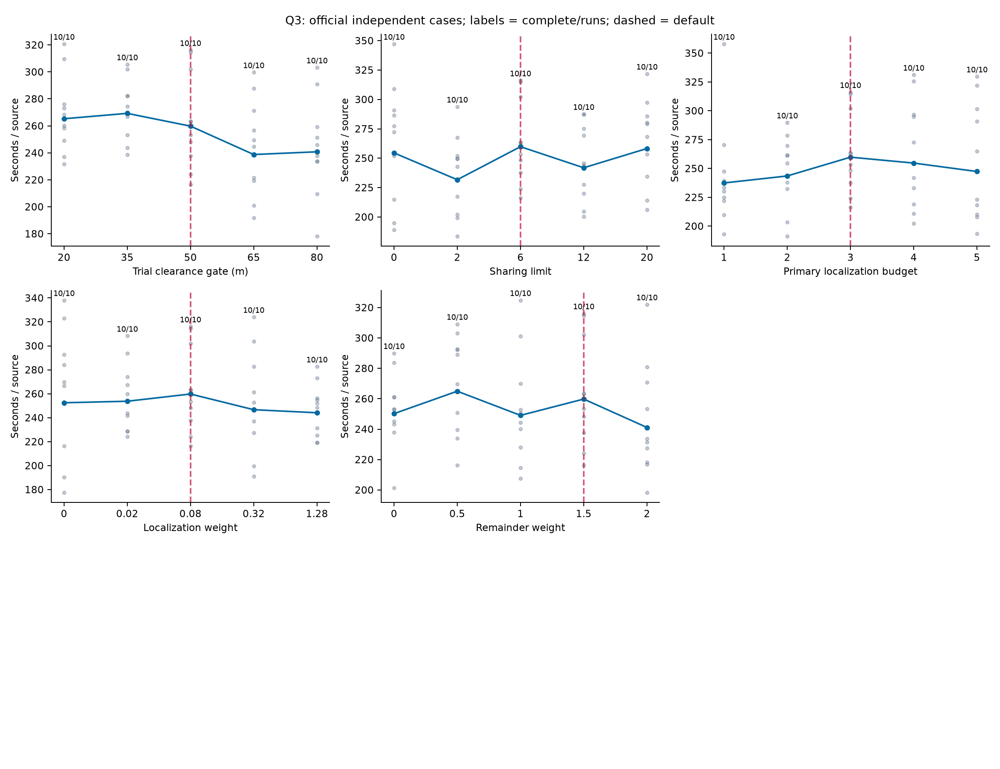
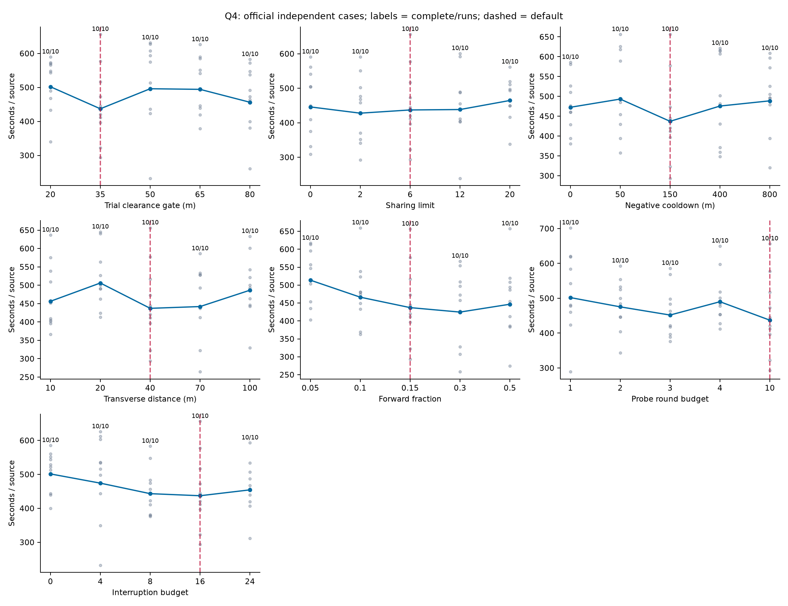
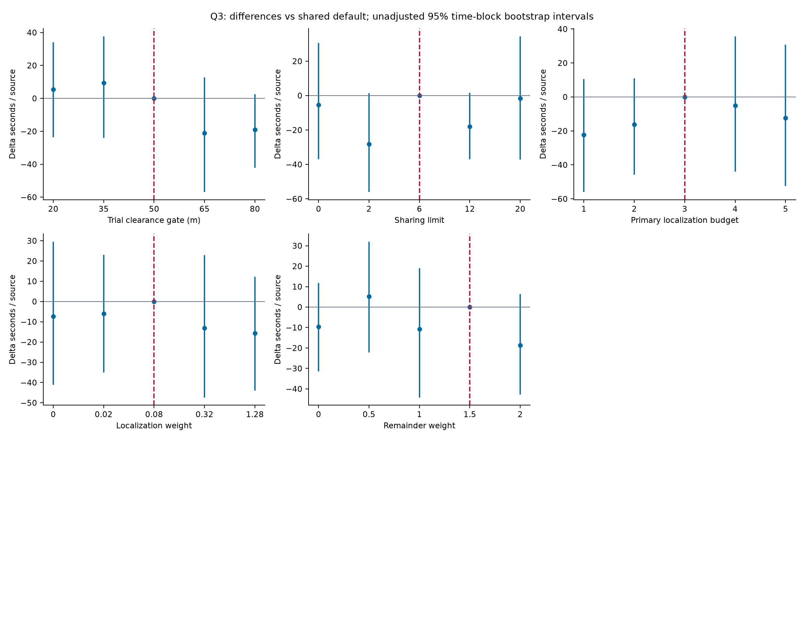
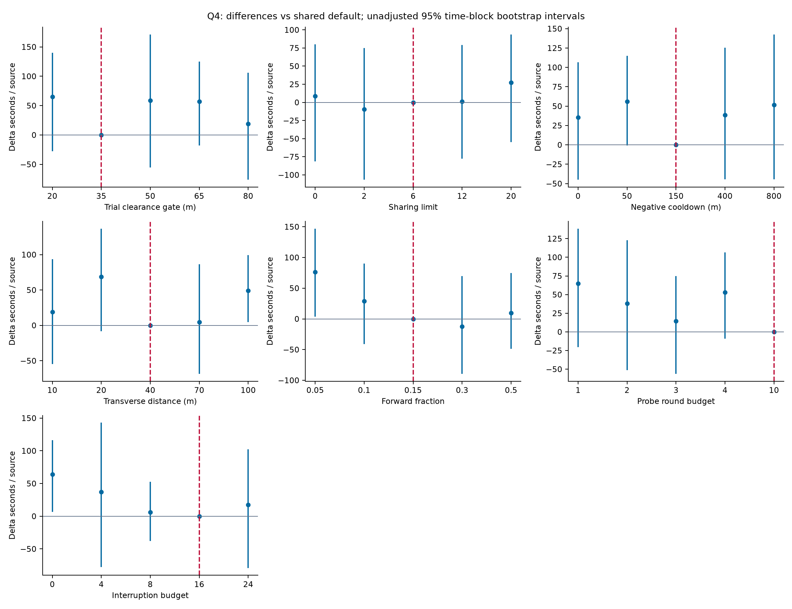
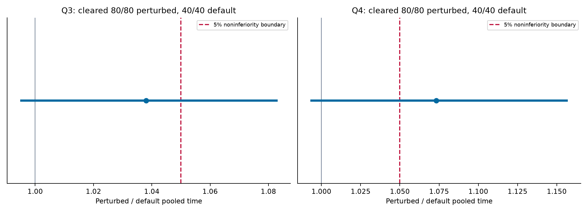
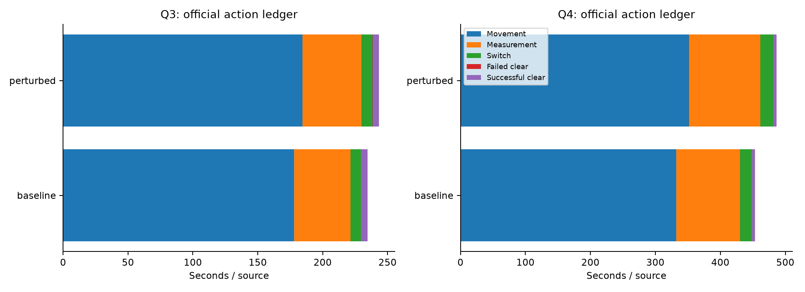

# 官方模拟器参数敏感性与联合扰动实验

已归档 742/742 局：接入 2/2，宽扫 500/500，联合扰动 240/240。

**数据全部来自原官方模拟器演练。未运行mock，未使用正式测试额度。** 每次演练为独立新案例；随机区组平衡运行顺序，不构成相同场景配对。

## 预设判据与结论

两题分别要求联合扰动80/80全清、同期默认40/40全清，且扰动/默认源加权耗时比的单侧97.5% bootstrap上界小于1.05。区组重采样100000次；两题采用Bonferroni校正。配置和排程均在敏感性结果出现之前冻结。

|题目|扰动全清|默认全清|扰动秒/源|默认秒/源|耗时比|上界97.5%|全清概率下界97.5%|主要结论|
|---|---:|---:|---:|---:|---:|---:|---:|---|
|Q3|80/80|40/40|243.502|234.585|1.03801|1.08312|95.494%|证据不足以确认退化不超过5%|
|Q4|80/80|40/40|486.424|453.223|1.07326|1.15711|95.494%|观测退化至少5%，判据未通过|

当前数据未同时满足两题的全部预设稳健性判据，不能写成“已证明成功不依赖参数偶然性”。完成可靠性、观测效率及统计精度应分开解释。

这些结论仅针对预设离散参数分布和官方演练案例；不代表每一种组合或连续参数域均已充分验证。概率下界依赖独立、分布稳定的案例假设；bootstrap为有限样本近似，不是严格最坏情况保证。

## 宽范围单因素结果

|题目|设置|全清/局数|秒/源|失手/源|
|---|---|---:|---:|---:|
|Q3|baseline|10/10|259.795|0.0574|
|Q3|localization_weight=0|10/10|252.482|0.0159|
|Q3|localization_weight=0.02|10/10|253.752|0.0079|
|Q3|localization_weight=0.32|10/10|246.689|0.0078|
|Q3|localization_weight=1.28|10/10|244.136|0.0469|
|Q3|max_active=1|10/10|237.450|0.2647|
|Q3|max_active=2|10/10|243.515|0.0240|
|Q3|max_active=4|10/10|254.689|0.0234|
|Q3|max_active=5|10/10|247.373|0.0312|
|Q3|remainder_weight=0|10/10|250.207|0.0161|
|Q3|remainder_weight=0.5|10/10|264.970|0.0086|
|Q3|remainder_weight=1|10/10|249.067|0.0312|
|Q3|remainder_weight=2|10/10|241.123|0.0388|
|Q3|share_limit=0|10/10|254.487|0.0079|
|Q3|share_limit=12|10/10|241.857|0.0299|
|Q3|share_limit=2|10/10|231.702|0.0365|
|Q3|share_limit=20|10/10|258.243|0.0085|
|Q3|trial_radius=20|10/10|265.278|0.0000|
|Q3|trial_radius=35|10/10|269.267|0.0086|
|Q3|trial_radius=65|10/10|238.762|0.0238|
|Q3|trial_radius=80|10/10|240.771|0.0229|
|Q4|baseline|10/10|437.173|0.0146|
|Q4|fraction=0.05|10/10|513.724|0.0081|
|Q4|fraction=0.1|10/10|466.266|0.0000|
|Q4|fraction=0.3|10/10|424.704|0.0000|
|Q4|fraction=0.5|10/10|446.626|0.0075|
|Q4|pause_limit=0|10/10|501.424|0.0000|
|Q4|pause_limit=24|10/10|454.470|0.0000|
|Q4|pause_limit=4|10/10|474.270|0.0000|
|Q4|pause_limit=8|10/10|443.265|0.0000|
|Q4|share_cooldown=0|10/10|472.530|0.0000|
|Q4|share_cooldown=400|10/10|475.654|0.0076|
|Q4|share_cooldown=50|10/10|493.213|0.0236|
|Q4|share_cooldown=800|10/10|488.769|0.0079|
|Q4|share_limit=0|10/10|445.939|0.0073|
|Q4|share_limit=12|10/10|438.375|0.0000|
|Q4|share_limit=2|10/10|427.850|0.0144|
|Q4|share_limit=20|10/10|464.627|0.0233|
|Q4|steps=1|10/10|502.009|3.1825|
|Q4|steps=2|10/10|475.379|0.0079|
|Q4|steps=3|10/10|451.868|0.0000|
|Q4|steps=4|10/10|490.111|0.0080|
|Q4|transverse_m=10|10/10|456.361|0.0224|
|Q4|transverse_m=100|10/10|486.520|0.0000|
|Q4|transverse_m=20|10/10|506.119|0.0081|
|Q4|transverse_m=70|10/10|441.995|0.0076|
|Q4|trial_radius=20|10/10|502.008|0.0000|
|Q4|trial_radius=50|10/10|496.177|0.0083|
|Q4|trial_radius=65|10/10|494.330|0.0323|
|Q4|trial_radius=80|10/10|456.359|0.0543|

宽扫每设置10局，主要用于识别响应趋势、预算门槛和明显退化。全部原始散点和失败均保留；差异未显著不能表述为不敏感。48项比较的原始区间和Holm校正结果见comparisons.csv。

10个区组的双侧精确随机化检验最小p值为2/1024；同时校正48项比较时，最小Holm调整值也不低于0.09375，因此本轮宽扫无法给出5%水平的多重比较显著性结论。图中横轴为离散测试值，连线不表示连续参数响应的插值模型。

## 证据与局限

- trials.csv：逐局官方成绩、源数、动作账本、实际参数及证据目录。
- config.json / analysis_plan.json：预先冻结的742局排程、宽扫范围、联合扰动分布及主要判据。
- summary.csv / comparisons.csv / robustness.json：全部组汇总、宽扫对比和独立联合扰动结果。
- adjusted_robustness.csv：按公开源数量、Q4定向数及时间区组调整的HC3辅助比较；不替代主判据。
- audit.json：官方成绩、案例码、动作成本和参数归属核验；jlogs/与jlog_manifest.json保存官方加密日志原件。
- 运行中消融结果未与本实验合并；随机种子只控制参数与顺序，不控制官方场景。
- 未全清的短耗时不构成效率优势；没有相同案例默认组，不能计算逐局因果退化或宣称逐局占优。
- Q3使用完整定位循环，未记录逐源轮数；round_counters_recorded为false，预算触达数与最大轮数留空。Q4记录的是交错探测轮数。两题active_measurements均为真实主定位测量总数。
- optical_fallback_calls统计光学覆盖点的逐次清除尝试，不能解释为进入兜底的源数；Q4的packet_fallbacks才统计进入兜底的源任务数。
- 未记录的内部计数保持空值；预算未触发与参数路径无效不等于普遍鲁棒。

