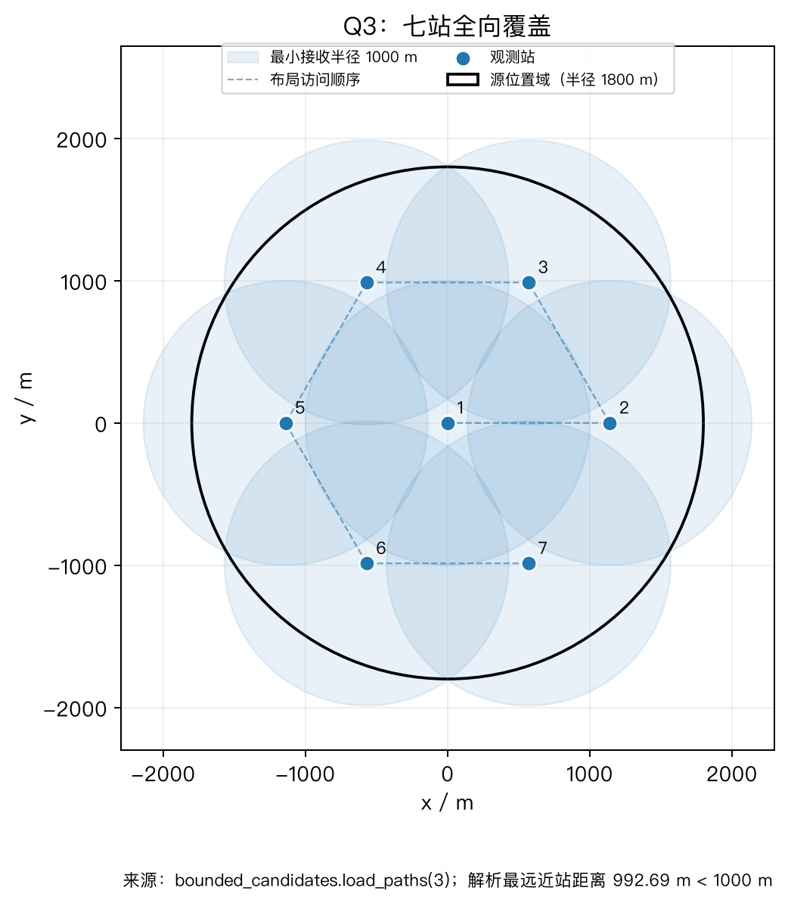
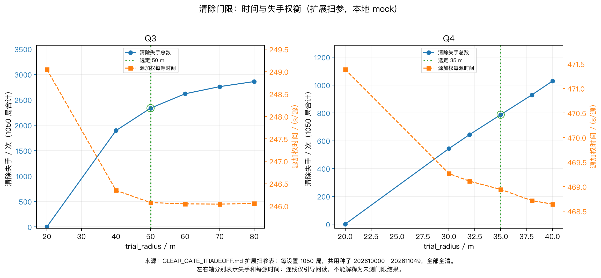
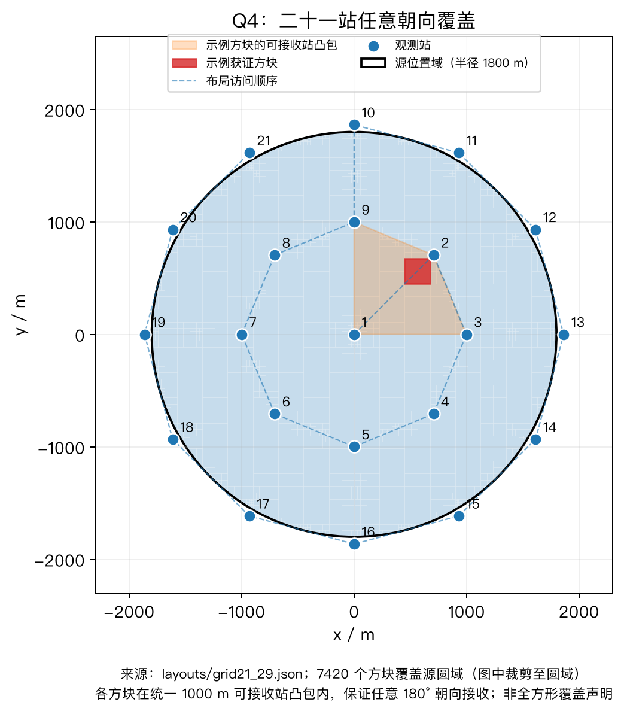
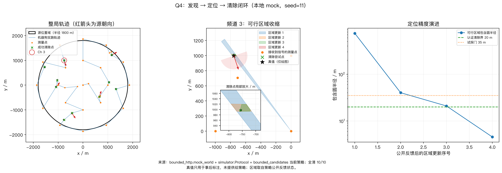
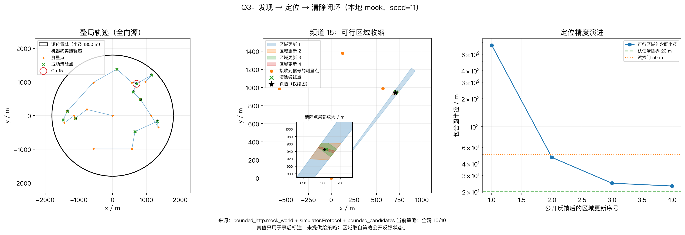
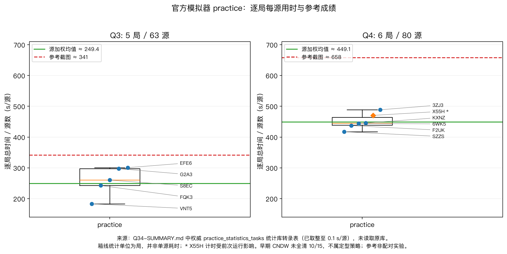
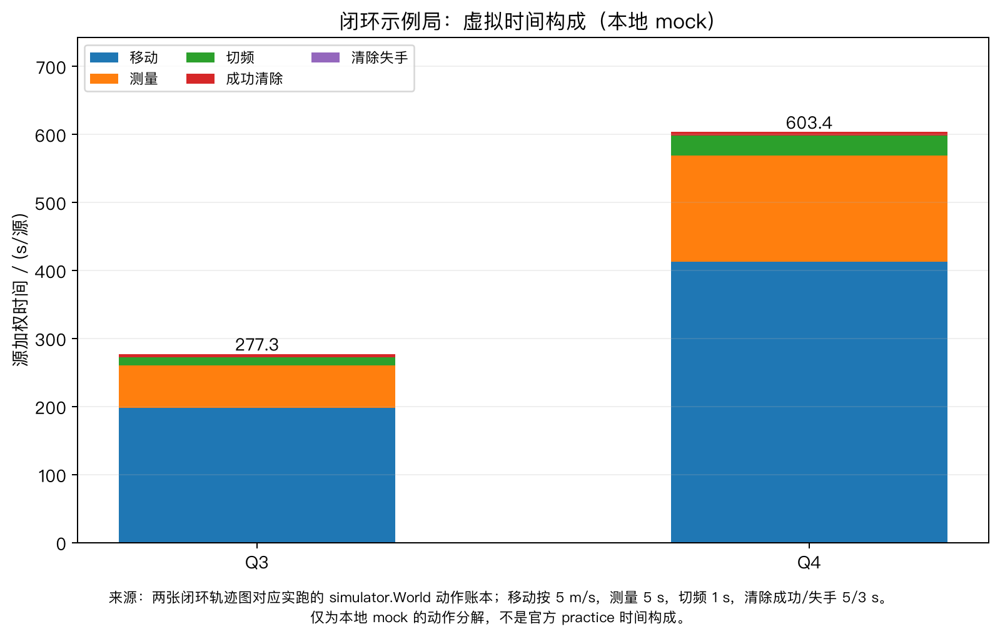

# 有界示向误差下干扰源的定位、覆盖搜索与协同清除

## 摘要

干扰源接收距离有限，示向误差有界，且源数与部分源的发射朝向未知。为使定位结果能够直接指导清除行动，建立“位置可行集—发现覆盖—序贯清除”的统一模型，在保留相容源位置的基础上协调扫描、补充测向和移动。

针对问题1，将前向角锥交集转化为半平面交，计算定位区域直径与最小覆盖圆，并给出直径圆覆盖的充要判据。合法三站构造得到直径20米、最小覆盖半径11.547005米的等边三角形，证明直径圆并非总能覆盖；四站纯几何基准得到直径41.321338米、最小覆盖半径20.660669米。结合Jung界，将统一20米清除落点的存在性转化为最小覆盖半径不超过20米，区分直径34.641016米以下、34.641016—40米及40米以上的三类判定。

针对问题2，利用首次正反馈对固定未知接收半径进行条件化，导出完整保收域，并将未知第二读数下的最坏直径转化为共同反馈源位置对的最大距离。标准首测场景的保收域精确约化为四圆盘交；固定第二点 $(750,400)$ 米时，连续最坏直径认证区间为 $[147.221645,147.319912]$ 米。另证明移动预算仅10米时，最坏剩余歧义至少1000米。固定点认证不等于第二点全局最优，网格与局部细化仍只给出数值候选。

针对问题3，以原点和半径1140米的六个等角站构成七站布局，全域最近站距离上界为992.689147米，保证最小接收半径下的全向发现。针对问题4，将任意180度发射朝向的发现要求转化为局部可接收站的凸包包含条件，二十一站实际整数布局通过连续单元证书复核；成对探测的双负反馈进一步提供安全截断依据。两问均以位置外包判定清除，并以有限光学网格兜底；任务排序、测向评分和试探清除用于改善效率，属于启发式。

独立几何与清除基准279项中277项通过，另2项为保守保留多余候选的位置更新差异，未发现删真源或错误保证清除的安全反例。官方模拟器演练（practice）统计库记录：问题3所列5局全部清除，共63源，源加权用时约249.4秒/源；问题4所列6局全部清除，共80源，约449.1秒/源，其中一局计时受会话复用影响；完整历史另含一局早期问题4失败。本模型的任务适配增量在于，将接收信息的条件化、定位歧义和清除动作的可行性连成可复核的论证链，实验结论限于所列配置与样本。

**关键词：** 有界示向误差；集员定位；最小覆盖圆；连续覆盖证书；协同清除

## 1 问题重述与符号约定

干扰源的示向度存在不超过 $1^\circ$ 的误差，因此一次测量确定的是可能源位置的角域，多次中心示向线的交点不能完整反映定位不确定性。问题1要求根据同一干扰源的若干组检测点与示向度，求出定位区域及其直径，并判断能否用半径为直径一半的圆盘覆盖该区域。问题2在首次取得示向度后选择第二检测点，既要考虑有限接收距离，又要尽量缩小第二次反馈后仍不能排除的位置范围。

问题3要求在源数未知的情况下发现并清除全部全向源，问题4进一步包含数量和朝向未知的定向源。后两问在保证任务完整性的前提下减少定位清除时间，必须同时决定发现扫描、补充测向和清除的顺序。

四问通过位置可行集衔接。问题1研究纯测向约束的交集 $P$；问题2将源活动范围、首次收信号与近场反馈纳入，得到物理可行集 $F$ 及第二次反馈后的条件集合 $K$。问题3、4维护同一频道的序贯位置外包 $U_j$，将单源定位结果接入多源任务调度。本文所称“后验”仅指按已知反馈对集合进行条件化，不表示贝叶斯概率后验。“圆覆盖”均指闭圆盘包含整个集合。

以目标圆域中心为原点，正东为 $x$ 轴正向，正北为 $y$ 轴正向；示向度从正东起逆时针计量。位置和距离统一使用米，角度展示采用度，三角运算使用弧度。记

\[
u(\theta)=(\cos\theta,\sin\theta),\qquad
\operatorname{cross}(a,b)=a_xb_y-a_yb_x.
\]

两个方位之间的差取圆周上的最短有向角差，避免将跨越 $0^\circ$ 的相邻方向误判为相距很远。主要符号如下。基准报告中的直径 $D$、最小覆盖半径 $R^*$ 在正文分别统一记为 $d$、$R$；$D(c,r)$ 仅表示圆盘。

| 符号 | 含义 |
|---|---|
| $S_i,\theta_i,\varepsilon_i$ | 第 $i$ 个检测点、示向度及误差半宽；理论上 $\varepsilon_i=\pi/180$ |
| $p$ | 可能的干扰源位置 |
| $D(c,r)$ | 圆心为 $c$、半径为 $r$ 的闭圆盘 |
| $A=D(0,1800)$ | 干扰源所在目标圆域 |
| $W_i,\ P=\bigcap_iW_i$ | 单次测量角锥、问题1纯角锥定位区域 |
| $d(K)=\sup_{x,y\in K}\lVert x-y\rVert $ | 集合直径，即最远二点歧义 |
| $R(K)=\min_c\sup_{p\in K}\lVert p-c\rVert $ | 最小覆盖圆半径，即最佳点估计的最坏误差 |
| $S,\theta,F$ | 首次检测点、首测读数及对应源可行集 |
| $\rho\in[1000,1500]$ | 同一源固定但未知的有效接收半径 |
| $C_{\rm sig},C_{\rm dir}$ | 保证收到信号、保证取得示向度的第二点候选域 |
| $K_o(q),J(q)$ | 在 $q$ 收到反馈 $o$ 后的条件集合、观测前最坏定位直径 |
| $E_{20}(K)$ | 对全部可能源位置均有效的20米清除落点集 |
| $j,\mathcal H,\mathcal C$ | 源频道、已发现频道集合、已成功清除频道集合 |
| $U_j,c_j,r_j$ | 频道 $j$ 的位置凸外包、包含圆圆心及包含半径上界 |
| $\mathcal S,\mathcal S_{\rm rem}$ | 获证发现站集合、尚待完成的发现站集合 |
| $\nu_j$ | 定向源的单位发射朝向，区别于检测点指向源的示向度 |
| $T,L,N_{\rm RF},N_{\rm sw}$ | 整局虚拟时间、实际移动总路长、检测次数、切频次数 |

空集表示观测不一致，不将其直径记为零；非空无界集的直径为 $+\infty$，不存在有限覆盖圆。对有界但含开边界的集合，直径使用上确界，覆盖半径按闭包计算。

## 2 模型假设与方法依据

有界角误差的集员建模已有明确研究基础。Garulli和Vicino将集员估计用于含有界角误差的机器人定位[R2]；Tokekar和Isler通过前向角锥求交描述位置不确定性，并以交集直径或面积衡量最坏情况[R1]。据此，本文保留所有与观测相容的位置，不在缺少概率信息时给误差指定分布。为区分已知条件与主动选择，将建模前提列为三类。

| 类别 | 采用内容 | 用途及适用范围 |
|---|---|---|
| 题面事实 | 源位于二维圆域 $A$；各源频道不同、信号互不影响；检测点允许位于目标域外 | 按同源频道合并测量，区分源域与行动域 |
| 题面事实 | 每源有效接收半径固定但未知，范围为1000—1500米；距离不超过5米返回 `near`，不提供示向度；20米内可光学定位清除 | 保留未知半径和近场分支，不以平均接收半径代替真实约束 |
| 题面事实 | 理论示向误差为 $\pm1^\circ$；同地点同源误差在一段时间内固定；返回示向度保留两位小数 | 重访同点不能按独立观测平均降噪；固定性限于本次定位的稳定时段 |
| 题面事实 | 移动速度为5米/秒，检测耗时5秒，成功清除另耗时5秒 | 将移动距离换算为行动时间，区分测量与清除 |
| 建模解释与假设 | 本次定位期间源静止、会话一致且尚未清除；坐标执行无额外误差，无障碍绕行 | 使不同站点测量可约束同一位置；不外推至真实地形及动态源 |
| 建模解释与假设 | 问题1按纯角锥解释定位区域；问题2从已知全向源的首次合法 `direction` 出发 | $P$ 不以目标域或接收距离裁剪；$F$ 使用问题2新增物理信息 |
| 建模解释与假设 | 合法域外检测沿用统一反馈和角误差规则 | 依据附件行动合同，不额外假设域外传播规律 |
| 求解选择 | 异点误差仅受硬界约束，无位置概率先验、零均值、独立性及相关长度假设 | 构成信息不足时的稳健外包，可能比真实误差场更悲观 |
| 求解选择 | 第二点必须保收信号，允许 `near`；最坏直径优先，定位效果相当时减少移动 | 明确可靠性偏好；这不是题面允许的全部策略，无信号反馈也可能提供信息 |
| 求解选择 | 问题2使用连续读数模型及浮点网格、局部细化求数值候选 | 解析定义保持连续，有限搜索不提供全局最优保证 |
| 题面事实 | 问题3、4共有20个备选频道，源数为10—16；问题3均全向，问题4类型和朝向未知 | 按不同频道计数；16是停止发现的公开上限，10不是停止依据 |
| 题面事实 | 定向接收域为包含边界的180度半圆盘；近场接收仍受方向限制，20米光学清除不受发射朝向限制 | 分开处理无线电发现与光学清除 |
| 求解选择 | 问题3用区域面积先验和协方差代理排序，问题4用有限成对探测及预测任务点 | 只影响效率，不将这些先验视为题面分布或位置包含依据 |

在本次稳定时段内，可将某频道误差表示为未知固定函数 $e(s)$，满足 $|e(s)|\le\varepsilon$。同点重访复用同一函数值；不同位置的任意有限组界内取值均可扩展为这样的函数。因此，对异点误差遍历全部合法组合与同点固定相容，也不意味着误差在概率意义下独立。

问题1、2的解析结论采用连续 $1^\circ$ 半宽。若另行假定“潜在角误差不超过 $1^\circ$，随后最近舍入到 $0.01^\circ$”，则可用 $1.005^\circ$ 作保守外包。附件未明确舍入流程，不能将该外包当作任意舍入规则下的保证；若 $\pm1^\circ$ 已包含返回值总误差，则无需再扩大。精确量化模型还须要求共同读数区间含合法的 $0.01^\circ$ 网格值，本文连续模型不作这一额外限制。

## 3 问题1：定位区域与圆覆盖模型

### 3.1 从示向误差到半平面交

在检测点 $S_i$ 读得 $\theta_i$ 时，真实方向位于 $[\theta_i-\varepsilon_i,\theta_i+\varepsilon_i]$ 的圆周角域。令 $u_i^\pm=u(\theta_i\pm\varepsilon_i)$，则对 $0<\varepsilon_i<\pi/2$，对应闭前向角锥为

\[
W_i=\left\{x:
\operatorname{cross}(u_i^-,x-S_i)\ge0,\quad
\operatorname{cross}(u_i^+,x-S_i)\le0,\quad
u(\theta_i)\cdot(x-S_i)\ge0
\right\}.
\tag{1}
\]

前两式限定角域，末式保留前向性；正常半宽下末式冗余，但在零误差退化时可避免误把射线当成整条直线。角锥包含顶点 $S_i$ 是闭几何定义，设备在源点不返回示向度的排除条件留待物理集合处理。

将每项写成 $n\cdot x\le b$，其单位法向与常数项分别为

\[
\begin{aligned}
n_i^-&=(\sin(\theta_i-\varepsilon_i),-\cos(\theta_i-\varepsilon_i)),\quad b_i^-=n_i^-\cdot S_i,\\
n_i^+&=(-\sin(\theta_i+\varepsilon_i),\cos(\theta_i+\varepsilon_i)),\quad b_i^+=n_i^+\cdot S_i,\\
n_i^0&=-u(\theta_i),\quad b_i^0=n_i^0\cdot S_i.
\end{aligned}
\tag{2}
\]

于是 $N$ 组观测给出

\[
P=\bigcap_{i=1}^N W_i=\{x:n_j\cdot x\le b_j,\ j=1,\ldots,M\},\qquad M\le3N.
\tag{3}
\]

$P$ 是闭凸多面集，可能为空、点、线段、有界多边形或无界集，不能预设为四边形。求解时先以二维增量边界法检查可行性，再检查衰退锥

\[
\operatorname{Rec}(P)=\{v:n_j\cdot v\le0,\ \forall j\}.
\]

非空 $P$ 无界当且仅当该锥含非零向量；此时任取可行点 $p_0$，射线 $p_0+tv\ (t\ge0)$ 即为无界见证。该判定防止用任意大方框裁剪后，把人为有限的图形误报为真实定位区域。

对有界情形，将边界排序后采用双端队列半平面交，取得完整顶点集 $V$，并逐点复查原约束。退化情形以边界两两求交、全约束筛选和凸包构造复核，不以队列顶点不足三个直接判空。可行性与衰退方向检查各为 $O(M^2)$，半平面交排序为 $O(M\log M)$；不能据后者把整个流程称为 $O(N\log N)$。

### 3.2 直径及最远点对

直径反映观测后相距最远的两个可能源位置。若 $P=\operatorname{conv}(V)$，将任意 $x,y\in P$ 写成顶点凸组合，则

\[
\|x-y\|
\le\sum_{i,j}\lambda_i\mu_j\|v_i-v_j\|
\le\max_{i,j}\|v_i-v_j\|.
\]

故

\[
d(P)=\max_{v_i,v_j\in V}\|v_i-v_j\|.
\tag{4}
\]

将顶点规范为逆时针顺序、去除重复点和直边内部点后，采用旋转卡壳枚举对踵顶点对。对每条边单调推进对侧支撑点，更新两端点与支撑点之间的平方距离；支撑面积并列时同时检查相邻候选，以保留平行边情形。算法在 $|V|$ 上为线性时间，输出直径及一组最远点对。点、线段直接计算；小规模算例以全部顶点对枚举独立复核。

### 3.3 直径圆覆盖的充要判据

**命题1（强制圆心与Thales判据）。** 设 $P=\operatorname{conv}(V)$ 非空有界，$V$ 为完整顶点集，$d=d(P)>0$。任取最远点对 $A_0,B_0$，令 $m=(A_0+B_0)/2$。以下条件等价：存在半径 $d/2$ 的圆盘覆盖 $P$；$D(m,d/2)$ 覆盖 $P$；全部顶点满足

\[
(X-A_0)\cdot(X-B_0)\le0;
\tag{5}
\]

最小覆盖半径满足 $R(P)=d/2$。

**证明。** 若圆心 $c$、半径 $d/2$ 的圆盘包含 $P$，则

\[
d=\|A_0-B_0\|\le\|A_0-c\|+\|c-B_0\|\le d.
\]

两侧相等迫使中间所有不等式取等，故 $A_0,c,B_0$ 共线且两端至圆心均为 $d/2$，从而 $c=m$。因此直径中点圆覆盖失败时，不能通过更换同半径圆心补救。圆盘凸，包含全部顶点等价于包含其凸包；再由

\[
(X-A_0)\cdot(X-B_0)=\|X-m\|^2-\frac{d^2}{4}
\]

得到式（5）。任意覆盖圆又必须满足 $R\ge d/2$，等价性得证。

该结论对任意最远点对成立。若不同最远点对的中点不同，即可断定直径圆不能覆盖；即使中点相同，仍须检查全部顶点。计算时输出最大Thales残差及对应顶点，使不覆盖结论具有可复核见证。$d=0$ 时区域为一点，使用零半径圆单独处理；线段自动满足覆盖条件。

### 3.4 最小覆盖圆与Jung界

对非空紧集，函数 $f(c)=\max_{x\in P}\|x-c\|$ 连续，且 $\|c\|\to\infty$ 时 $f(c)\to\infty$，故最小覆盖圆存在。其圆心必须位于圆周接触点的凸包内，否则可以小幅移动圆心并减小半径；平面上至多三个接触点即可支撑该圆。

若两点支撑最小圆，两点位于直径两端，从而 $R=d/2$。若需要三点支撑，围绕圆心的三个相邻圆心角均不超过 $180^\circ$，且至少一个不小于 $120^\circ$，对应弦长至少为 $\sqrt3R$。因此得到平面Jung界[R15]

\[
\frac d2\le R(P)\le\frac d{\sqrt3}.
\tag{6}
\]

当命题1判定直径圆覆盖失败时，进一步有

\[
\boxed{\frac d2<R(P)\le\frac d{\sqrt3}}.
\tag{7}
\]

上界由等边三角形达到。仅比较上界 $d/\sqrt3>d/2$ 不能证明直径圆不覆盖，仍需具体反例或式（5）的违反点。

最小覆盖圆采用Welzl随机增量方法[R14]计算，记录圆心、半径、支撑顶点及全顶点包含残差。必须区分普通三点最小圆和算法中的强制边界子问题：普通钝角三角形由最长边直径圆覆盖；若三个非共线点被要求同时位于圆周上，则必须取外接圆。三个不同共线点不可能同时位于有限圆周上，遇此情形须作为不变量或数值异常复核。对小规模输入，可枚举两点圆与三点外接圆交叉核验。

### 3.5 可由 $\pm1^\circ$ 读数构造的等边三角形反例

为使反例同时满足测向几何和接收条件，取

\[
A_0=(0,0),\quad B_0=(L,0),\quad C_0=(L/2,\sqrt3L/2),\quad
O=(L/2,\sqrt3L/6),
\]

其中 $L=20$ 米、$\varepsilon=1^\circ$。令 $h=L\cot(2\varepsilon)$，第一站为 $S_0=(-h,0)$、读数为 $\theta_0=\varepsilon$。该角锥下边界为边 $A_0B_0$ 所在直线的前向射线；三角形内点满足

\[
0\le y\le\sqrt3L/2<L=h\tan(2\varepsilon)\le(x+h)\tan(2\varepsilon),
\]

因而上边界不会截去三角形。将该站点与角锥绕 $O$ 旋转 $120^\circ k$，定义

\[
S_k=O+\operatorname{Rot}(120^\circ k)(S_0-O),\qquad
\theta_k=1^\circ+120^\circ k,\quad k=0,1,2.
\tag{8}
\]

三条下边界内侧半平面恰好围成三角形，三条上边界均不削去它，故三角锥交集恰为 $\triangle A_0B_0C_0$。下表坐标为式（8）的显示近似，构造以解析式为准。

| 检测站 | $x$/米 | $y$/米 | 示向度 | 半宽 |
|---|---:|---:|---:|---:|
| $S_0$ | -572.725066 | 0.000000 | $1.00^\circ$ | $1^\circ$ |
| $S_1$ | 306.362533 | -495.994456 | $121.00^\circ$ | $1^\circ$ |
| $S_2$ | 296.362533 | 513.314964 | $241.00^\circ$ | $1^\circ$ |

取真实源为 $O$，三个站源距离均约为582.753666米，处于5米与1000米之间，真实方位均在对应角域内。因此对任一合法全向接收半径均可产生这些示向度。

该定位区域满足

\[
d=20\ {\rm m},\qquad R=\frac{20}{\sqrt3}=11.547005\ldots\ {\rm m},\qquad
(C_0-A_0)\cdot(C_0-B_0)=200\ {\rm m}^2>0.
\tag{9}
\]

故半径10米的直径圆不能覆盖，而最小覆盖圆可以覆盖。此例直接否定“任何测向定位区域均可由直径圆覆盖”的命题。

### 3.6 最佳圆心与直径中点的覆盖膨胀

为量化将 $d/2$ 当作覆盖半径造成的不足，定义

\[
\kappa(P)=\frac{2R(P)}d,\qquad
\eta(P;A_0,B_0)=\frac{2\max_{x\in P}\|x-m\|}d.
\tag{10}
\]

$\kappa$ 允许自由选择最佳圆心，$\eta$ 则固定使用所选直径中点。由最小圆定义有 $1\le\kappa\le\eta$。又因 $\|x-A_0\|,\|x-B_0\|\le d$，

\[
\|x-m\|^2=\frac{\|x-A_0\|^2+\|x-B_0\|^2}{2}-\frac{d^2}{4}
\le\frac{3d^2}{4}.
\]

结合Jung界得到紧界

\[
1\le\kappa\le\eta\le\sqrt3,\qquad \kappa\le\frac2{\sqrt3}.
\tag{11}
\]

令 $\tau=\max_{X\in V}(X-A_0)\cdot(X-B_0)$，因端点残差为零而有 $\tau\ge0$，且

\[
\eta=\sqrt{1+4\tau/d^2}.
\tag{12}
\]

等边三角形同时达到 $\kappa=2/\sqrt3$、$\eta=\sqrt3$：相比 $d/2$，最佳圆心半径增加约15.47%，坚持直径中点则可能增加73.21%。这两个比值是经典半径—直径关系的解释性归一化，不作为新的几何理论。$\kappa$ 与最远点对选择无关，$\eta$ 须同时记录所用端点；零直径时不定义二者。

### 3.7 统一20米清除落点与直径三段判据

对非空有界集合 $K$，定义

\[
E_{20}(K)=\bigcap_{p\in K}D(p,20).
\tag{13}
\]

$c\in E_{20}(K)$ 表示无论哪个可行位置是真源，移动到同一个 $c$ 都能满足20米清除条件。由最小覆盖半径定义及其存在性，

\[
\boxed{E_{20}(K)\ne\varnothing\iff R(K)\le20}.
\tag{14}
\]

该判据适用于含圆弧、非凸和开边界的 $K$，因为覆盖 $K$ 等价于覆盖其闭包。其最小圆心可在 $\operatorname{conv}(\overline K)$ 中选取；对 $K\subseteq A$，该圆心符合行动域限制，但未必属于 $K$ 本身。

至多三点支撑还给出

\[
R(K)=\sup_{x,y,z\in K}R(\{x,y,z\}),
\tag{15}
\]

其中允许重复点。闭包支撑点可由 $K$ 内点逼近，且各点移动不超过 $\delta$ 时最小覆盖半径变化不超过 $\delta$，故开边界不影响上确界。式（15）意味着每个至多三点子集均可被20米圆覆盖时，整个集合才具有统一清除落点；不能仅凭二点距离检查替代三点形状信息。

由式（6）得到以下直接判据。

| 定位集合直径 $d$ | 统一20米清除落点的存在性 |
|---|---|
| $d\le20\sqrt3\approx34.641016$ 米 | 必存在 |
| $20\sqrt3<d\le40$ 米 | 仅凭直径无法判断，须进一步计算 $R$ 或检查形状 |
| $d>40$ 米 | 不存在 |

例如，直径同为36米的线段和等边三角形分别有 $R=18$ 米和 $R=12\sqrt3\approx20.784610$ 米，清除结论相反。后者将式（8）取 $L=36$ 即可构造，站源距离约1048.956599米，取 $\rho=1500$ 米可合法接收。故 $d\le40$ 不是充分清除条件。

“直径圆覆盖”仅说明 $R=d/2$，还必须比较该半径与20米；反过来，直径圆覆盖失败也不必继续测向，例如式（9）的最小覆盖半径仍小于20米。问题1的 $P$ 若作为真实源集合的外包，$R(P)\le20$ 足以清除；$R(P)>20$ 则只否定基于该纯角锥集合的统一落点，加入物理信息后还应对更小的 $K$ 重新判断。

## 4 问题2：保收约束下的第二点选择

### 4.1 首测可行集与未知接收半径的条件化

设在 $S$ 对已知全向源首次取得合法读数 $\theta$，对应角锥为 $W_1$。源位置必须同时满足目标域、角度、非近场及最大接收距离约束，因此

\[
F=\{p\in A\cap W_1:5<\|p-S\|\le1500\}.
\tag{16}
\]

5米边界被排除，因为该处应返回 `near`。若 $F=\varnothing$，则首测信息物理不一致，不能据此推荐第二点。

接收半径是同一源的固定未知量。令 $r_1(p)=\|p-S\|$，则首测后的联合可能世界为

\[
Z=\{(p,\rho):p\in F,\ \max\{1000,r_1(p)\}\le\rho\le1500\}.
\tag{17}
\]

当 $r_1(p)>1000$ 时，首次正反馈已排除较小的 $\rho$。这一条件化是推导完整保收域的关键。

为计算 $F$，令 $p=S+r u(\theta+\alpha)$，$|\alpha|\le\varepsilon_1$。目标圆给出

\[
r^2+2(S\cdot u)r+\|S\|^2-1800^2\le0.
\]

对判别式 $\Delta=(S\cdot u)^2+1800^2-\|S\|^2\ge0$ 的方向，径向可行区间为

\[
[-S\cdot u-\sqrt\Delta,-S\cdot u+\sqrt\Delta]\cap(5,1500].
\tag{18}
\]

该表达允许首站在目标圆外，并保留开边界。

### 4.2 完整保收域与保示向域

记合法行动域 $Q=[-2000000,2000000]^2$。第二点要对全部 $(p,\rho)\in Z$ 保证收到信号，等价于

\[
\boxed{C_{\rm sig}=Q\cap\bigcap_{p\in F}
D\!\left(p,\max\{1000,\|p-S\|\}\right)}.
\tag{19}
\]

对固定 $p$，若 $\|q-p\|\le\max\{1000,r_1(p)\}$，则任一仍可能的 $\rho$ 均能覆盖 $q$；若违反该不等式，取 $\rho=\max\{1000,r_1(p)\}$ 即得到第二点无信号的合法世界。这证明式（19）的必要性与充分性。统一使用1000米圆盘交只能得到其保守子集。

$C_{\rm sig}$ 为闭凸集，且只要 $F$ 非空、$S$ 合法，就有 $S\in C_{\rm sig}$。任取 $p_0\in F$，候选域包含于 $D(p_0,\max\{1000,r_1(p_0)\})$，因而有界。此处“完整”仅指保收策略类内完整；不保证收信号但可利用无信号反馈的点不在本策略类内。

一般场景下，将 $F$ 按 $r_1\le1000$ 与 $r_1\ge1000$ 分成 $F_L,F_H$，令 $h=q-S$，定义

\[
\begin{aligned}
g_L(q)&=\sup_{p\in F_L}\bigl(\|q-p\|^2-1000^2\bigr),\\
g_H(q)&=\|h\|^2-2\inf_{p\in F_H}h\cdot(p-S).
\end{aligned}
\tag{20}
\]

空分支略去，则 $q\in C_{\rm sig}$ 当且仅当 $q\in Q$ 且两式均不大于零。$F$ 的边界由有限线段和圆弧构成：平方距离最大值、线性函数最小值只需检查各边界端点及圆弧驻点，可形成有限解析成员判据。开边界只使用实际可达极限。

保证第二次一定返回示向度还须排除所有可能的近场位置，故

\[
C_{\rm dir}=\{q\in C_{\rm sig}:\|q-p\|>5,\ \forall p\in F\}
=C_{\rm sig}\setminus\bigcup_{p\in F}D(p,5).
\tag{21}
\]

该集合一般不凸。$\operatorname{dist}(q,\overline F)>5$ 是方便验证的充分条件，等号时须核对最近点是否属于实际 $F$。例如首测排除了全部 $r_1=5$ 的位置，故 $S\in C_{\rm dir}$，即使其到闭包距离恰为5米。原始两类候选域均非空；讨论无候选时必须说明是否排除了 $S$ 或加入其他行动约束。本文使用允许 `near` 的 $C_{\rm sig}$，因为近场反馈直接提供清除依据。

### 4.3 标准场景的四圆盘精确约化

取 $S=(0,0)$、$\theta=0$、$\varepsilon=1^\circ$，令 $a=5$、$r_0=1000$、$r_{\max}=1500$ 及 $u_\pm=(\cos\varepsilon,\pm\sin\varepsilon)$。此时目标圆不裁剪首测扇形，式（19）可精确化为

\[
\boxed{C_{\rm sig}=
D(au_+,r_0)\cap D(au_-,r_0)
\cap D(r_0u_+,r_0)\cap D(r_0u_-,r_0)}.
\tag{22}
\]

后两个圆盘来自 $r=r_0$ 的两个角端点，前两个来自 $r\downarrow a$ 的可达极限。闭距离不等式在极限仍成立，因此必要性不需要将 $r=a$ 误作合法首测源位置。

为证充分性，后两个圆盘给出 $\|q\|^2\le2r_0q\cdot u_\pm$，相加可得 $q_x\ge0$。在 $|\alpha|\le\varepsilon<90^\circ$ 上，$q\cdot u(\alpha)$ 的最小值在角端点取得：内部极小方向须与 $q$ 相反，不能落入该正向角域。固定角端点时，$\|q-r u_\pm\|^2$ 关于 $r$ 为凸二次函数，故 $a\le r\le r_0$ 的最大值在两端取得，已由四盘控制。对 $r\ge r_0$，

\[
\|q-r u(\alpha)\|^2-r^2
=\|q\|^2-2r q\cdot u(\alpha)
\le\|q\|^2-2r_0q\cdot u(\alpha)\le0.
\]

这保证远距分支在最小允许接收半径 $r$ 下仍有信号；$q=0$ 直接成立。

因此，在完整角域且目标圆不裁剪的这一场景中，外径从1000米增至1500米不再缩小保收域，但仍改变源可行集和最坏直径。任意首站或目标圆裁剪情形应使用式（20），不能直接套用四盘公式。

轴线上 $q=(s,0)$ 的可行范围为

\[
0\le s\le\min\left\{2r_0\cos\varepsilon,
 a\cos\varepsilon+\sqrt{r_0^2-a^2\sin^2\varepsilon}\right\}
\approx1004.999235\ {\rm m}.
\tag{23}
\]

作为非轴线可行例，$q=(750,400)$ 满足四盘条件；它到首测角锥的距离为 $400\cos1^\circ-750\sin1^\circ>386$ 米，故也属于 $C_{\rm dir}$。该点仅用于核验候选域，不作为直径最优点。

### 4.4 最坏定位直径与不可区分点对公式

对 $q\in C_{\rm sig}$、$q\ne S$，第二次反馈的非空条件集合分别为

\[
\begin{aligned}
K_{\rm near}(q)&=F\cap D(q,5),\\
K_{\rm dir}(q,\beta)&=\{p\in F:\|p-q\|>5,\
|\operatorname{angle\_delta}(\operatorname{bearing}(q,p),\beta)|\le\varepsilon_2\}.
\end{aligned}
\tag{24}
\]

保收条件已经对全部未知半径成立，故不再另设正常的无信号分支。以所有可实现反馈为对手选择，定义

\[
J(q)=\sup_{o\ {\rm 可实现}}d(K_o(q)).
\tag{25}
\]

该量衡量第二次反馈后仍可能混淆的最远二点距离，不是平均误差、均方误差或某次零误差读数的结果。$K$ 可能非凸且含圆弧，不能直接将问题1的多边形算法用于整个物理集合。

为衔接问题1，对同一个可实现的示向度 $\beta$，另列纯角锥区域 $P_{\rm ang}(q,\beta)=W_1\cap W(q,\beta,\varepsilon_2)$ 及其直径作对照。它不使用物理先验裁剪，可能无界，而 $K_{\rm dir}\subseteq F$ 始终有界。两者不可混用；`near` 没有第二条示向度，也不能据此虚构第二角锥。

未知读数的连续枚举可转为共同反馈点对。记 $\psi(q,x,y)$ 为 $x-q$ 与 $y-q$ 的圆周最短夹角，定义

\[
\begin{aligned}
H_{\rm near}(q)&=\{(x,y)\in F^2:\|x-q\|\le5,\ \|y-q\|\le5\},\\
H_{\rm dir}(q)&=\{(x,y)\in F^2:\|x-q\|>5,\ \|y-q\|>5,\ \psi(q,x,y)\le2\varepsilon_2\}.
\end{aligned}
\tag{26}
\]

**命题2（不可区分点对表达）。** 在连续读数及未知固定有界误差模型下，对 $q\ne S$ 有

\[
\boxed{J(q)=\sup_{(x,y)\in H_{\rm near}(q)\cup H_{\rm dir}(q)}\|x-y\|}.
\tag{27}
\]

**证明。** 展开某反馈条件集合的直径，并交换对反馈与点对的上确界，所得可行条件为“存在一个共同反馈，使 $x,y$ 同时相容”。共同 `near` 恰对应式（26）第一行。共同 `direction` 要求两点均非近场，且两个半宽为 $\varepsilon_2$ 的允许读数区间相交，这等价于真实方向夹角不超过 $2\varepsilon_2$。两分支穷尽保收反馈，故得式（27）。

$x,y$ 分别属于两个可能世界，可有不同的合法半径和误差值，不要求现实中同时存在两个同频道源。首测误差已通过 $F$ 条件化；异点固定误差函数的外包类允许式（26）中的第二读数。原地重测须单列：同点误差固定使反馈重复，因而

\[
J(S)=d(F),
\tag{28}
\]

不能将式（24）按可自由变化的第二误差套到原地重测。

计算共同方向时，令 $a=x-q,b=y-q,w=a\cdot b$。因 $2\varepsilon_2<90^\circ$，可用 $w\ge0$ 与 $|\operatorname{cross}(a,b)|\le\tan(2\varepsilon_2)w$ 检查，避免反复计算反三角函数。找到点对后再取两个允许读数区间的交，构造共同读数并独立复查。由 $F\subseteq D(S,1500)$ 可知 $0\le J(q)\le3000$ 米，其中近场分支直径不超过10米。

### 4.5 第二点优化及清除三态

本文在保证第二点仍能收到信号的位置中，选择使“两次测量后仍可能混淆的最远两个源位置”尽量接近的检测点。主问题为

\[
J^*=\inf_{q\in C_{\rm sig},\ q\ne S}J(q).
\tag{29}
\]

排除首站后候选集可能非闭，故使用下确界，不预设最优点一定取得。移动距离不以任意加权项混入主目标；对数值效果相当的终选点，再选择移动较短者，同时并列条件覆盖半径、清除状态及面积。

为说明不同选点准则的含义，统一使用式（24）的信息条件作如下比较。

| 准则 | 观测前定义或局部指标 | 本题作用 |
|---|---|---|
| 最坏直径 | $\inf_q\sup_o d(K_o(q))$ | 主指标，控制最远二点歧义[R1] |
| 最坏覆盖半径 | $\inf_q\sup_o\min_c\sup_{p\in K_o(q)}\lVert p-c\rVert $ | 连接最佳落点误差与20米清除；圆心在见到反馈后选择 |
| 最坏面积 | $\inf_q\sup_o\operatorname{area}(K_o(q))$ | 集合范围对照；细长区域面积小也可能保留很长歧义[R9] |
| 高斯A/D/E准则 | $\operatorname{tr}I^{-1}$、$\log\det I$、$\lambda_{\min}I$ | 在另加统计与线性化假设后解释几何；不提供硬界保证[R6] |

概率信息增益还需源位置先验与测量似然，不能由 $\pm1^\circ$ 唯一确定，故不作为默认目标。定义 $J_R(q)=\sup_oR(K_o(q))$，由Jung界逐反馈取上确界有

\[
\frac{J(q)}2\le J_R(q)\le\frac{J(q)}{\sqrt3}.
\tag{30}
\]

直径控制覆盖误差的尺度，但二者不保证产生相同的站点排序；$J/2$ 仅为下界。若真实连续目标满足 $J(q)\le20\sqrt3$，则任一反馈后都存在清除落点，有限样本估计达标不能替代这一结论。

收到具体反馈后，令 $H(q,K)=\sup_{p\in K}\|p-q\|$，行动状态为

| 状态 | 精确条件 | 行动解释 |
|---|---|---|
| 原地可清除 | $H(q,K)\le20$ | 直接在当前点执行清除 |
| 移动到覆盖中心可清除 | $H(q,K)>20$ 且 $R(K)\le20$ | 可移动到最小覆盖圆心后清除 |
| 尚不可保证 | $R(K)>20$ | 当前信息不足以用一个统一落点保证清除 |

`near` 给出 $K\subseteq D(q,5)$，必属第一态，但仍须执行单独的5秒清除动作。到可覆盖中心 $c$ 后清除的时间为 $\|q-c\|/5+5$ 秒；若继续优化后续时间，可在 $E_{20}(K)$ 内选择最近点，问题2不将这一扩展写成已完成的路径优化结果；问题3在已有实现中进一步采用第6.4节的最近可清除落点，但它只优化当前清除移动，不保证整局路线最优。

### 4.6 移动预算与短基线不可辨识下界

引入预算 $B\ge0$，并保留首站作为无信息增益基线，定义

\[
V(B)=\inf_{q\in C_{\rm sig},\ \|q-S\|\le B}J(q).
\tag{31}
\]

预算增大使可选集合扩大，故 $V(B)$ 理论上不增；这不意味着实际选择的点越远越好。第二次移动和检测耗时为 $\|q-S\|/5+5$ 秒，预算不必全部用尽。

**命题3（短基线下界）。** 若同射线上的 $x=S+au,y=S+bu$ 均属于 $F$，$5<a<b$，且

\[
0\le B<a-5,\qquad
\arcsin(B/a)+\arcsin(B/b)\le2\varepsilon_2,
\tag{32}
\]

则 $V(B)\ge b-a$。

**证明。** 预算圆内各站距 $x,y$ 均大于5米，故两点不会因近场与示向度的反馈差异而被分开。从 $x,y$ 看首站周围半径 $B$ 的移动圆盘，视线相对原方向的最大偏转分别为 $\arcsin(B/a)$ 与 $\arcsin(B/b)$。因此对任一预算内的第二点，

\[
\psi(q,x,y)\le\arcsin(B/a)+\arcsin(B/b)\le2\varepsilon_2.
\]

对合法 $q\ne S$，式（27）给出 $J(q)\ge\|x-y\|=b-a$；对 $q=S$，式（28）也保留该点对。对候选站取下确界即得结论。

在标准场景中，取 $a=500$ 米、$b=1500$ 米、$B=10$ 米、$\varepsilon_2=1^\circ$，则

\[
\arcsin(10/500)+\arcsin(10/1500)\approx1.528^\circ<2^\circ,
\qquad \boxed{V(10)\ge1000\ {\rm m}}.
\tag{33}
\]

这是一项解析不可能性下界，并非 $V(10)$ 的紧最优值或网格实验结果。它表明仅移动10米时，至少存在一对相隔1000米的候选源位置仍无法区分；原因是几何视角变化不足，无需假设某个空间相关长度。

### 4.7 距离与交会角的共同影响

在给定真实源 $G$ 附近，令 $r_i=\|G-S_i\|$，真实方位为 $\vartheta_i$，$n_i=(-\sin\vartheta_i,\cos\vartheta_i)$。角误差线性化为位置扰动条带

\[
|n_i\cdot\delta G|\le r_i\varepsilon_i.
\]

两条带的交会角为 $\phi=\vartheta_2-\vartheta_1$，其平行四边形面积为

\[
A_{\rm lin}=\frac{4r_1r_2\varepsilon_1\varepsilon_2}{|\sin\phi|}.
\tag{34}
\]

该式与Tekdas和Isler采用的双站几何代理 $r_1r_2/|\sin\phi|$ 具有相同结构[R5]。固定两站到同一目标的距离时，正交交会可减小该近似面积；移动第二点会同时改变距离与夹角，且真实目标未知，故不能推出“90度即全局最优”。

若另行采用独立、零均值、同方差高斯角误差作为辅助模型，则给定目标处的线性化信息矩阵为

\[
I=\frac1{\sigma_\theta^2}\sum_{i=1}^2\frac{n_in_i^T}{r_i^2},\qquad
\operatorname{tr}I^{-1}=\sigma_\theta^2\frac{r_1^2+r_2^2}{\sin^2\phi},\qquad
\det I=\frac{\sin^2\phi}{\sigma_\theta^4r_1^2r_2^2}.
\tag{35}
\]

这一统计几何解释与信息矩阵布点研究相衔接[R6]。若将GDOP定义为位置RMS误差除以角噪声标准差，则相应几何因子为 $\sqrt{r_1^2+r_2^2}/|\sin\phi|$，与面积代理量纲不同。硬界 $\pm1^\circ$ 不能直接当成 $\pm3\sigma$，本文也不据该高斯模型作保收或清除保证。

式（34）—（35）说明，近共向或近反向的平行视线使局部误差放大；远离目标还会扩大角误差对应的横向位置尺度。因此第二点不是越远越好，须在保收域内联合考察距离、交会角和全部可行源位置。近平行不等于纯角锥必然无界，例如相向角锥仍可能围成有界区域；当局部近似失效时，以精确角锥与式（27）为准。

## 5 问题1、2的数值求解、结果与验证范围

### 5.1 数值候选的求取与报告

问题2采用“解析候选检查—全域网格—源点对评分—多起点局部细化—统一精度复评”的求解方案。对每个站点，使用满足式（16）的公共源样本枚举式（26）的合法点对，得到 $\widehat J(q)$，再从最长点对出发细化源位置。外层在有物理依据的候选域包围盒内铺设50米、25米网格，补入候选边界点，并从多个分散低值起点局部细化。源采样以角度和径向参数组织，基础三级为 $9\times25$、$17\times49$、$33\times97$，另外保留合法边界事件及近场附近样本。这些是求解方案的初始分辨率，不表示已经完成相应全域计算。

终选点用相同细级源样本与局部细化规则复评，将新增合法见证点合并后供各候选公平比较。数值并列阈值取0.1米与终选比较最大细化变化二者的较大值，进入该带的候选再按移动距离择优。该带只表示当前数值分辨率下效果相当。

所有此类选点结果标注 **`NUMERICAL_CANDIDATE`**。合法有限源样本 $X\subseteq F$ 给出的 $J_X(q)\le J(q)$；只离散站点而精确计算目标则有 $\min_{q\in G}J(q)\ge J^*$。内外两层同时离散后，$\min_{q\in G}J_X(q)$ 相对 $J^*$ 没有固定界向，不能将误差相抵当成全局保证。报告须分别列出固定站点的源加密变化、候选站加密变化及容差变化；“细化变化范围”既非严格误差界，也非置信区间。浮点阈值带中尚未复核合法的点对不得作为解析下界见证。

具体反馈的 $\widehat R(K)$ 仅覆盖样本。若需报告清除依据，另构造保守凸多边形 $U\supseteq K$：保留角锥约束，以圆盘切线半平面外包物理圆约束，并忽略示向度分支的5米排除孔洞。用全部外包顶点到给定圆心 $c_U$ 的最大距离得到 $r_U$，则模型上 $R(K)\le r_U$。结合浮点残差与阈值裕量检查，可给出原地或移动清除依据；贴近20米时保留未决，不称区间认证。

数值报告中的“尚不可保证”须区分两种原因：已由合法共同反馈点对距离大于40米、或三点最小圆大于20米证明不存在统一落点；以及目前仅有样本或外包太松，证据不足。$r_U>20$ 不能证明 $R(K)>20$。若只找到移动方案而未证明原地不可清除，也须注明“已找到移动方案，未断言必须移动”。

### 5.2 问题1的几何结果与问题2的解析下界

以下结果具有闭式依据或已有独立核验，长度均以米计；它们不代替尚待汇总的第二点优化实验。

**表1　几何反例、圆覆盖锚点与短基线下界**

| 算例及条件 | 直径或下界 | 最小覆盖半径 | 对题意的回答 |
|---|---:|---:|---|
| 三站 $\pm1^\circ$ 构造，边长20的等边三角形 | $d=20$ | $R=11.547005$ | 直径圆不覆盖，但存在20米清除落点 |
| 对称四站纯角锥正方形 | $d=41.321338$ | $R=20.660669$ | 直径圆覆盖成立，但对该集合不存在统一20米落点 |
| 边长36的等边三角形 | $d=36$ | $R=20.784610$ | $d<40$ 仍不可保证一次清除 |
| 长36的线段 | $d=36$ | $R=18$ | 同直径而清除结论相反，说明须检查形状 |
| 标准首测场景，第二点移动预算10 | $V(10)\ge1000$ | 不适用 | 全部预算内合法站均保留至少1000米歧义 |

对称四站算例的正方形边长为 $\ell=20.660669\sqrt2$，顶点为 $(0,0),(\ell,0),(\ell,\ell),(0,\ell)$。取 $h=2\ell\cot2^\circ$，第一站为 $(-h,0)$、读数 $1^\circ$，绕正方形中心旋转90度依次构造另外三站，读数为 $91^\circ,181^\circ,271^\circ$，半宽均为1度。闭式给出 $d=\ell\sqrt2$、$R=\ell/\sqrt2$；已有四站观测至区域再至圆覆盖的完整链路核验得到 $41.32133800000035$ 与 $20.660669000000173$，六位小数与闭式一致。该例仅为纯角锥几何构造，不声称满足1500米设备接收上限，不能作为合法设备观测实验。

上述两类圆覆盖算例分别说明：覆盖失败不排除20米清除，覆盖成立也不自动允许20米清除。统一判断应回到实际使用的信息集合及其 $R(K)$。短基线算例则在任何数值搜索之前排除了“小步移动即可消除远距歧义”的普遍保证。

### 5.3 问题2固定检测点的连续认证结果

有限样本可能遗漏最不利源位置，因此对选定检测点另用独立区间分支定界验证式（27）。以两源点的角度和径向参数构成四维参数盒，分别处理 `near`、`direction` 分支；原地重测单独计算 $d(F)$。经过区间验证的合法共同反馈点对给出下界 $J_L$，覆盖全部尚未排除参数盒的距离上界给出 $J_U$，从而保持 $J_L\le J(q)\le J_U$。只有区间已证明不相容或不可能改善下界的盒才被删除，停止条件为 $J_U-J_L\le0.1$ 米。

归档认证报告的7项均达到上述精度。表中端点按六位小数**向外取整**，因而展示区间仍包含原始认证区间；区间是确定性包含界，不是概率置信区间。

**表2　问题2固定检测点的连续最坏直径认证（距离单位：米）**

| 场景 | 第二点 $q$ | $[J_L,J_U]$ | 原始区间宽度 |
|---|---|---|---:|
| 线段 $[10,100]\times\{0\}$，首测零半宽，第二测 $1^\circ$ | $(0,20)$ | $[15.446777,15.527344]$ | 0.080566 |
| 线段 $[20,80]\times\{0\}$，首测零半宽，第二测 $1^\circ$ | $(0,40)$ | $[6.503906,6.601563]$ | 0.097656 |
| 首测 $0.001^\circ$、第二测 $0.03^\circ$ 窄角场景 | $(400,150)$ | $[8.896790,8.988495]$ | 0.091704 |
| 首测半宽 $0.2^\circ$，原地重测 | $(0,0)$ | $[1495.000122,1495.087530]$ | 0.087408 |
| 线段 $[10,18]\times\{0\}$，全为近场反馈 | $(14,0)$ | $[7.999999,8.093751]$ | 0.093750 |
| 标准首测场景 | $(750,400)$ | $[147.221645,147.319912]$ | 0.098265 |
| 跨零角场景：首测 $359^\circ$，两次半宽 $1^\circ$ | $(700,-300)$ | $[193.496128,193.585202]$ | 0.089073 |

除表中另有说明外，各认证例均以 $S=(0,0)$ 为首站、以 $0^\circ$ 为首测方向，源域半径为1800米；线段场景改用表列线段作为首测可行集。标准场景为 $S=(0,0)$、$\theta=0^\circ$、$\varepsilon_1=\varepsilon_2=1^\circ$，源域与接收条件同第4.3节。对 $q=(750,400)$，第4.3节已解析核验保收；认证见证的两个源位置约为 $(1361.278845,23.761211)$ 与 $(1499.771543,-26.178610)$，精确定义以报告中的参数及坐标区间为准，不能用显示舍入坐标替代边界见证。下界超过40米，说明至少存在一种共同反馈，使一次统一落点清除无法保证。该点移动距离850米，移动并检测需175秒；这只回答固定点的定位代价，不代表推荐点已最优。

表中线段与窄角场景用于检验退化、近场和边界分支，改变了源域或误差半宽，不能冒充题设标准场景的性能。区间后端为 `mpmath.iv 1.3.0`、30位十进制精度，结论依赖其基本区间运算的包含合同；该后端非形式化验证库。认证器本身不认证保收域成员资格，也没有给出外层 $J^*$ 的全局区间。原始输入、参数见证、节点数和停止原因见[固定点认证报告](q1q2/benchmarks/q2_worst_diameter/report-certified.json)，方法边界见[认证说明](q1q2/benchmarks/q2_worst_diameter/README.md)。

**【TODO-1：补齐标准、近边界及域外首测场景的最终推荐点表，列出候选坐标、统一复评的最坏直径、条件覆盖半径与外包上界、清除状态、移动时间、实际网格和容差细化记录。现有固定点区间不能代替外层最优性或不同准则的公平比较。】**

## 6 问题3：全向源的覆盖搜索与定位清除闭环

### 6.1 从单源定位转向整局时间目标

问题2在给定首测下控制第二次观测的最坏歧义，问题3还必须找到尚未出现过的频道。若只追求单源定位区域最小，可能为补充测向付出过长移动；若只缩短扫描路线，又可能错过顺路清除的机会。因此，将发现扫描与已知源服务放入同一个任务集合，以全部清除为首要要求，再减少整局虚拟时间。

对一个完整行动序列，时间账本为

\[
T=\frac L5+5N_{\rm RF}+N_{\rm sw}
 +5N_{\rm clr}^{+}+3N_{\rm clr}^{-},\qquad
\bar t=\frac{T}{N_{\rm clr}^{+}}.
\tag{36}
\]

$N_{\rm clr}^{+}$、$N_{\rm clr}^{-}$ 分别为成功和失败清除次数。每次检测一个频道需5秒，切换检测频道另计1秒；清除成功的5秒已含光学定位与清除，不能重复加费。清除不改变检测频道。路线从原点开始，退出不要求回到原点；已清除最后一个已知源后，为确认没有漏源所需的扫描也计入 $T$。当尚未全清时，不能仅凭较小的 $\bar t$ 判断策略更优。

式（36）定义真实评价目标。下文的任务路径、位置先验和协方差评分是降低该目标的代理，未精确求解所有未知反馈下的整局随机或极小极大优化。公开信息没有给出唯一的场景概率分布，因而本文不宣称这些代理对应题设的真实期望时间。

### 6.2 七站全向覆盖定理

设源域半径为 $a_0=1800$ 米，扫描站为原点及半径 $a=1140$ 米的六个等角环站：

\[
\mathcal S_3=\{(0,0)\}\cup
\{a\,u(2\pi k/6):k=0,\ldots,5\}.
\tag{37}
\]

**定理4（中心—六环站覆盖）。** 对任意 $p\in A$，至少存在 $s\in\mathcal S_3$ 满足

\[
\|p-s\|\le
\max\left\{\frac{a}{2\cos(\pi/6)},
\sqrt{a_0^2+a^2-2a_0a\cos(\pi/6)}\right\}
=992.689147\ldots<1000.
\tag{38}
\]

因而任意合法全向源都能在这些站点中的至少一个被发现。

**证明。** 令源到原点的距离为 $r$。取角度最近的环站，其与源的极角差不超过 $\pi/6$，故到原点或该环站的较小距离平方不超过

\[
f(r)=\min\{r^2,r^2+a^2-2ra\cos(\pi/6)\}.
\]

两支于 $r_*=a/[2\cos(\pi/6)]$ 相交。$r\le r_*$ 时第一支递增；$r\ge r_*$ 时第二支为凸函数，其在 $[r_*,a_0]$ 的最大值位于端点。比较 $r_*$ 与 $a_0$ 处的值即得式（38）。夹角为 $\pi/6$ 的边界位置达到后一项，证明同时覆盖圆域内部与圆周。

理论接收余量约7.310853米。发现包括 `direction` 与 `near`，不要求每个源均在多个站取得示向度。七站是已构造的可行布局，本文未证明七站为全向发现所需的最少站数。半径1000米取自接收半径下界，不是将每源真实半径假定为1000米。

图1展示七站布局及最不利边界位置；覆盖结论由式（38）给出，图中圆盘重叠只作几何解释。

**图1　七站全向发现布局与1000米接收覆盖。** 标出1800米源域、1140米环站及992.689147米的最不利最近站距离。

### 6.3 位置外包与时间导向的补充测向

频道 $j$ 首次返回示向度后，用目标圆域、观测角锥与以检测点为中心的1500米接收圆建立位置外包。对后续正反馈递推求交，抽象表示为

\[
U_j^{+}=U_j\cap W(q,\theta,\varepsilon_{\rm eng})
                  \cap\overline D_{1500}(q),
\tag{39}
\]

其中 $\overline D_{1500}(q)$ 为圆盘的外切多边形，首次 $U_j$ 取目标圆的外切多边形。实现以64个支撑方向外包圆约束，并忽略示向度分支的5米孔洞，故 $U_j$ 是位置可行集的凸外包，不是精确的物理后验集合。

工程角锥半宽取 $\varepsilon_{\rm eng}=1.01^\circ$，区别于前两问的理论 $1^\circ$；成对探测另取 $1.02^\circ$ 作为几何余量。$1.01^\circ$ 可以包含潜在 $1^\circ$ 误差加两位最近舍入，或绝对误差小于 $0.01^\circ$ 的截断，但不构成对任意未知量化流程的保证。位置包含结论仍以真实返回误差落在所用角界内为前提。

问题3沿用问题2的“先检查接收、再比较定位效果”结构，但不直接运行式（29）的连续最坏直径优化。实现从有限候选点中筛选满足全向接收充分条件者：或者整个 $U_j$ 都在候选点的1000米圆内，或者候选点对全部 $p\in U_j$ 都不比首次成功检测点 $S$ 离源更远，即 $\|q-p\|^2-\|S-p\|^2\le0$。后一差值对 $p$ 为仿射函数，两种条件均可在完整顶点集上检查。两分支取其一是廉价充分判据，比第4节完整保收域保守，不允许用不同顶点各自满足不同分支来冒充该实现的整域检查。随后依据区域面积先验构造位置协方差，并加 $0.01I$（平方米）的正则项，记为 $\Sigma$。对区域积分节点 $p_k$、权重 $w_k$，令 $d_k=\max\{1,\|p_k-q\|\}$，$n_k=\operatorname{Rot}(\pi/2)(p_k-q)/d_k$，采用线性化协方差代理

\[
\Sigma_k^+(q)=\Sigma-
\frac{\Sigma n_kn_k^T\Sigma}
 {n_k^T\Sigma n_k+d_k^2\varepsilon_{\rm eng}^2/3},
\qquad
\widehat e(q)=\sum_k w_k\sqrt{3\lambda_{\max}(\Sigma_k^+(q))}.
\tag{40}
\]

此处角度换算为弧度；分母中的均匀误差方差换算仅服务于代理计算，不将其升格为题面噪声分布。积分节点对区域低阶矩的处理不意味着对非线性定位损失精确积分；极近预测点的数值截断也不替代 `near` 反馈规则。

令当前位置为 $x$，$c_j$ 为 $U_j$ 的包含圆中心，主配置按

\[
\widehat e(q)+0.08\left(\frac{\|q-x\|+\|q-c_j\|}{5}+5\right)
\tag{41}
\]

选取评分较低的候选。权重0.08具有米/秒的换算作用，取值为经验参数。增加到预测清除中心的路程，是为了避免仅看下一次检测路程而忽略检测后的返程；$c_j$ 仍是任务预测点，不是真源坐标。式（41）未逐项预报切频、未来检测和清除失败，不等同于式（36），也不保证问题2的最坏直径最优。

### 6.4 保证清除、试探清除与有限兜底

由第3.7节，若 $U_j\subseteq D(c_j,r_j)$ 且 $r_j\le20$，则 $c_j$ 对所有相容源位置有效。实现通常要求 $r_j\le20-10^{-5}$ 米并检查全顶点包含残差；这里的工程裕量不等于区间算术认证。

问题3还可在同一信息集下缩短当前清除移动。若 $V_j$ 为凸多边形 $U_j$ 的完整顶点集，则

\[
E_{20}(U_j)=\bigcap_{v\in V_j}D(v,20),\qquad
q_{\rm clr}\in\arg\min_{q\in E_{20}(U_j)}\|q-x\|.
\tag{42}
\]

等式来自圆盘的凸性：覆盖全部顶点即可覆盖整个 $U_j$。若当前位置已在交集中则原地清除；否则最近点位于一个圆弧边界或两圆交点，可通过候选枚举并检查全部顶点求得，同时保留已验证包含圆心作回退。该处理只减少当前清除动作路程，后续任务顺序改变时不保证总路程不增。

保证清除之外，策略允许在包含半径尚大于20米时向中心进行一次试探清除。当前入口Q3门限为50米，Q4为35米；一次试探失败后继续定位或兜底，不把“尝试过”记为“已清除”，也不据此删除整个频道。试探门限是时间与失败费用的经验权衡，不能写成50米或35米内必然清除。门限取值由22320局本地扫参在“清除失手”与“每源虚拟时间”之间折中确定（图5）：Q3由80米收紧到50米，失手减约18.9%且时间略降；Q4由40米收紧到35米，失手减约21.7%，每源时间仅增约0.155秒。更激进的20米门虽近零失手，却使每源时间显著上升，故不采用。

**图5　清除试探门限的时间—失手权衡（本地mock扫参）。** 横轴为试探半径，双轴分别为清除失手总数与源加权每源虚拟时间；标出选定的Q3=50米、Q4=35米。

问题3每源主要主动测向至多3次，问题4每源主要探测至多10轮、20次；扫描与共享测量另计。当预算耗尽或提前停止测向而仍不足以达到清除条件时，以 $U_j$ 在首测方向坐标系中的外接矩形为搜索范围，划分边长至多28米的小矩形，依次访问格心并执行光学清除。每个小格中任一点到格心的距离至多

\[
\frac{\sqrt{28^2+28^2}}2=\frac{28}{\sqrt2}
\approx19.799<20.
\tag{43}
\]

只要 $U_j$ 始终包含真实源、清除规则正确且执行资源足够，有限格心中至少一个清除动作成功。这是有限兜底的几何依据，无需假设有界误差下测向一定逐次收敛。若外包失真或接口异常，不能将异常退出当作成功。

### 6.5 发现—定位—清除的闭环与停止依据

每次新反馈到达后，更新频道集合、位置外包和已清除状态，再重新安排剩余任务。执行框架如下。

1. 初始化获证站集合 $\mathcal S_3$、20个频道的扫描记录及空的已发现、已清除集合。
2. 扫描任务在选定站依次检测尚需检测的频道。`direction` 建立或收紧 $U_j$，`near` 触发原地清除；仅成功清除响应才能把频道加入 $\mathcal C$。
3. 对已发现未清除源，执行保证清除、一次试探或有限补充测向，预算耗尽则进入式（43）的光学兜底。服务完成后的实际位置用于下一轮调度。
4. 每轮在未完成扫描与未清除源之间重排。未知频道保留完整发现覆盖；已知频道可按第8节的证书删去无用检测。
5. 若已发现16个不同频道，可以结束发现扫描，但仍须清除所有已知源；若不足16个，则待获证扫描完成且所有已发现源已清除后退出。

**命题5（无漏源的停止判据）。** 在源数至多16、每源频道唯一、反馈正确、未知频道的获证站检测均实际完成的条件下，以下任一状态足以说明全部源已清除：一是已成功清除16个不同频道；二是全部发现扫描完成且全部已发现频道均已清除。

**证明。** 第一种状态直接由公开源数上限成立。第二种状态若仍有未清除源，则其频道既未被清除，也未被发现，因而已在全部获证站接受过真实检测。由覆盖定理至少一站应返回成功接收，与未发现矛盾。证明不要求事先知道真实源数。有限站数、有限源服务预算与有限光学兜底使抽象流程能够结束，但不保证在任意现实截止时间前结束。

## 7 问题4：未知发射朝向下的覆盖与成对定位

### 7.1 接收模型与问题2保收条件的边界

定向源 $j$ 的接收域为

\[
\mathcal V(p_j,\rho_j,\nu_j)=
\{q:\|q-p_j\|\le\rho_j,\ \nu_j\cdot(q-p_j)\ge0\},
\quad \|\nu_j\|=1.
\tag{44}
\]

$\nu_j$ 是源向外发射的方向，而示向度是检测点指向源的方向，两者不可互换。源类型、$\rho_j$ 与 $\nu_j$ 在同一频道的观测间共享；严格的条件集合应在这些联合变量中排除不相容世界，再投影到位置。实际程序维护位置凸外包，未对全部联合变量精确求解，也不要求先判定源类型。

单次无信号可能由距离过远或处于背面造成。例如源在原点且朝东时，$(-1,0)$ 虽距源仅1米，仍可无信号。因此不能把Q2的全向保收域直接用于定向源，也不能用一个 `no_signal` 排除以检测点为中心的1000米圆。`near` 同样先要求无线电可接收，光学清除才与朝向无关。

七站Q3布局也不保证Q4发现：对 $p=(1800,0)$、朝东的边界源，七站全部位于严格背面。这要求Q4保留源域外的检测站；把外站投影回1800米圆域会改变覆盖命题。

### 7.2 任意方向覆盖的凸包判据及连续证书

对有限站集合 $\mathcal S$ 和固定源位置 $p$，定义最小接收半径内的站集合

\[
\mathcal S(p)=\{s\in\mathcal S:\|s-p\|\le1000\}.
\tag{45}
\]

**定理6（任意闭半圆方向覆盖）。** 对固定 $p$，半径1000米、任意发射朝向的源均能被至少一个站发现，当且仅当

\[
p\in\operatorname{conv}\mathcal S(p).
\tag{46}
\]

若式（46）对所有 $p\in A$ 成立，则布局保证发现任意合法半径的全向或定向源。

**证明。** 若 $p=\sum_i\lambda_i s_i$，$\lambda_i\ge0$、$\sum_i\lambda_i=1$，对任意 $\nu$ 有 $\sum_i\lambda_i\nu\cdot(s_i-p)=0$。所有投影不可能严格为负，故至少一站既在接收半径内，又位于闭发射半平面内。反之，若 $p$ 不在该有限集合的凸包中，严格分离定理给出某个方向 $\nu$，使所有近站满足 $\nu\cdot(s-p)<0$；远站因距离超过1000米也不能接收。因此取合法半径1000米即可构造无站发现的世界。近站集合为空时结论直接成立。半径增大只会增加可接收站，不破坏充分性。

连续源域不能仅靠随机源位置或有限朝向采样验收。将根方形 $[-1800,1800]^2$ 四叉细分，对每个与 $A$ 相交的叶方块 $B_\ell$，寻找站点子集 $I_\ell$，使

\[
\max_{v\in\operatorname{vert}(B_\ell)}\|s_i-v\|\le1000
\quad(i\in I_\ell),\qquad
\operatorname{vert}(B_\ell)\subseteq
\operatorname{conv}\{s_i:i\in I_\ell\}.
\tag{47}
\]

固定站点的距离平方是凸函数，方块内最大值可由角点控制；站点凸包包含四角就包含整个方块。因此式（47）使每个块内源位置满足式（46）。再以四叉分区核验叶块无内部重叠、每个未保留子树均严格位于源圆外（相切块不可跳过），并逐一核对实际执行站点与获证坐标，才得到源圆域的全域证书。这里不要求有效叶块覆盖整个根方形；要求完整方形面积的辅助接口具有更强合同，不能与圆盘证书混用。单独通过若干叶块检查不代表覆盖完整。

主布局 `grid21_29` 包含原点、8个内站与12个外站。以下坐标均为米，正负号按所有独立组合展开。

**表3　二十一站布局的实际整数坐标**

| 组别 | 实际坐标 | 数量 |
|---|---|---:|
| 中心 | $(0,0)$ | 1 |
| 内层轴点 | $(\pm999,0),(0,\pm999)$ | 4 |
| 内层斜点 | $(\pm706,\pm706)$ | 4 |
| 外层轴点 | $(\pm1864,0),(0,\pm1864)$ | 4 |
| 外层斜点 | $(\pm1614,\pm932),(\pm932,\pm1614)$ | 8 |

所用7420叶块证书经独立整数角点、凸包和完整分区复核；审计报告给出的最小接收距离余量约0.062188米、浮点凸包距离余量约0.002886米。对同坐标另行生成的整数证书为6976叶块、18837分割节点，两者划分不同，不能拼成同一证书的统计。精确整数运算支持所检验几何关系，余量数值用于描述距离尺度，不等同于全程浮点执行认证。

二十一站是经连续证书支持的可行设计。有限布局搜索没有证明二十站不可能，也没有证明当前布局站数最少或路径最短。证书约束实际坐标，舍入、旋转后重新取整或删站均须重新核验。

图2用于说明域外站和局部可接收站凸包的作用。覆盖检验仍使用实际整数坐标与完整源圆盘分区。

**图2　二十一站任意朝向发现布局及局部凸包覆盖证书。** 区分中心、内层与域外站，标出示例叶块及其公共可接收站；叶块示例不代表完整证书。

### 7.3 成对探测与双负反馈收缩

已发现源的定向定位使用“多个候选点中至少一个可接收”的保证，允许先测的点无信号。以最近一次成功示向点 $S$ 为原点，读数方向为局部 $x$ 轴。设真实源坐标为 $(x,y)$，已知

\[
x\ge0,\qquad |y|\le tx,\qquad t=\tan1.02^\circ.
\]

对 $l>0$ 选择 $q_\pm=(l,\pm kl)$。

**定理7（成对探测的安全截断）。** 若 $k\ge t$ 且 $k^2+2kt\le1$，则对所有 $x\ge l$、与成功锚点相容的源世界，$q_+$、$q_-$ 至少一个可以接收。因此，同一频道两点均返回真实无信号后，可安全保留 $x\le l$ 作为位置外包约束。

**证明。** 对 $x\ge l$，利用 $|y|\le tx$ 得

\[
\begin{aligned}
\|q_\pm-(x,y)\|^2-\|S-(x,y)\|^2
&\le l^2(1+k^2)-2lx(1-kt)\\
&\le l^2(k^2+2kt-1)\le0.
\end{aligned}
\tag{48}
\]

故两探测点都不比成功锚点离源更远，均在同一个真实接收半径内。线段 $[S,(x,y)]$ 与直线 $x=l$ 交于 $(l,ly/x)$；由 $k\ge t$，该交点属于 $[q_-,q_+]$。源所在闭发射半平面包含源和成功锚点，因而包含这条线段上的交点。若两探测点均在其严格背面，它们的整条连线也在背面，产生矛盾。故至少一点同时满足距离与朝向条件。全向源无需半平面论证，结论亦成立。

主配置令 $U_j$ 在锚点读数轴上的投影范围为 $[a_j,b_j]$，选

\[
l=a_j+0.15(b_j-a_j),\qquad
w=\min\{l\tan30^\circ,\ \max\{l\tan1.02^\circ,40\}\},
\qquad k=w/l.
\tag{49}
\]

若 $l\le10^{-3}$ 米则转入兜底；否则两点为 $S+l u\pm wv$，$v$ 为垂直于 $u$ 的单位向量。该横向限幅满足定理的斜率条件，0.15和40米用于控制前进程度与横向移动，属于经验参数。按距当前位置较近者先测，成功后更新角锥并结束本轮；只有两点均无信号才能执行截断，不能在只完成一半时提前使用双负反馈结论。

这不是“每轮直径减半”的算法。成功反馈收紧角域，双负反馈收紧轴向范围，但区域形状、共享测量及浮点外包均影响收缩比例。每源累计至多10轮、20次主探测；跨任务切换不重置计数，预算耗尽后使用第6.4节的有限光学兜底。共享的辅助测量另计，不能将20次误报为全部检测次数上限。

图3将距离支配与发射半平面的论证放在同一局部坐标系中，解释为什么只有完整双负反馈才允许截断。

**图3　问题4定向源发现—定位—清除实测轨迹（本地mock一局）。** 含全向与定向源，标出机器狗路径、测量点、成对探测的双负反馈截断与清除落点。定向源经负反馈几何逐步收缩外包后清除。**【TODO-3：成对探测截断的纯几何示意图（锚点$S$、角锥、$q_\pm$、截线$x=l$）尚可另绘补充。】**

### 7.4 负反馈信息的保守使用与闭环衔接

对定向源，无信号的利用必须保留同源固定接收集合的约束。除定理7外，接收集合的凸性还给出一般关系：若同频道在 $a,b$ 成功接收、在 $q$ 无信号，则任何满足 $q\in\operatorname{conv}\{p,a,b\}$ 的候选源位置 $p$ 均不相容，因为圆盘与闭半平面的交为凸集。该关系可用于历史负反馈排除；取非凸保留集的凸包则得到较松外包。

当前主候选采用成对双负反馈和简单距离删测，未默认启用全部历史负点凸包裁剪、布局旋转或有向服务路径实验。因此，这些可推导关系不计作官方演练主配置已经实现的额外收益。实际Q4闭环仍以获证站发现未知频道，以正反馈和合法双负反馈更新已知源，再由20米包含条件或有限光学覆盖清除。

## 8 扫描与源服务的耦合调度

### 8.1 联合任务集合与滚动路线

在当前位置 $x$，令任务集合为

\[
\mathcal T=\{(\mathrm{scan},s):s\in\mathcal S_{\rm rem}\}
\cup\{(\mathrm{source},j):j\in\mathcal H\setminus\mathcal C\}.
\tag{50}
\]

扫描任务预测位置为站点，已知源任务预测位置取包含圆中心。主配置 `dispatch_model=base` 从实际当前位置出发，对这些任务点建立开路径，用最近邻和至多三轮2-opt改良后执行首任务；下一次反馈使位置外包或任务状态改变时，再重新排序。这里的“耦合”指扫描与定位清除共同竞争下一次行动，未使用真实源位置，也未把预测中心当作保证接收点。

Q3通常完成选中源的有限定位清除流程后再调度；Q4按成对探测包交替调度，已经开始但尚未清除的源保留生命周期预算。Q4探测包主链默认允许16次任务打断，构造器限制不超过24次；达到上限后强制续做未完成源，防止无限让位。主候选使用的是上述位置代理路径，不是所有历史分支中的有向入口—出口路线、遗传搜索或发现奖励的组合。

图4概括扫描与源服务共享任务队列的关系；每次排序均由已接受的公开反馈更新。

**图4　问题3全向源发现—定位—清除实测轨迹（本地mock一局）。** 区分未知频道覆盖扫描、已知源测向、保证/试探清除与光学兜底，并体现16源上限与覆盖排尽两种停止条件在闭环中的作用。

### 8.2 有依据的删测与机会测量

未知频道是否存在尚不可知，因此不能按当前已知源的位置分布删去其覆盖检测。对已有位置外包的频道，若 $U_j\subseteq D(c_j,r_j)$ 且

\[
\|s-c_j\|>1500+r_j+\delta,\qquad\delta>0,
\tag{51}
\]

则任意 $p\in U_j$ 均满足 $\|s-p\|>1500$，在站 $s$ 必不接收。此时可跳过该已知频道的扫描请求。证明仅用三角不等式，对全向和定向源都成立；条件依赖 $r_j$ 为真实包含上界，不能以样本半径代替。

推断性跳过不更新真实位置、频道或虚拟时钟，也不伪造一条实测无信号记录。已清除频道以及已有统一清除落点的频道无需继续普通扫描，但未清除源仍留在服务任务中。

在定位或清除到达的地点，程序还可选择若干已知未清除频道补充测向，以当前移动同时改善多个源的位置外包。每个实际频道检测仍单独计5秒及必要切频，不能把“同地点共享”写成一次检测获得全部频道。Q4在距最近负反馈位置不足150米时抑制部分可选共享测量，以减少重复失收；该冷却不删除源区域，也不减少未知频道的发现覆盖。

### 8.3 时间改善的作用范围

静态站数只能解释时间的一部分。假定不插入定位清除、每站完整测20频道、当前频道优先且每站切频19次，七站和二十一站的扫描参照为：

**表4　固定站序下的扫描时间参照**

| 布局 | 站数 | 静态开路径/米 | 检测次数 | 检测及切频/秒 | 扫描参照总时间/秒 |
|---|---:|---:|---:|---:|---:|
| Q3七站 | 7 | 6840.00 | 140 | 833 | 2201.00 |
| Q4二十一站 | 21 | 17826.74 | 420 | 2499 | 6064.35 |

这些是特定静态站序的费用参照，不是实际整局时间或其上界。较早发现并清除可省去后续该频道扫描，跨源定位又会增加绕行。即便当前位置到某个可清除点的路程减少，下一任务也可能更远。因此，最短静态站序、最少站数、较小定位区域均不能单独推出式（36）最小。

覆盖与有限兜底提供带前提的任务完整性依据，整局时间优势仍需逐局计分。既有推导中的大尺度虚拟时间界只对指定预算、路径范围和包含前提有效，本文不将其换算为现实运行时限保证，也不把有限轮数当作所有数值路径已经形式化验证。

## 9 演练结果、数值检验与证据范围

### 9.1 官方模拟器演练的统计口径

本文官方环境成绩均来自**演练测试（practice）**，未进行正式测试。依据2026年9月11日汇总，最终清除数和时间以模拟器自写的 `practice-statistics-queue.sqlite3` 库、`practice_statistics_tasks` 表为准，关键字段为 `jammer_count`、`cleared_jammer_count`、`clear_failure_count`、`end_reason`、`virtual_time_us`。本稿使用 [Q34-SUMMARY](../Q34-SUMMARY.md) 中已核对的统计，不声称本次写作重新查询过模拟器实时库；机器狗自报文件和截图仅作旁证。

对一组全清局，源加权时间定义为

\[
\bar t_{\rm pooled}=\frac{\sum_i T_i}{\sum_i n_i},\qquad
T_i=10^{-6}\,\mathrm{virtual\_time\_us}_i.
\tag{52}
\]

$n_i$ 为该局源数，全清时等于清除数。该量不同于各局 $T_i/n_i$ 的算术平均。下表单局时间已四舍五入至0.1秒/源，汇总沿用权威统计汇总近似值，不从表内舍入数反推微秒总时长。数据库的 `user_exit` 本身不表示全清，必须同时核对源数与清除数相等。

### 9.2 Q3五局演练结果

**表5　问题3官方模拟器practice逐局结果**

| 案例码 | 源数 | 清除数 | 清除失败次数 | 虚拟秒/源 |
|---|---:|---:|---:|---:|
| G2A3-4AXU-V5DH-GDQ9 | 11 | 11 | 1 | 297.4 |
| FQK3-PR75-VDPD-F6V9 | 15 | 15 | 0 | 242.7 |
| VNT5-4QM8-6XSJ-NMHQ | 16 | 16 | 2 | 183.1 |
| S8EC-4VBV-GDWM-K3KP | 11 | 11 | 0 | 260.3 |
| EFE6-TXDA-F5UK-JZMX | 10 | 10 | 0 | 300.7 |
| **合计/源加权** | **63** | **63** | **3** | **约249.4** |

`range_area7` 在所列5局中5局全清，共63源。单局每源时间为183.1—300.7秒；3次失败清除说明试探动作并非次次成功，不能把5/5全清写成“零失手”。进场前中止的 `UATV-FA9K-BVGW-QACB` 不计入演练局数。

### 9.3 Q4六局全清及完整历史失败记录

**表6　问题4官方模拟器practice逐局结果及历史失败**

| 案例码 | 源数 | 清除数 | 清除失败次数 | 虚拟秒/源 | 限定说明 |
|---|---:|---:|---:|---:|---|
| 3ZJ3-6N8G-ZK22-B5KH | 12 | 12 | 0 | 488.6 | 演练 |
| F2UK-ARDY-R6ZA-7XJG | 14 | 14 | 1 | 437.0 | 演练 |
| KXNZ-5Z9X-XS36-8DU8 | 14 | 14 | 0 | 445.6 | GUI确认6全向、8定向 |
| X55H-2ZHD-VC6H-EP6D | 12 | 12 | 0 | 470.5 | 同一演练会话重跑，计时受污染 |
| SZZS-7SJB-K6VX-VPRN | 14 | 14 | 0 | 417.3 | GUI确认11全向、3定向 |
| 6WK5-U77M-QK6K-PU2Y | 14 | 14 | 0 | 444.3 | GUI确认6全向、8定向 |
| **所列全清局合计/源加权** | **80** | **80** | **1** | **约449.1** | **6局；包含上述计时异常局** |
| CNDW-U29G-NUXR-UVKU | 15 | 10 | 431 | 不并入全清均值 | 早期探索策略失败 |

`range_grid21_29` 所列6局共清80源，其中至少19个定向源有GUI类型确认；类型计数不冒充统计库字段。X55H的12/12清除结果由统计库确认，但它在一次发送错误后复用原会话重跑，故约449.1秒/源不是六个计时均干净会话的估计。若仅作敏感性说明，用已公布的一位小数数据剔除该局，可得其余5局68源约445.3秒/源；这一值是舍入数据重算近似，不替代数据库正式汇总。

完整入场权威记录为Q3五局、Q4七局，共12局中11局全清。早期CNDW仅清10/15源，且有431次清除失败，必须保留；其对应未定型策略，不与主候选全清批次混合求时间均值。另一次标记为162156的发送错误中止没有统计库行，只作为运行异常披露，不补造为第13条库内结果。不能将“所列定型策略均全清”改写成“全部历史运行均成功”。

参考截图给出的Q3约341秒/源、Q4约658秒/源，可作为数值背景；由于缺少相同场景、版本及汇总权重，本文不据此计算可归因的算法提升比例，也不声称配对优于参考实现。

**图6　问题3、4官方演练每源虚拟时间（practice，以统计库为准）。** 逐局源加权用时与参考截图数值背景对照；不作可归因提升比例的定量声称。

**图7　本地mock一局的时间构成分解。** 按测量、移动、清除（成功/失手）、切频等分项展示虚拟时间去向，用于说明稀缺资源为虚拟时间。

### 9.4 本地验证与参数修订

官方演练、合成场景和几何证书检验承担不同作用。七站覆盖具有闭式推导，二十一站证书覆盖连续位置与任意朝向；本地模拟用于检验反馈分支、调度、清除和计时，不能替代上述证明。

独立HTTP审计报告记录2400局合成运行全部全清，分为以下四组。这里的均值为各局秒/源的算术平均，与第9.1节源加权口径不同。

| 合成配置 | 局数 | 全清局数 | 平均虚拟秒/源 |
|---|---:|---:|---:|
| Q3默认分布 | 750 | 750 | 245.80 |
| Q3改变分布 | 450 | 450 | 252.90 |
| Q4默认分布 | 750 | 750 | 472.80 |
| Q4改变分布 | 450 | 450 | 523.96 |

场景包含均匀、贴边和成簇位置，地点固定的多类误差场及边界取值；改变分布组同时扰动半径、位置、方向或误差结构。跨误差场景复用部分源几何，2400次执行不等于2400个独立同分布源布局。该HTTP批次与参考归档共用同一物理模型族，独立性主要体现于新生成案例和独立轨迹核对，不是完全异构模拟器验证。Q4均值随合成配置变化，说明时间表现依赖场景；未出现未全清不能证明任意误差、朝向、位置或数值环境下全清。HTTP审计采用了明确的本地串行服务器调度适配，不能视为原官方网络时序的复现。汇总中另有4460局合并后端验证，两批统计范围可能重叠，本文不相加扩充样本量。

官方演练汇总之后，针对试探清除门限的本地扫参记录共22320局执行，采用训练、验证种子分离。独立验证中，Q3门限80米改为50米，失败清除次数从2881降至2337，平均每源时间减少0.059秒；Q4从40米改为35米，失败次数从1032降至808，平均每源时间增加0.155秒。失败次数为相应验证批次的动作累计，不是官方失败次数或失败局数。

因此当前入口采用50米和35米门限，但第9.2—9.3节是此前归档演练成绩，不能倒写为新门限已重新完成全部官方演练。20米试探门在所测本地批次可避免试探失手，但每源用时分别增加约2.9秒和2.2秒；这一时间—失手权衡是参数选择依据，未证明新参数逐局更快或绝不失败。

### 9.5 独立几何与清除基准

独立 benchmark 将生产程序仅作为被测对象，采用有理数几何、独立高精度半平面交及支撑圆枚举构造真值。它核对冻结布局的连续证书、定位外包和清除判据，与模拟器整局演练分开计数。

**表7　问题3、4独立 benchmark 结果**

| 模块 | 案例数 | 通过数 | 未通过数 |
|---|---:|---:|---:|
| 覆盖证书 | 49 | 49 | 0 |
| 集员定位 | 74 | 72 | 2 |
| 清除判据 | 156 | 156 | 0 |
| 合计 | 279 | 277 | 2 |

两项未通过均来自问题3单次无信号后的精确后验成员检查：检测点为原点时，候选位置 $(999.999,0)$、$(1000,0)$ 必处于全向源的最小接收圆内，与无信号不相容；程序却保留旧矩形，未排除二者。这是外包偏松、未充分利用负信息，未导致删真源或错误保证清除。该批次通过率为99.28%：277项通过，另2项为保守外包差异；所检安全性质未见反例。这一结果支持测试范围内的包含与清除判断，未证明任意输入安全。

覆盖模块还检查缺格、重复、重叠、非四叉树单元、错误站点索引及边界相切；清除模块把试探动作与满足20米包含条件的动作分开。定位真值中的三角函数量化仍有数值容差，因此独立检验也不是全程序形式化证明。逐项失败及容差见[独立基准报告](../B/benchmarks_q34/report.json)和[真值方法说明](../B/benchmarks_q34/README.md)。

### 9.6 结论的证据分层

| 结论 | 证据性质 | 适用范围 |
|---|---|---|
| 直径圆判据、20米落点条件、短基线下界 | 第3—4节解析命题 | 对应集合、角误差及接收模型 |
| 固定检测点的连续最坏直径区间 | 第5.3节区间分支定界归档 | 7项固定输入；依赖区间运算合同，不认证外层最优 |
| 七站全向覆盖 | 定理4闭式证明 | 源域半径1800米、全向、最小接收半径1000米 |
| 二十一站任意方向发现 | 定理6与完整连续单元证书、独立整数复核 | 指定实际坐标及闭180度接收规则 |
| 双负反馈安全截断 | 定理7 | 同源成功锚点、所列斜率条件、两次真实负反馈 |
| 有限光学兜底与停止逻辑 | 式（43）与命题5 | 位置外包不漏真源、反馈正确、资源足够 |
| 路线、协方差选点、0.15分位与试探门限 | 启发式与有限实验 | 未证全局时间最优或逐局优势 |
| 独立benchmark 277/279通过 | 第9.5节独立真值比较 | 另2项为保守外包差异；所检安全性质未见反例 |
| Q3约249.4、Q4约449.1秒/源 | 官方演练统计汇总 | 所列practice样本，Q4含计时异常局 |

## 10 相关工作与模型评价

有界示向误差的角锥逆像、集合求交与最坏直径评价源于既有集员定位研究[R1–R2]。最小覆盖圆与半径—直径关系采用经典计算几何结果[R14–R15]。因此，本文的增量在于题设信息和行动条件的结合：首次正反馈收紧共享未知半径，保收域明确第二点的可靠性约束，共同反馈点对刻画最坏歧义，20米覆盖条件将定位精度转化为可执行清除动作。

区间分析已有机器人定位应用[R3]，但该文处理超声距离测量，其摘要不能直接支持本题角度模型的具体区间公式。本文固定点认证的包含依据由第5.3节及认证报告单独给出。测量约束压缩[R4]、三角定位布点[R5]、信息矩阵几何设计[R6]及带角度和距离约束的成对覆盖[R8]，分别对应不同的选择目标与模型条件：面积近似不能替代直径保证，统计信息量不能替代硬误差界，静态布点的近似比也不能直接用于自适应第二点或整局调度。文献[R1]报告的9倍数量及5.88/7.76倍精度双准则保证，亦不作为本文数值算法的认证常数。

主动测向中计入移动、检测成本及定位阈值已有研究[R7，R9]。本文进一步把未知源的发现与已知源的清除分开证明：七站距离覆盖、二十一站局部凸包证书支持发现；位置外包、成对双负反馈及有限光学覆盖支持清除。联合排序负责在这些任务之间选择下一步，并由实际行动计时评价效率。对文献[R2]、[R3]、[R9]仅引用文献审阅已核实的摘要层面事实，不引用未核对的定理细节，也不据有限检索声称全球首创。

模型的主要优点是关键动作具有可追踪依据：清除对应包含半径，距离删测对应1500米上限，停止发现对应完整覆盖或16源上限。局限则包括：保收策略未利用全部可能的无信号信息；位置凸外包可能较松，独立基准的两项差异已显示这一点；浮点几何尚未全程认证；有限候选、协方差评分和2-opt未证明时间最优；practice样本有限且一局计时异常。固定点认证补强了问题2的数值证据，但最终推荐点及统一对照仍需补齐。

## 11 结论

四问可统一为“保留相容位置—获得足够观测—执行有依据的清除动作”。问题1给出定位区域、直径与圆覆盖判据，并以20米及41.321338米直径构造说明圆覆盖与清除条件的区别；问题2利用首次接收信息建立保收域，对标准场景固定点取得 $[147.221645,147.319912]$ 米认证区间，并证明10米移动预算仍可保留至少1000米歧义；问题3用七站全向覆盖和时间导向服务实现多源闭环；问题4以二十一站任意方向覆盖及成对负反馈处理未知发射朝向。

独立benchmark的279项中277项通过，另2项为保守外包差异，所检安全性质未见反例。理论部分证明指定条件下的覆盖、截断与停止依据，数值调度部分给出已执行的启发式策略。官方模拟器practice统计支持所列Q3五局63源、Q4六局80源全部清除，源加权用时分别约249.4和449.1秒/源；完整历史另有一局早期失败，Q4时间汇总含一局受污染计时。故当前结论是已获证几何框架下的有限演练效果，不是任意场景的零失败或最短时间承诺。

## 参考文献

[R1] TOKEKAR P, ISLER V. Sensor placement and selection for bearing sensors with bounded uncertainty[C]//2013 IEEE International Conference on Robotics and Automation. 2013: 2515-2520. DOI: [10.1109/ICRA.2013.6630920](https://doi.org/10.1109/ICRA.2013.6630920).

[R2] GARULLI A, VICINO A. Set membership localization of mobile robots via angle measurements[J]. IEEE Transactions on Robotics and Automation, 2001, 17(4): 450-463. DOI: [10.1109/70.954757](https://doi.org/10.1109/70.954757).

[R3] KIEFFER M, JAULIN L, WALTER É, et al. Robust autonomous robot localization using interval analysis[J]. Reliable Computing, 2000, 6(3): 337-362. DOI: [10.1023/A:1009990700281](https://doi.org/10.1023/A:1009990700281).

[R4] ISLER V, MAGDON-ISMAIL M. Sensor selection in arbitrary dimensions[J]. IEEE Transactions on Automation Science and Engineering, 2008, 5(4): 651-660. DOI: [10.1109/TASE.2008.917096](https://doi.org/10.1109/TASE.2008.917096).

[R5] TEKDAS O, ISLER V. Sensor placement for triangulation-based localization[J]. IEEE Transactions on Automation Science and Engineering, 2010, 7(3): 681-685. DOI: [10.1109/TASE.2009.2037135](https://doi.org/10.1109/TASE.2009.2037135).

[R6] ZHAO S, CHEN B M, LEE T H. Optimal sensor placement for target localisation and tracking in 2D and 3D[J]. International Journal of Control, 2013, 86(10): 1687-1704. DOI: [10.1080/00207179.2013.792606](https://doi.org/10.1080/00207179.2013.792606).

[R7] VANDER HOOK J, TOKEKAR P, ISLER V. Cautious greedy strategy for bearing-only active localization: Analysis and field experiments[J]. Journal of Field Robotics, 2014, 31(2): 296-318. DOI: [10.1002/rob.21499](https://doi.org/10.1002/rob.21499).

[R8] BERCEA I O, ISLER V, KHULLER S. Minimizing uncertainty through sensor placement with angle constraints[C]//Canadian Conference on Computational Geometry. 2016: 287-294. [完整预印本](https://arxiv.org/abs/1607.05791).

[R9] BAYRAM H, STEFAS N, ISLER V. Aerial radio-based telemetry for tracking wildlife[C]//2018 IEEE/RSJ International Conference on Intelligent Robots and Systems. 2018: 4723-4728. DOI: [10.1109/IROS.2018.8594503](https://doi.org/10.1109/IROS.2018.8594503).

[R14] WELZL E. Smallest enclosing disks (balls and ellipsoids)[C]//MAURER H, ed. New Results and New Trends in Computer Science. Lecture Notes in Computer Science, vol. 555. Berlin, Heidelberg: Springer, 1991: 359-370. DOI: [10.1007/BFb0038202](https://doi.org/10.1007/BFb0038202).

[R15] JUNG H. Ueber die kleinste Kugel, die eine räumliche Figur einschliesst[J]. Journal für die reine und angewandte Mathematik, 1901, 123: 241-257. DOI: [10.1515/crll.1901.123.241](https://doi.org/10.1515/crll.1901.123.241).

## 附录A 文献编号与复核材料

参考文献直接沿用[文献审阅表](q1q2/reviews/literature-review.md)的R编号：R1—R9为定位与选点相关研究，R14、R15分别为最小覆盖圆算法和Jung界，保留索引间断以便核对。Q1/Q2原稿顺序编号[1]—[8]依次对应R1、R2、R14、R15、R5、R6、R7、R9。

| 材料 | 支持内容及限制 |
|---|---|
| [Q1/Q2草稿](q1q2/paper-q1q2.md)、[文献审阅](q1q2/reviews/literature-review.md) | 第1—5节理论与文献事实；其中旧的数值待办按本稿第5.3节补充 |
| [Q3/Q4建模文档](q34/modeling-q34.md) | 当前主候选参数、调用范围、覆盖与负反馈证明、源圆盘证书合同 |
| [Q1圆覆盖基准](q1q2/benchmarks/q1_circle_cover/report.json)、[Q2固定点认证](q1q2/benchmarks/q2_worst_diameter/report-certified.json) | 几何锚点与7项连续区间；不证明外层选点最优 |
| [Q3/Q4独立基准](../B/benchmarks_q34/report.json) | 279项的277通过与2项完整失败记录；不作为整局全清率 |
| [Q34演练汇总](../Q34-SUMMARY.md) | practice统计库转录、异常局与门限修订顺序；旧的“独立建模与benchmark待办”已由上述材料补充 |
| [覆盖审计](q1q2/peer-audit/q34/audit-coverage-search.md)、[定向审计](q1q2/peer-audit/q34/audit-directional.md) | 七站、二十一站及双负反馈依据；历史问题结合后续修复记录阅读 |
| [当前入口](../B/bounded_candidates.py)、[二十一站坐标](../B/layouts/grid21_29.json) | 当前50/35米门限及执行坐标；不证明归档演练已使用新门限 |
| [独立HTTP验证](q1q2/peer-audit/q34/scale-ours-mock.md)、[清除门限实验](../B/CLEAR_GATE_TRADEOFF.md) | 合成运行与参数比较；不与官方practice合并计分 |

Q3/Q4实现以已合并的协作分支 `NTJ_B` 为基础，经审计与修复形成当前候选；本稿统一四问的模型、结果与证据口径。本次论文修订读取既有报告，未重新运行benchmark、正式测试或查询实时统计库。

## 附录B 定稿前待补清单

- **TODO-1｜问题2最终推荐方案：**补充第5.3节所列外层候选选择、统一对照和反馈后清除结果。固定点认证已完成，不再作为空缺。
- **TODO-2｜示向度量化合同：**请作者确认题面 $\pm1^\circ$ 是否包含两位小数返回误差，或取得明确舍入规则；在确认前保留理论 $1^\circ$ 与工程 $1.01^\circ$ 的适用条件。
- **TODO-3｜问题3、4图件：**图1—图7已接入 `q34/figures/` 实际生成文件（覆盖布局、Q3/Q4闭环轨迹、清除门权衡、演练成绩、时间构成）；仅剩“成对探测双负反馈”的纯几何示意图（图3所述锚点/角锥/截线）可另绘补充，非必需。核对坐标、图例与题注仍建议作者过目。
- **TODO-4｜演练归档与干净计时：**补充统计库只读导出的逐局原始微秒值及配置版本索引；若需报告六局均无会话污染的时间指标，须另补干净会话记录。现有约249.4/449.1秒每源及污染说明保留，不能自行修正污染局时间。
